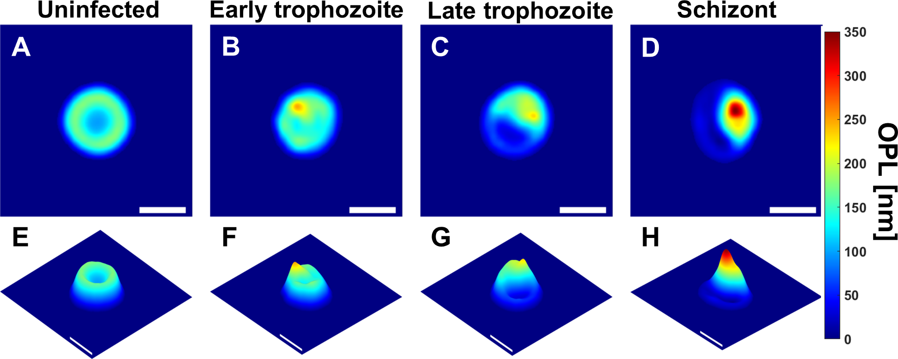
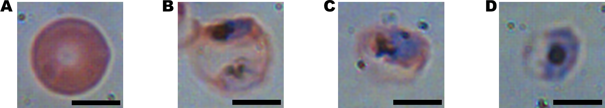

# Use case 1 {#use-case-1}

## Introduction
In the preceding chapters we have looked at four methods for supervised learning: Nearest Neighbours (chapter \@ref(nearest-neighbours)), Support Vector Machines (chapter \@ref(svm)), Decision Trees (chapter \@ref(decision-trees)) and Random Forests (chapter \@ref(decision-trees)). In this chapter we will consider how we choose the best method for a particular data set.

## Problem: automated detection of malaria

Park HS, Rinehart MT, Walzer KA, Chi J-TA, Wax A (2016) Automated Detection of P. falciparum Using Machine Learning Algorithms with Quantitative Phase Images of Unstained Cells. PLoS ONE 11(9): e0163045.
[https://doi.org/10.1371/journal.pone.0163045](https://doi.org/10.1371/journal.pone.0163045)

```{r malariaOPL, echo=FALSE, out.width='75%', fig.align='center', fig.cap="Bright-field microscopy images: (A) uninfected RBC (B-D) RBCs with malaria parasite in early trophozoite, late trophozoite, and schizont stages respectively (scale bars = 5μm). Source: Park et al (2016) https://doi.org/10.1371/journal.pone.0163045"}

```

```{r malariaBrightfield, echo=FALSE, out.width='75%', fig.align='center', fig.cap="Uninfected RBC and RBCs infected by P. falciparum in early trophozoite, late trophozoite, and schizont stages represented respectively as: (A-D) OPL maps, (E-F) OPL maps from different viewpoint (scale bars = 5μm). Source: Park et al (2016) https://doi.org/10.1371/journal.pone.0163045"}

```

N.B. These are images of typical specimens. There is actually considerable variation in the appearance of each stage. See the supplementary material for the paper:
[https://journals.plos.org/plosone/article?id=10.1371/journal.pone.0163045#sec014](https://journals.plos.org/plosone/article?id=10.1371/journal.pone.0163045#sec014)

Park et al (2016) performed cell segmentation on these images and extracted 23 morphological parameters from each RBC:

* Max optical path length (OPL)
* Mean OPL
* Median OPL
* Optical volume
* Minor axis length
* Major axis length
* Perimeter
* Area
* Elongation
* Equivalent diameter
* Eccentricity
* Standard deviation OPL
* Variance OPL
* Interquartile range OPL
* Skewness
* Kurtosis
* Mean symmetry
* Min symmetry
* Maximum gradient
* Mean gradient
* Centroid vs centre of mass
* Upper quartile mean OPL
* Upper quartile mean gradient

## Challenges

1. Find the best model for diagnosing malaria (discriminating infected from uninfected RBCs)

2. Find the best model for staging infection (classifying infection stage: uninfected, early trophozoite, late trophozoite, schizont).


## Getting started

### Load data
```{r}
load("data/malaria/malaria.RData")
```

Inspect objects that have been loaded into R session
```{r}
ls()
class(morphology)
dim(morphology)
names(morphology)
str(morphology)
class(infectionStatus)
summary(as.factor(infectionStatus))
class(stage)
summary(as.factor(stage))
```

**morphology** is a data.frame of the morphological parameters describing the red blood cells.

**infectionStatus** a factor identifying a red blood cell as either infected or uninfected.

**stage** a factor giving the stage of infection: early trophozoite, late trophozoite, schizont or uninfected.

### Model comparison
Explore how CARET's **resamples** function can help you compare models:
```{r}
?resamples
```


## Solutions
We have provided worked examples in appendix \@ref(use-case-1-solutions). Can you come up with better solutions?

