# Clustering {#clustering}

<!-- Matt -->

<!-- http://www.madgroup.path.cam.ac.uk/microarraysummary.shtml -->

<!--
if variables are in same units - don't standardize, otherwise standardize
-->

## Introduction

Clustering attempts to find groups (clusters) of similar objects. The members of a cluster should be more similar to each other, than to objects in other clusters. Clustering algorithms aim to minimize intra-cluster variation and maximize inter-cluster variation.

Methods of clustering can be broadly divided into two types:

**Hierarchic** techniques produce dendrograms (trees) through a process of division or agglomeration.

**Partitioning** algorithms divide objects into non-overlapping subsets (examples include k-means and DBSCAN)


<div class="figure" style="text-align: center">
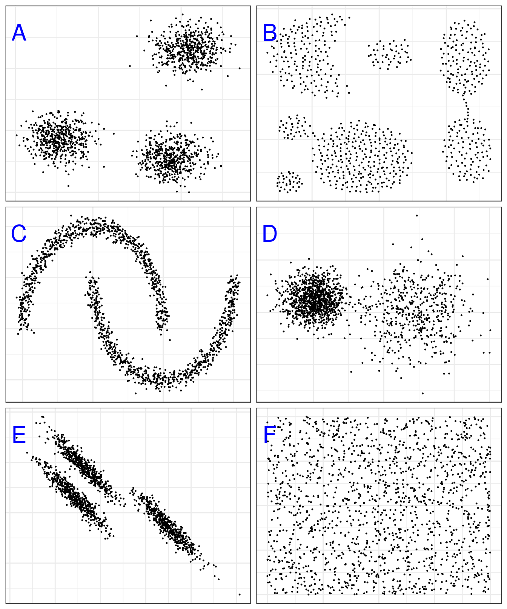
<p class="caption">Example clusters. **A**, *blobs*; **B**, *aggregation* [@Gionis2007]; **C**, *noisy moons*; **D**, *different density*; **E**, *anisotropic distributions*; **F**, *no structure*.</p>
</div>

## Distance metrics

Various distance metrics can be used with clustering algorithms. We will use Euclidean distance in the examples and exercises in this chapter.

\begin{equation}
  distance\left(p,q\right)=\sqrt{\sum_{i=1}^{n} (p_i-q_i)^2}
  (\#eq:euclidean)
\end{equation}

<div class="figure" style="text-align: center">

<p class="caption">Euclidean distance.</p>
</div>


## Hierarchic agglomerative


<div class="figure" style="text-align: center">
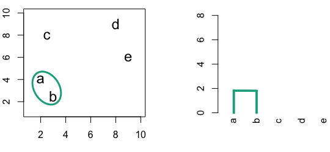
<p class="caption">Building a dendrogram using hierarchic agglomerative clustering.</p>
</div>


### Linkage algorithms


Table: Example distance matrix

     A    B    C    D  
---  ---  ---  ---  ---
B    2                 
C    6    5            
D    10   10   5       
E    9    8    3    4  


Single linkage - nearest neighbours linkage

Complete linkage - furthest neighbours linkage

Average linkage - UPGMA (Unweighted Pair Group Method with Arithmetic Mean) 


<!--
Explain anatomy of the dendrogram - branches, nodes and leaves.
-->


Table: Merge distances for objects in the example distance matrix using three different linkage methods.

Groups           Single   Complete   Average
--------------  -------  ---------  --------
A,B,C,D,E             0          0       0.0
(A,B),C,D,E           2          2       2.0
(A,B),(C,E),D         3          3       3.0
(A,B)(C,D,E)          4          5       4.5
(A,B,C,D,E)           5         10       8.0

<div class="figure" style="text-align: center">
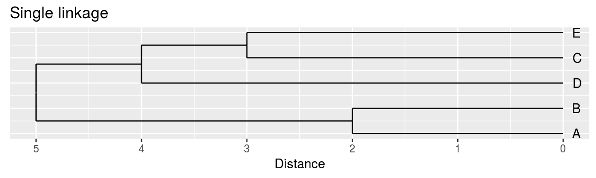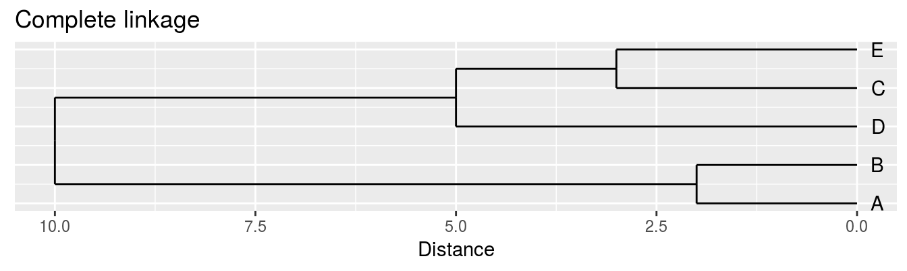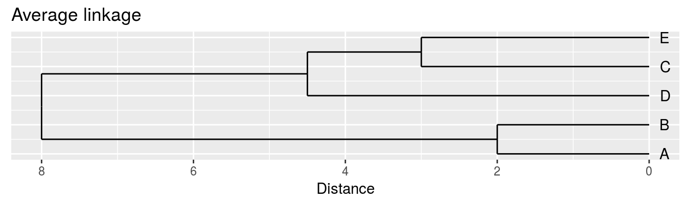
<p class="caption">Dendrograms for the example distance matrix using three different linkage methods. </p>
</div>

### Example: clustering synthetic data sets

#### Step-by-step instructions
1. Load required packages.

```r
library(RColorBrewer)
library(dendextend)
```

```
## 
## ---------------------
## Welcome to dendextend version 1.8.0
## Type citation('dendextend') for how to cite the package.
## 
## Type browseVignettes(package = 'dendextend') for the package vignette.
## The github page is: https://github.com/talgalili/dendextend/
## 
## Suggestions and bug-reports can be submitted at: https://github.com/talgalili/dendextend/issues
## Or contact: <tal.galili@gmail.com>
## 
## 	To suppress this message use:  suppressPackageStartupMessages(library(dendextend))
## ---------------------
```

```
## 
## Attaching package: 'dendextend'
```

```
## The following object is masked from 'package:ggdendro':
## 
##     theme_dendro
```

```
## The following object is masked from 'package:stats':
## 
##     cutree
```

```r
library(ggplot2)
library(GGally)
```

2. Retrieve a palette of eight colours.

```r
cluster_colours <- brewer.pal(8,"Dark2")
```

3. Read in data for **blobs** example.

```r
blobs <- read.csv("data/example_clusters/blobs.csv", header=F)
```

4. Create distance matrix using Euclidean distance metric.

```r
d <- dist(blobs[,1:2])
```

5. Perform hierarchical clustering using the **average** agglomeration method and convert the result to an object of class **dendrogram**. A **dendrogram** object can be edited using the advanced features of the **dendextend** package.

```r
dend <- as.dendrogram(hclust(d, method="average"))
```

6. Cut the tree into three clusters

```r
clusters <- cutree(dend,3,order_clusters_as_data=F)
```

7. The vector **clusters** contains the cluster membership (in this case *1*, *2* or *3*) of each observation (data point) in the order they appear on the dendrogram. We can use this vector to colour the branches of the dendrogram by cluster.

```r
dend <- color_branches(dend, clusters=clusters, col=cluster_colours[1:3])
```

8. We can use the **labels** function to annotate the leaves of the dendrogram. However, it is not possible to create legible labels for the 1,500 leaves in our example dendrogram, so we will set the label for each leaf to an empty string.

```r
labels(dend) <- rep("", length(blobs[,1]))
```

9. If we want to plot the dendrogram using **ggplot**, we must convert it to an object of class **ggdend**.

```r
ggd <- as.ggdend(dend)
```

10. The **nodes** attribute of **ggd** is a data.frame of parameters related to the plotting of dendogram nodes. The **nodes** data.frame contains some NAs which will generate warning messages when **ggd** is processed by **ggplot**. Since we are not interested in annotating dendrogram nodes, the easiest option here is to delete all of the rows of **nodes**.

```r
ggd$nodes <- ggd$nodes[!(1:length(ggd$nodes[,1])),]
```

11. We can use the cluster membership of each observation contained in the vector **clusters** to assign colours to the data points of a scatterplot. However, first we need to reorder the vector so that the cluster memberships are in the same order that the observations appear in the data.frame of observations. Fortunately the names of the elements of the vector are the indices of the observations in the data.frame and so reordering can be accomplished in one line.

```r
clusters <- clusters[order(as.numeric(names(clusters)))]
```

12. We are now ready to plot a dendrogram and scatterplot. We will use the **ggmatrix** function from the **GGally** package to place the plots side-by-side. 


```r
plotList <- list(ggplot(ggd),
                 ggplot(blobs, aes(V1,V2)) + 
                   geom_point(col=cluster_colours[clusters], size=0.2)
                 )

pm <- ggmatrix(
  plotList, nrow=1, ncol=2, showXAxisPlotLabels = F, showYAxisPlotLabels = F, 
  xAxisLabels=c("dendrogram", "scatter plot")
) + theme_bw()

pm
```

<div class="figure" style="text-align: center">
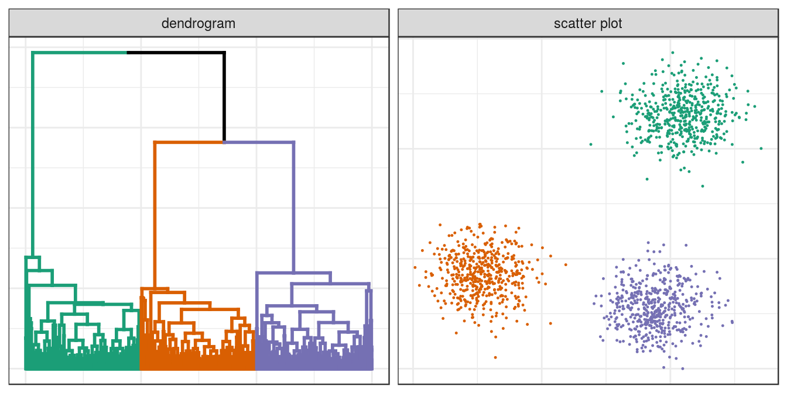
<p class="caption">Hierarchical clustering of the blobs data set.</p>
</div>

#### Clustering of other synthetic data sets


```r
aggregation <- read.table("data/example_clusters/aggregation.txt")
noisy_moons <- read.csv("data/example_clusters/noisy_moons.csv", header=F)
diff_density <- read.csv("data/example_clusters/different_density.csv", header=F)
aniso <- read.csv("data/example_clusters/aniso.csv", header=F)
no_structure <- read.csv("data/example_clusters/no_structure.csv", header=F)

hclust_plots <- function(data_set, n){
  d <- dist(data_set[,1:2])
  dend <- as.dendrogram(hclust(d, method="average"))
  clusters <- cutree(dend,n,order_clusters_as_data=F)
  dend <- color_branches(dend, clusters=clusters, col=cluster_colours[1:n])
  clusters <- clusters[order(as.numeric(names(clusters)))]
  labels(dend) <- rep("", length(data_set[,1]))
  ggd <- as.ggdend(dend)
  ggd$nodes <- ggd$nodes[!(1:length(ggd$nodes[,1])),]
  plotPair <- list(ggplot(ggd),
    ggplot(data_set, aes(V1,V2)) + 
      geom_point(col=cluster_colours[clusters], size=0.2))
  return(plotPair)
}

plotList <- c(
  hclust_plots(aggregation, 7),
  hclust_plots(noisy_moons, 2),
  hclust_plots(diff_density, 2),
  hclust_plots(aniso, 3),
  hclust_plots(no_structure, 3)
)

pm <- ggmatrix(
  plotList, nrow=5, ncol=2, showXAxisPlotLabels = F, showYAxisPlotLabels = F,
  xAxisLabels=c("dendrogram", "scatter plot"), 
  yAxisLabels=c("aggregation", "noisy moons", "different density", "anisotropic", "no structure")
) + theme_bw()

pm
```

<div class="figure" style="text-align: center">
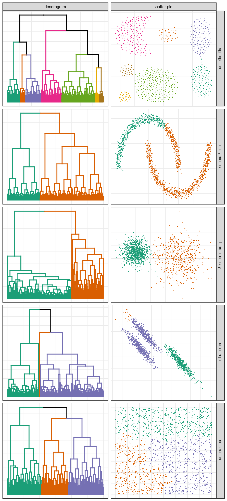
<p class="caption">Hierarchical clustering of synthetic data-sets. </p>
</div>

### Example: gene expression profiling of human tissues

#### Basics
Load required libraries

```r
library(RColorBrewer)
library(dendextend)
```

Load data

```r
load("data/tissues_gene_expression/tissuesGeneExpression.rda")
```

Inspect data

```r
table(tissue)
```

```
## tissue
##  cerebellum       colon endometrium hippocampus      kidney       liver 
##          38          34          15          31          39          26 
##    placenta 
##           6
```

```r
dim(e)
```

```
## [1] 22215   189
```

Compute distance between each sample

```r
d <- dist(t(e))
```

perform hierarchical clustering

```r
hc <- hclust(d, method="average")
plot(hc, labels=tissue, cex=0.5, hang=-1, xlab="", sub="")
```

<div class="figure" style="text-align: center">
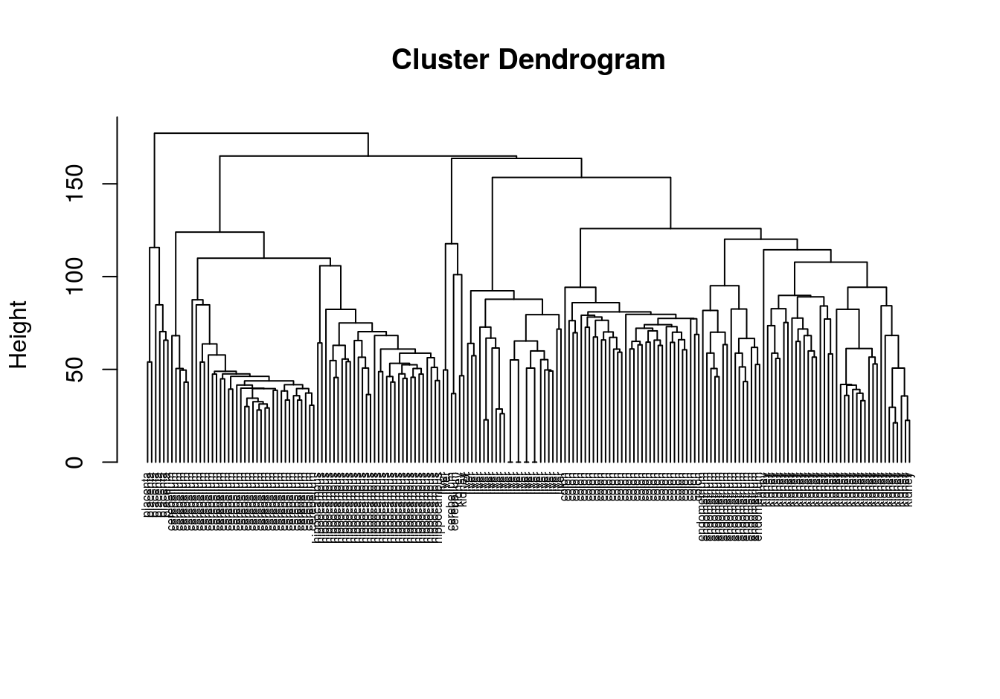
<p class="caption">Clustering of tissue samples based on gene expression profiles. </p>
</div>


#### Colour labels

The dendextend library can be used to plot dendrogram with colour labels

```r
tissue_type <- unique(tissue)
dend <- as.dendrogram(hc)
dend_colours <- brewer.pal(length(unique(tissue)),"Dark2")
names(dend_colours) <- tissue_type
labels(dend) <- tissue[order.dendrogram(dend)]
labels_colors(dend) <- dend_colours[tissue][order.dendrogram(dend)]
labels_cex(dend) = 0.5
plot(dend, horiz=T)
```

<div class="figure" style="text-align: center">
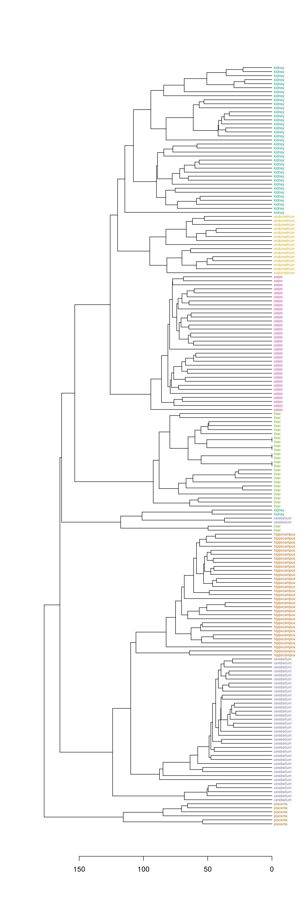
<p class="caption">Clustering of tissue samples based on gene expression profiles with labels coloured by tissue type. </p>
</div>

#### Defining clusters by cutting tree

Define clusters by cutting tree at a specific height

```r
plot(dend, horiz=T)
abline(v=125, lwd=2, lty=2, col="blue")
```

<div class="figure" style="text-align: center">
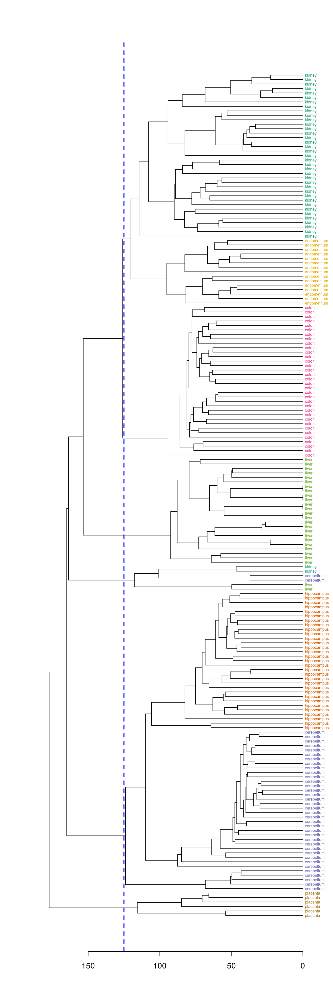
<p class="caption">Clusters found by cutting tree at a height of 125</p>
</div>

```r
hclusters <- cutree(dend, h=125)
table(tissue, cluster=hclusters)
```

```
##              cluster
## tissue         1  2  3  4  5  6
##   cerebellum   0 36  0  0  2  0
##   colon        0  0 34  0  0  0
##   endometrium 15  0  0  0  0  0
##   hippocampus  0 31  0  0  0  0
##   kidney      37  0  0  0  2  0
##   liver        0  0  0 24  2  0
##   placenta     0  0  0  0  0  6
```

Select a specific number of clusters.

```r
plot(dend, horiz=T)
abline(v = heights_per_k.dendrogram(dend)["8"], lwd = 2, lty = 2, col = "blue")
```

<div class="figure" style="text-align: center">
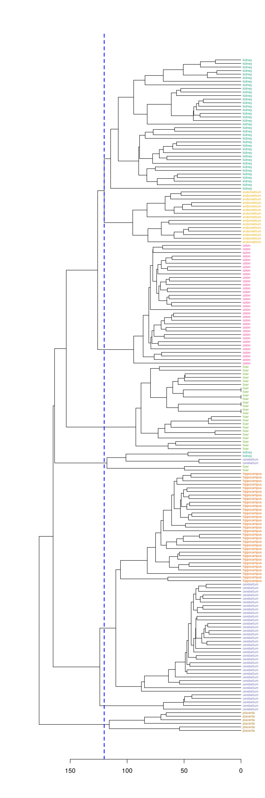
<p class="caption">Selection of eight clusters from the dendogram</p>
</div>

```r
hclusters <- cutree(dend, k=8)
table(tissue, cluster=hclusters)
```

```
##              cluster
## tissue         1  2  3  4  5  6  7  8
##   cerebellum   0 31  0  0  2  0  5  0
##   colon        0  0 34  0  0  0  0  0
##   endometrium  0  0  0  0  0 15  0  0
##   hippocampus  0 31  0  0  0  0  0  0
##   kidney      37  0  0  0  2  0  0  0
##   liver        0  0  0 24  2  0  0  0
##   placenta     0  0  0  0  0  0  0  6
```

#### Heatmap
Base R provides a **heatmap** function, but we will use the more advanced **heatmap.2** from the **gplots** package.

```r
library(gplots)
```

```
## 
## Attaching package: 'gplots'
```

```
## The following object is masked from 'package:stats':
## 
##     lowess
```

Define a colour palette (also known as a lookup table).

```r
heatmap_colours <- colorRampPalette(brewer.pal(9, "PuBuGn"))(100)
```

Calculate the variance of each gene.

```r
geneVariance <- apply(e,1,var)
```

Find the row numbers of the 40 genes with the highest variance.

```r
idxTop40 <- order(-geneVariance)[1:40]
```

Define colours for tissues.

```r
tissueColours <- palette(brewer.pal(8, "Dark2"))[as.numeric(as.factor(tissue))]
```

Plot heatmap.

```r
heatmap.2(e[idxTop40,], labCol=tissue, trace="none",
          ColSideColors=tissueColours, col=heatmap_colours)
```

<div class="figure" style="text-align: center">
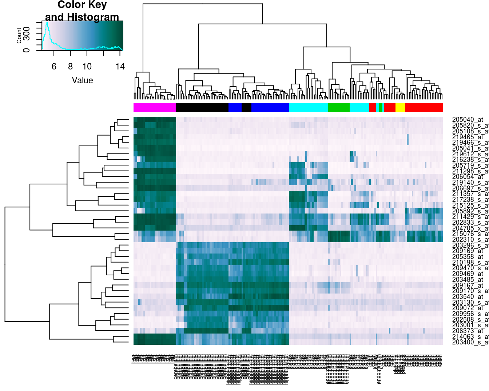
<p class="caption">Heatmap of the expression of the 40 genes with the highest variance.</p>
</div>


## K-means

### Algorithm

Pseudocode for the K-means algorithm
```
randomly choose k objects as initial centroids
while true:
  1. create k clusters by assigning each object to closest centroid
  2. compute k new centroids by averaging the objects in each cluster
  3. if none of the centroids differ from the previous iteration:
        return the current set of clusters
```


<div class="figure" style="text-align: center">
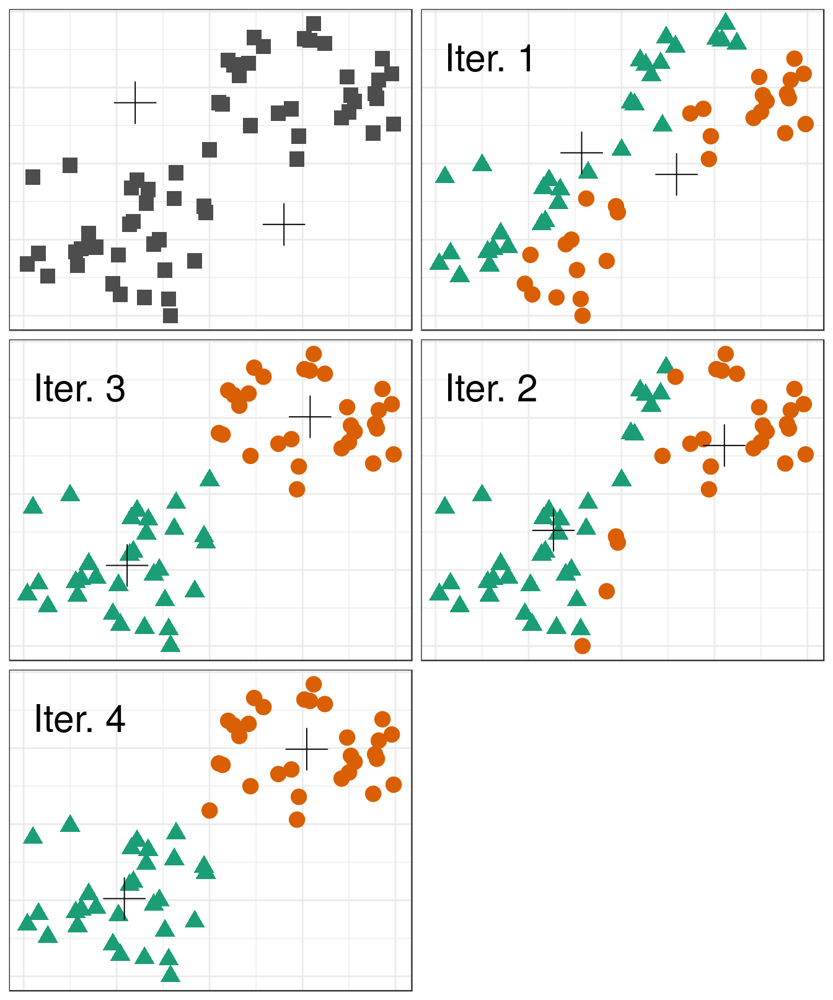
<p class="caption">Iterations of the k-means algorithm</p>
</div>

The default setting of the **kmeans** function is to perform a maximum of 10 iterations and if the algorithm fails to converge a warning is issued. The maximum number of iterations is set with the argument **iter.max**.

### Choosing initial cluster centres

```r
library(RColorBrewer)
point_shapes <- c(15,17,19)
point_colours <- brewer.pal(3,"Dark2")
point_size = 1.5
center_point_size = 8

blobs <- as.data.frame(read.csv("data/example_clusters/blobs.csv", header=F))

good_centres <- as.data.frame(matrix(c(2,8,7,3,12,7), ncol=2, byrow=T))
bad_centres <- as.data.frame(matrix(c(13,13,8,12,2,2), ncol=2, byrow=T))

good_result <- kmeans(blobs[,1:2], centers=good_centres)
bad_result <- kmeans(blobs[,1:2], centers=bad_centres)

plotList <- list(
ggplot(blobs, aes(V1,V2)) + 
  geom_point(col=point_colours[good_result$cluster], shape=point_shapes[good_result$cluster], 
             size=point_size) + 
  geom_point(data=good_centres, aes(V1,V2), shape=3, col="black", size=center_point_size) + 
  theme_bw(),
ggplot(blobs, aes(V1,V2)) + 
  geom_point(col=point_colours[bad_result$cluster], shape=point_shapes[bad_result$cluster], 
             size=point_size) + 
  geom_point(data=bad_centres, aes(V1,V2), shape=3, col="black", size=center_point_size) + 
  theme_bw()
)

pm <- ggmatrix(
  plotList, nrow=1, ncol=2, showXAxisPlotLabels = T, showYAxisPlotLabels = T, 
  xAxisLabels=c("A", "B")
) + theme_bw()

pm
```

<div class="figure" style="text-align: center">
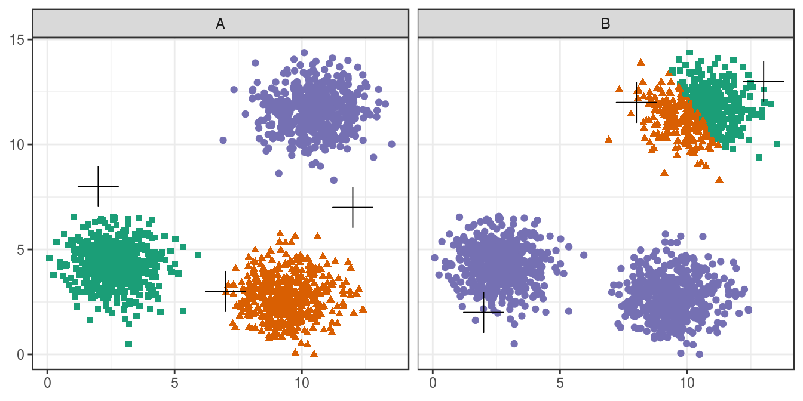
<p class="caption">Initial centres determine clusters. The starting centres are shown as crosses. **A**, real clusters found; **B**, convergence to a local minimum.</p>
</div>
Convergence to a local minimum can be avoided by starting the algorithm multiple times, with different random centres. The **nstart** argument to the **k-means** function can be used to specify the number of random sets and optimal solution will be selected automatically.


### Choosing k {#choosingK}


```r
point_colours <- brewer.pal(9,"Set1")
k <- 1:9
res <- lapply(k, function(i){kmeans(blobs[,1:2], i, nstart=50)})

plotList <- lapply(k, function(i){
  ggplot(blobs, aes(V1, V2)) + 
    geom_point(col=point_colours[res[[i]]$cluster], size=1) +
    geom_point(data=as.data.frame(res[[i]]$centers), aes(V1,V2), shape=3, col="black", size=5) +
    annotate("text", x=2, y=13, label=paste("k=", i, sep=""), size=8, col="black") +
    theme_bw()
}
)

pm <- ggmatrix(
  plotList, nrow=3, ncol=3, showXAxisPlotLabels = T, showYAxisPlotLabels = T
) + theme_bw()

pm
```

<div class="figure" style="text-align: center">
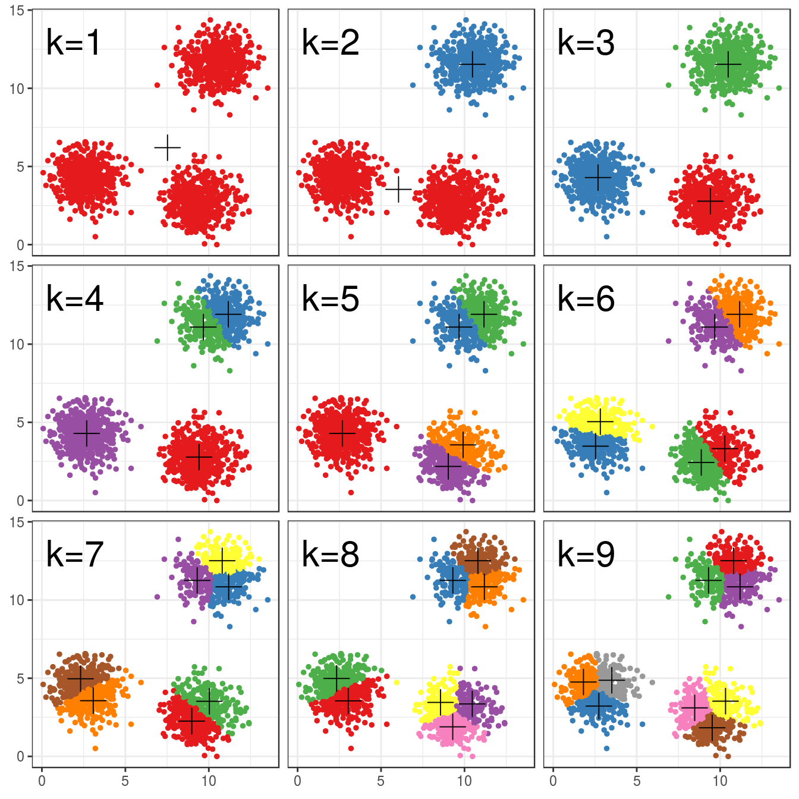
<p class="caption">K-means clustering of the blobs data set using a range of values of k from 1-9. Cluster centres indicated with a cross.</p>
</div>


```r
tot_withinss <- sapply(k, function(i){res[[i]]$tot.withinss})
qplot(k, tot_withinss, geom=c("point", "line"), 
      ylab="Total within-cluster sum of squares") + theme_bw()
```

<div class="figure" style="text-align: center">
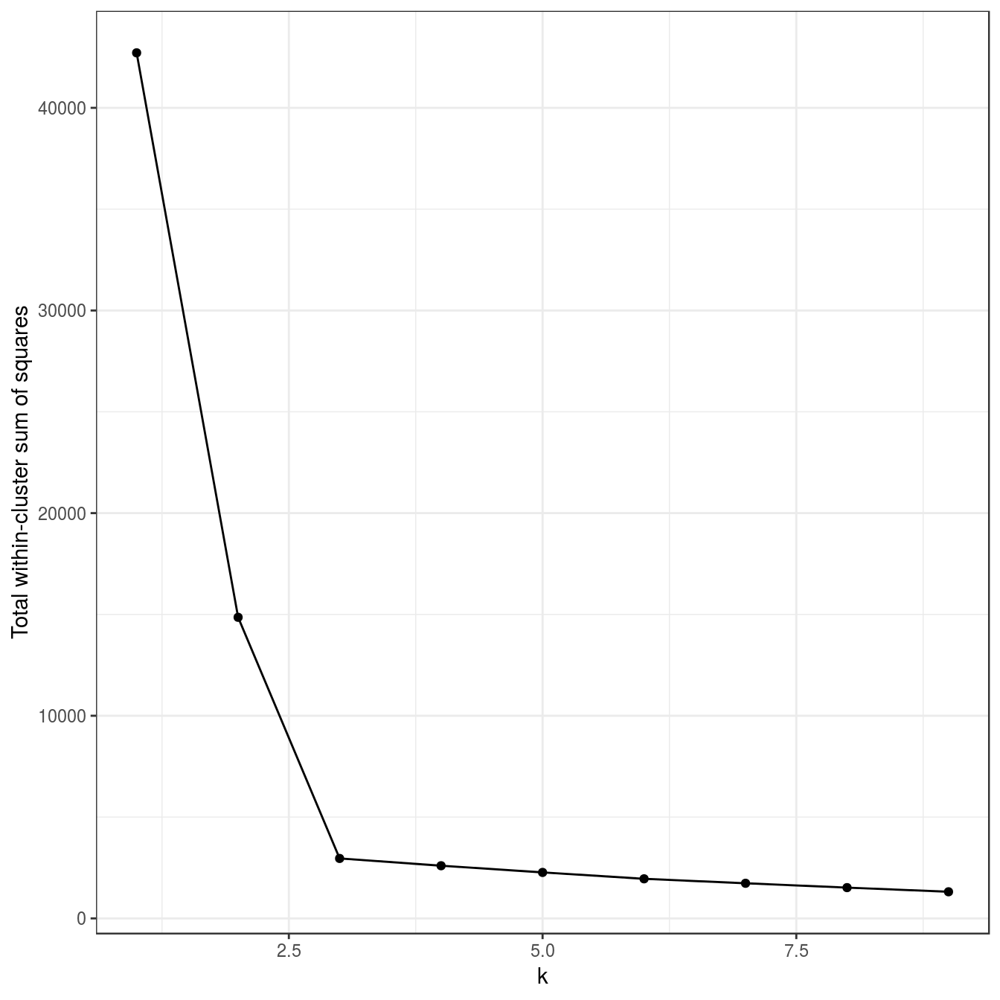
<p class="caption">Variance within the clusters. Total within-cluster sum of squares plotted against k.</p>
</div>

*N.B.* we have set ```nstart=50``` to run the algorithm 50 times, starting from different, random sets of centroids.


### Example: clustering synthetic data sets
Let's see how k-means performs on the other toy data sets. First we will define some variables and functions we will use in the analysis of all data sets.

```r
k=1:9
point_shapes <- c(15,17,19,5,6,0,1)
point_colours <- brewer.pal(7,"Dark2")
point_size = 1.5
center_point_size = 8

plot_tot_withinss <- function(kmeans_output){
  tot_withinss <- sapply(k, function(i){kmeans_output[[i]]$tot.withinss})
  qplot(k, tot_withinss, geom=c("point", "line"), 
        ylab="Total within-cluster sum of squares") + theme_bw()
}

plot_clusters <- function(data_set, kmeans_output, num_clusters){
    ggplot(data_set, aes(V1,V2)) + 
    geom_point(col=point_colours[kmeans_output[[num_clusters]]$cluster],
               shape=point_shapes[kmeans_output[[num_clusters]]$cluster], 
               size=point_size) +
    geom_point(data=as.data.frame(kmeans_output[[num_clusters]]$centers), aes(V1,V2),
               shape=3,col="black",size=center_point_size) + 
    theme_bw()
}
```

#### Aggregation

```r
aggregation <- as.data.frame(read.table("data/example_clusters/aggregation.txt"))
res <- lapply(k, function(i){kmeans(aggregation[,1:2], i, nstart=50)})
plot_tot_withinss(res)
```

<div class="figure" style="text-align: center">
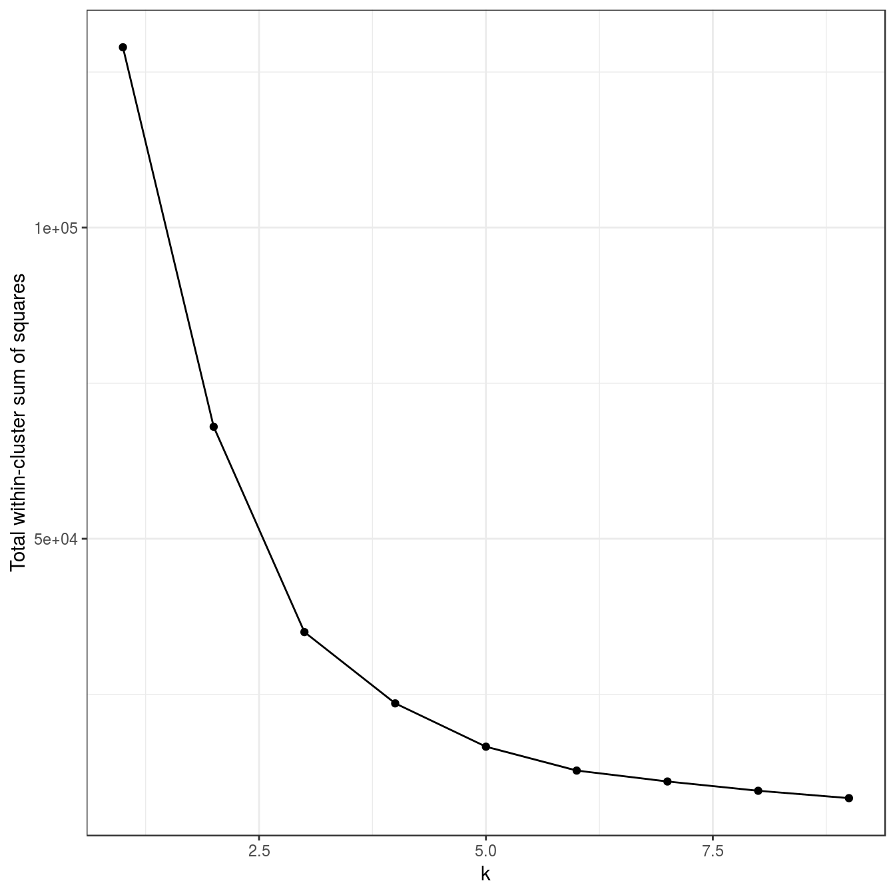
<p class="caption">K-means clustering of the aggregation data set: variance within clusters.</p>
</div>


```r
plotList <- list(
  plot_clusters(aggregation, res, 3),
  plot_clusters(aggregation, res, 7)
)
pm <- ggmatrix(
  plotList, nrow=1, ncol=2, showXAxisPlotLabels = T, showYAxisPlotLabels = T, 
  xAxisLabels=c("k=3", "k=7")
) + theme_bw()
pm
```

<div class="figure" style="text-align: center">
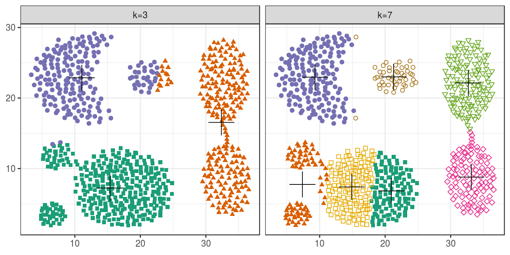
<p class="caption">K-means clustering of the aggregation data set: scatterplots of clusters for k=3 and k=7. Cluster centres indicated with a cross.</p>
</div>

#### Noisy moons

```r
noisy_moons <- read.csv("data/example_clusters/noisy_moons.csv", header=F)
res <- lapply(k, function(i){kmeans(noisy_moons[,1:2], i, nstart=50)})
plot_tot_withinss(res)
```

<div class="figure" style="text-align: center">
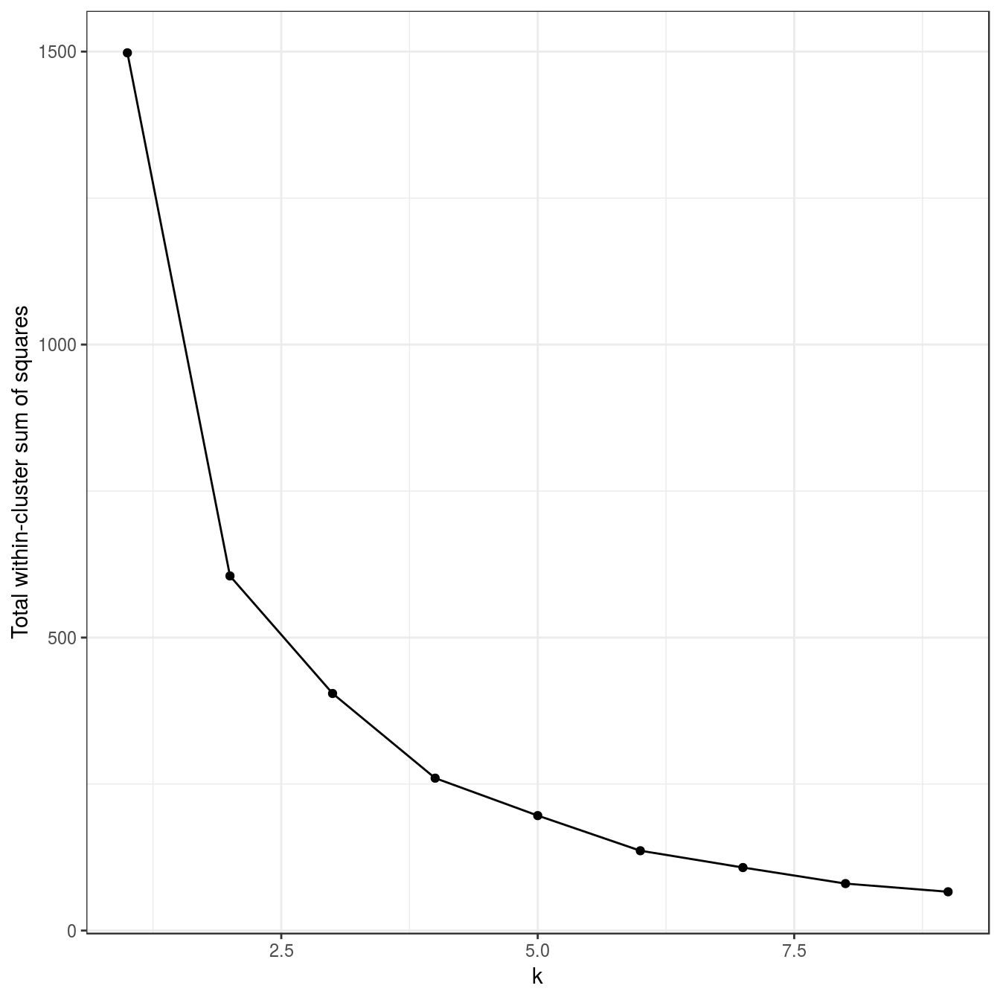
<p class="caption">K-means clustering of the noisy moons data set: variance within clusters.</p>
</div>


```r
plot_clusters(noisy_moons, res, 2)
```

<div class="figure" style="text-align: center">

<p class="caption">K-means clustering of the noisy moons data set: scatterplot of clusters for k=2. Cluster centres indicated with a cross.</p>
</div>

#### Different density


```r
diff_density <- as.data.frame(read.csv("data/example_clusters/different_density.csv", header=F))
res <- lapply(k, function(i){kmeans(diff_density[,1:2], i, nstart=50)})
```

```
## Warning: did not converge in 10 iterations

## Warning: did not converge in 10 iterations
```
Failure to converge, so increase number of iterations.

```r
res <- lapply(k, function(i){kmeans(diff_density[,1:2], i, iter.max=20, nstart=50)})
plot_tot_withinss(res)
```

<div class="figure" style="text-align: center">
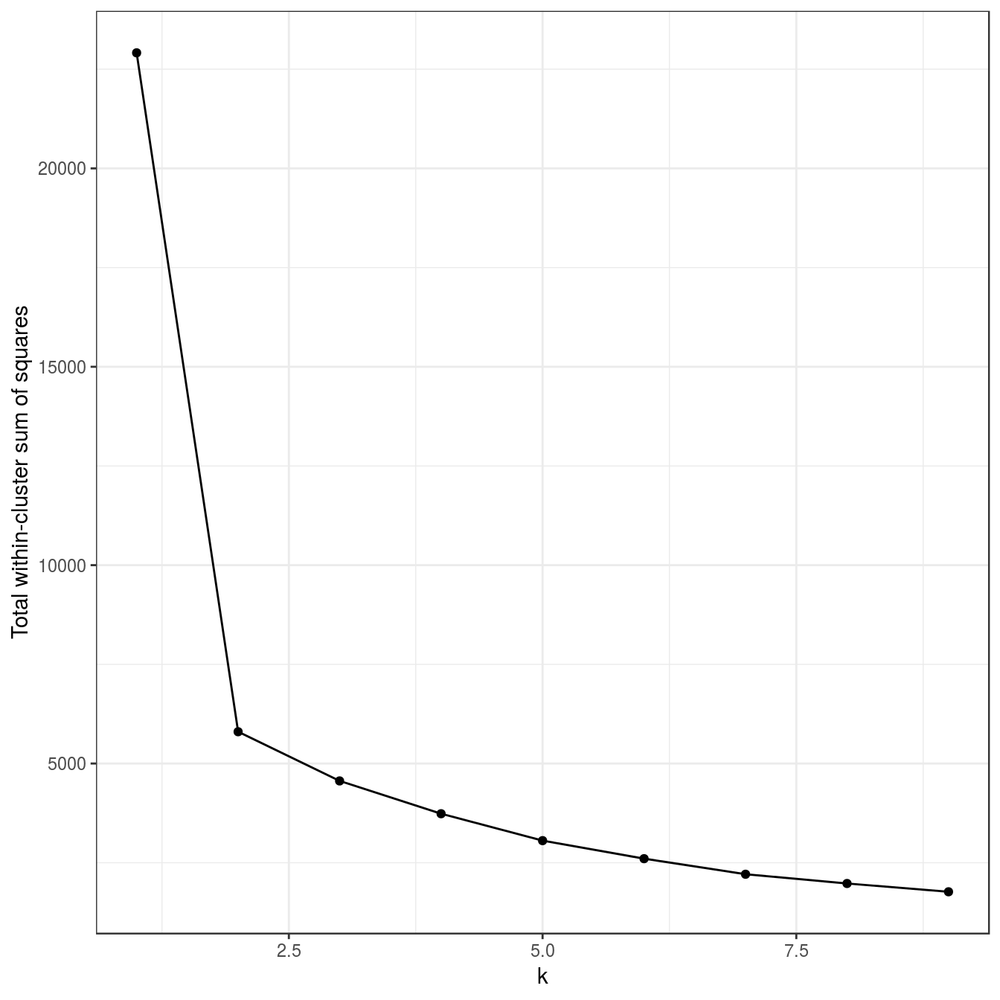
<p class="caption">K-means clustering of the different density distributions data set: variance within clusters.</p>
</div>


```r
plot_clusters(diff_density, res, 2)
```

<div class="figure" style="text-align: center">
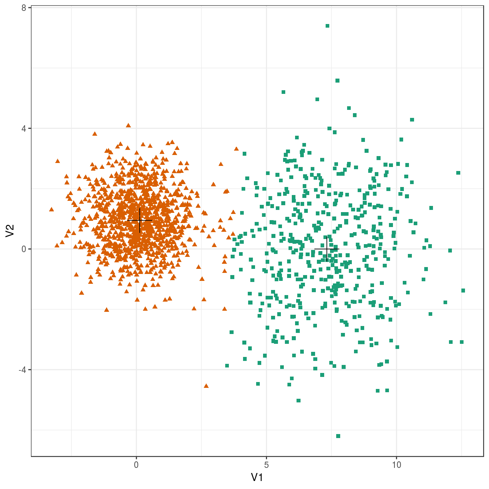
<p class="caption">K-means clustering of the different density distributions data set: scatterplots of clusters for k=2 and k=3. Cluster centres indicated with a cross.</p>
</div>

#### Anisotropic distributions

```r
aniso <- as.data.frame(read.csv("data/example_clusters/aniso.csv", header=F))
res <- lapply(k, function(i){kmeans(aniso[,1:2], i, nstart=50)})
plot_tot_withinss(res)
```

<div class="figure" style="text-align: center">

<p class="caption">K-means clustering  of the anisotropic distributions data set: variance within clusters.</p>
</div>


```r
plotList <- list(
  plot_clusters(aniso, res, 2),
  plot_clusters(aniso, res, 3)
)
pm <- ggmatrix(
  plotList, nrow=1, ncol=2, showXAxisPlotLabels = T, 
  showYAxisPlotLabels = T, xAxisLabels=c("k=2", "k=3")
) + theme_bw()
pm
```

<div class="figure" style="text-align: center">
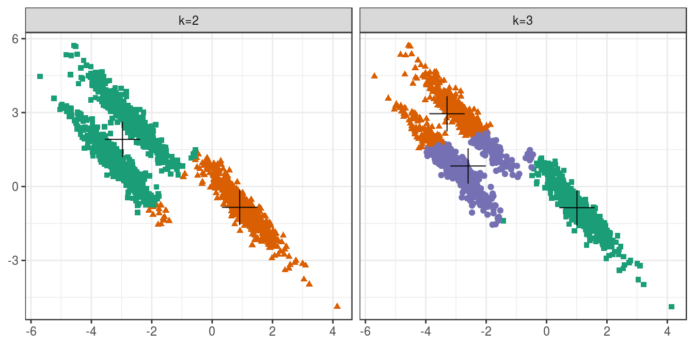
<p class="caption">K-means clustering of the anisotropic distributions data set: scatterplots of clusters for k=2 and k=3. Cluster centres indicated with a cross.</p>
</div>

#### No structure

```r
no_structure <- as.data.frame(read.csv("data/example_clusters/no_structure.csv", header=F))
res <- lapply(k, function(i){kmeans(no_structure[,1:2], i, nstart=50)})
plot_tot_withinss(res)
```

<div class="figure" style="text-align: center">
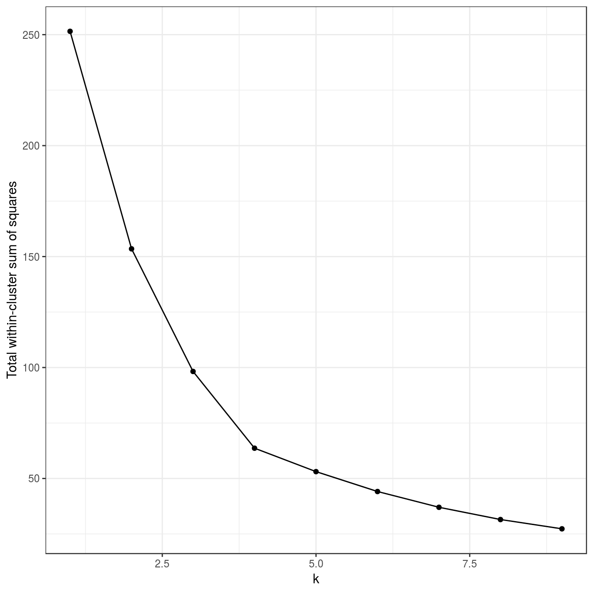
<p class="caption">K-means clustering of the data set with no structure: variance within clusters.</p>
</div>


```r
plot_clusters(no_structure, res, 4)
```

<div class="figure" style="text-align: center">
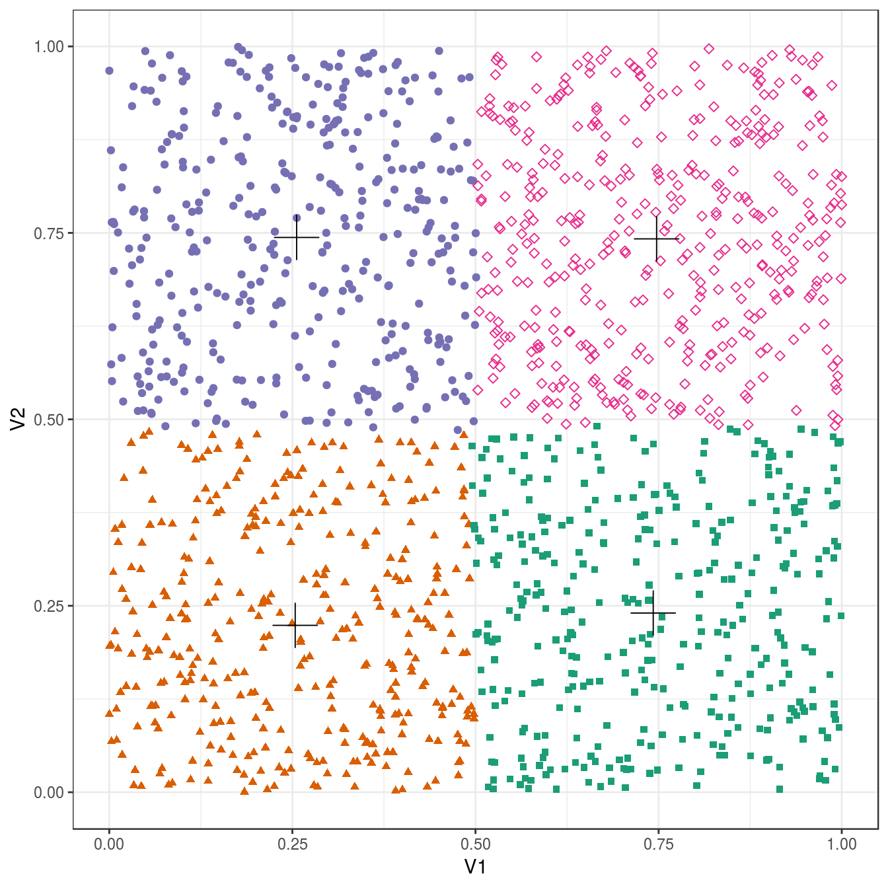
<p class="caption">K-means clustering of the data set with no structure: scatterplot of clusters for k=4. Cluster centres indicated with a cross.</p>
</div>

### Example: gene expression profiling of human tissues
Let's return to the data on gene expression of human tissues.
Load data

```r
load("data/tissues_gene_expression/tissuesGeneExpression.rda")
```

As we saw earlier, the data set contains expression levels for over 22,000 transcripts in seven tissues.

```r
table(tissue)
```

```
## tissue
##  cerebellum       colon endometrium hippocampus      kidney       liver 
##          38          34          15          31          39          26 
##    placenta 
##           6
```

```r
dim(e)
```

```
## [1] 22215   189
```

First we will examine the total intra-cluster variance with different values of *k*. Our data-set is fairly large, so clustering it for several values or *k* and with multiple random starting centres is computationally quite intensive. Fortunately the task readily lends itself to parallelization; we can assign the analysis of each 'k' to a different processing core. As we have seen in the previous chapters on supervised learning, [caret](http://cran.r-project.org/web/packages/caret/index.html) has parallel processing built in and we simply have to load a package for multicore processing, such as [doMC](http://cran.r-project.org/web/packages/doMC/index.html), and then register the number of cores we would like to use. Running **kmeans** in parallel is slightly more involved, but still very easy. We will start by loading [doMC](http://cran.r-project.org/web/packages/doMC/index.html) and registering all available cores:

```r
library(doMC)
```

```
## Loading required package: foreach
```

```
## Loading required package: iterators
```

```
## Loading required package: parallel
```

```r
registerDoMC(detectCores())
```
To find out how many cores we have registered we can use:

```r
getDoParWorkers()
```

```
## [1] 4
```

Instead of using the **lapply** function to vectorize our code, we will instead use the parallel equivalent, **foreach**. Like **lapply**, **foreach** returns a list by default. For this example we have set a seed, rather than generate a random number, for the sake of reproducibility. Ordinarily we would omit ```set.seed(42)``` and ```.options.multicore=list(set.seed=FALSE)```.

```r
k<-1:15
set.seed(42)
res_k_15 <- foreach(
  i=k, 
  .options.multicore=list(set.seed=FALSE)) %dopar% kmeans(t(e), i, nstart=10)
plot_tot_withinss(res_k_15)
```

<div class="figure" style="text-align: center">
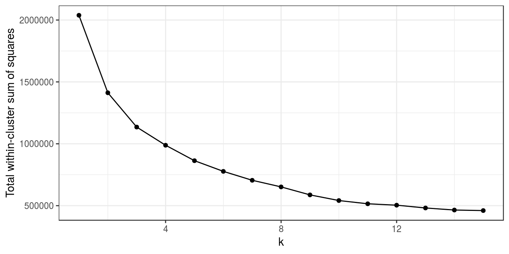
<p class="caption">K-means clustering of human tissue gene expression: variance within clusters.</p>
</div>
<!--
set.seed(42)
res_k_15 <- lapply(k, function(i){kmeans(t(e), i, nstart=10)})
-->
There is no obvious elbow, but since we know that there are seven tissues in the data set we will try k=7. 
<!--

```r
set.seed(42)
res <- kmeans(t(e), 7, nstart=10)
table(tissue, res$cluster)
```

```
##              
## tissue         1  2  3  4  5  6  7
##   cerebellum   0  0  0 33  0  0  5
##   colon        0  0  0  0  0 34  0
##   endometrium  0  0  0  0 15  0  0
##   hippocampus  0  0  0  0  0  0 31
##   kidney       0  0 39  0  0  0  0
##   liver       26  0  0  0  0  0  0
##   placenta     0  6  0  0  0  0  0
```
-->

```r
table(tissue, res_k_15[[7]]$cluster)
```

```
##              
## tissue         1  2  3  4  5  6  7
##   cerebellum   0  0  5 31  0  0  2
##   colon        0 34  0  0  0  0  0
##   endometrium 15  0  0  0  0  0  0
##   hippocampus  0  0 31  0  0  0  0
##   kidney      37  0  0  0  0  0  2
##   liver        0  0  0  0  0 24  2
##   placenta     0  0  0  0  6  0  0
```
The analysis has found a distinct cluster for each tissue and therefore performed slightly better than the earlier hierarchical clustering analysis, which placed endometrium and kidney observations in the same cluster.

To visualize the result in a 2D scatter plot we first need to apply dimensionality reduction. We will use principal component analysis (PCA), which was described in chapter \@ref(dimensionality-reduction).


```r
pca <- prcomp(t(e))
ggplot(data=as.data.frame(pca$x), aes(PC1,PC2)) + 
  geom_point(col=brewer.pal(7,"Dark2")[res_k_15[[7]]$cluster], 
             shape=c(49:55)[res_k_15[[7]]$cluster], size=5) + 
  theme_bw()
```

<div class="figure" style="text-align: center">
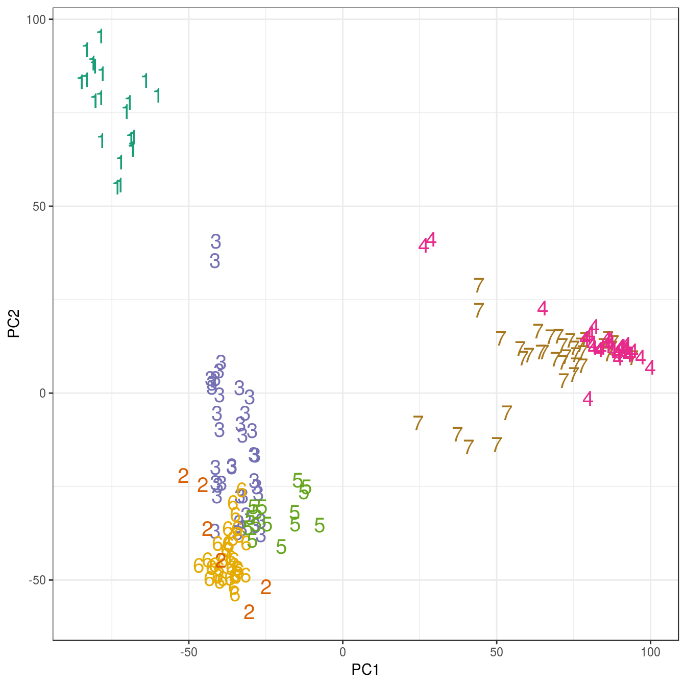
<p class="caption">K-means clustering of human gene expression (k=7): scatterplot of first two principal components.</p>
</div>

## DBSCAN
Density-based spatial clustering of applications with noise

### Algorithm


Abstract DBSCAN algorithm in pseudocode [@Schubert2017]

```
1 Compute neighbours of each point and identify core points   // Identify core points
2 Join neighbouring core points into clusters                 // Assign core points
3 foreach non-core point do
      Add to a neighbouring core point if possible            // Assign border points
      Otherwise, add to noise                                 // Assign noise points
```


<div class="figure" style="text-align: center">

<p class="caption">Illustration of the DBSCAN algorithm. By Chire (Own work) [CC BY-SA 3.0 (http://creativecommons.org/licenses/by-sa/3.0)], via Wikimedia Commons.</p>
</div>

The method requires two parameters; MinPts that is the minimum number of samples in any cluster; Eps that is the maximum distance of the sample to at least one other sample within the same cluster.

This algorithm works on a parametric approach. The two parameters involved in this algorithm are:

* e (eps) is the radius of our neighborhoods around a data point p.
* minPts is the minimum number of data points we want in a neighborhood to define a cluster.


### Implementation in R
DBSCAN is implemented in two R packages: [dbscan](https://cran.r-project.org/package=dbscan) and [fpc](https://cran.r-project.org/package=fpc). We will use the package [dbscan](https://cran.r-project.org/package=dbscan), because it is significantly faster and can handle larger data sets than [fpc](https://cran.r-project.org/package=fpc). The function has the same name in both packages and so if for any reason both packages have been loaded into our current workspace, there is a danger of calling the wrong implementation. To avoid this we can specify the package name when calling the function, e.g.:
```
dbscan::dbscan
```

We load the dbscan package in the usual way:

```r
library(dbscan)
```

### Choosing parameters
The algorithm only needs parameteres **eps** and **minPts**.

Read in data and use **kNNdist** function from [dbscan](https://cran.r-project.org/package=dbscan) package to plot the distances of the 10-nearest neighbours for each observation (figure \@ref(fig:blobsKNNdist)).


```r
blobs <- read.csv("data/example_clusters/blobs.csv", header=F)
kNNdistplot(blobs[,1:2], k=10)
abline(h=0.6)
```

<div class="figure" style="text-align: center">
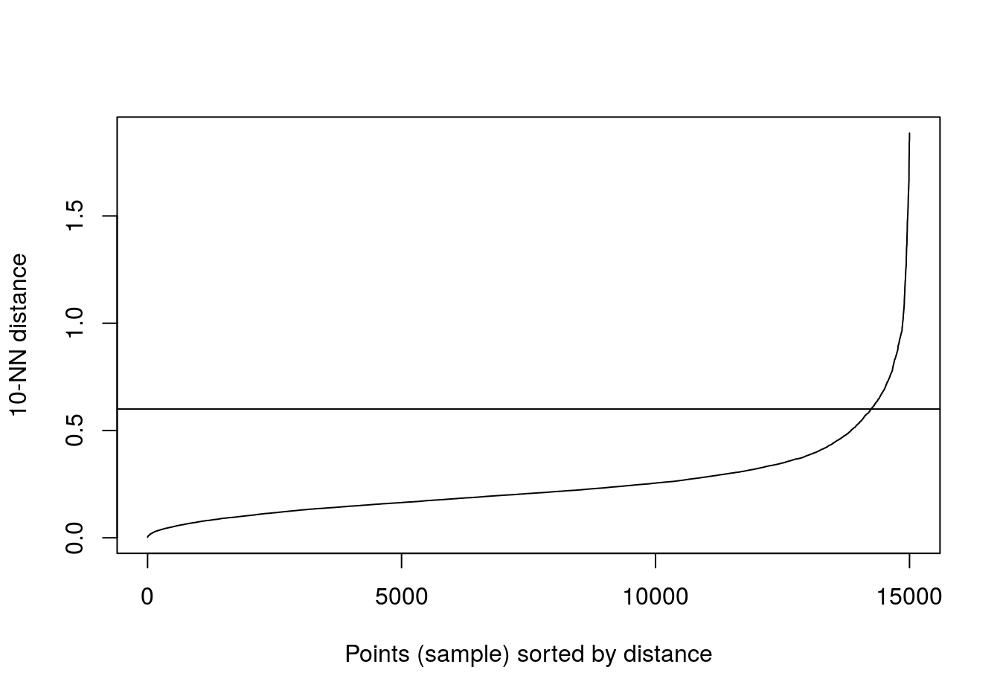
<p class="caption">10-nearest neighbour distances for the blobs data set</p>
</div>
<!-- dist2knn <- kNNdist(blobs, 10) -->


```r
res <- dbscan::dbscan(blobs[,1:2], eps=0.6, minPts = 10)
table(res$cluster)
```

```
## 
##   0   1   2   3 
##  43 484 486 487
```


```r
ggplot(blobs, aes(V1,V2)) + 
  geom_point(col=brewer.pal(8,"Dark2")[c(8,1:7)][res$cluster+1],
             shape=c(4,15,17,19)[res$cluster+1],
             size=1.5) +
  theme_bw()
```

<div class="figure" style="text-align: center">
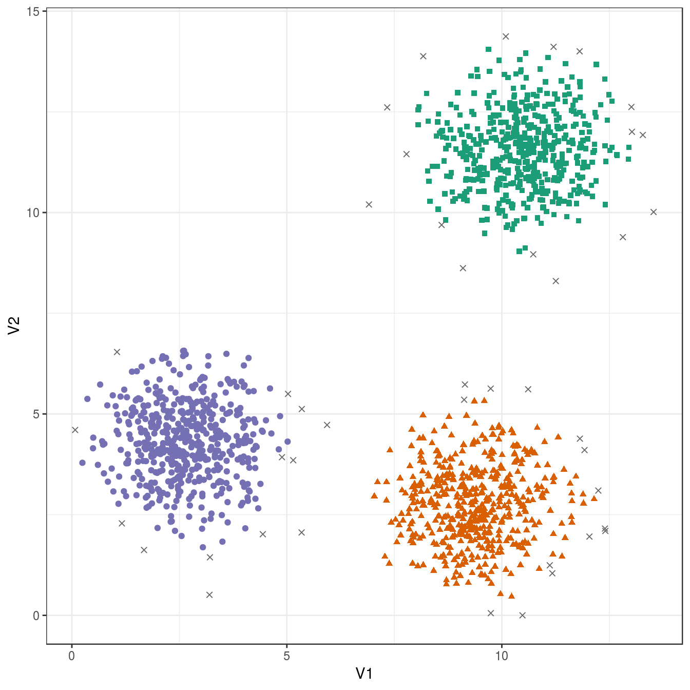
<p class="caption">DBSCAN clustering (eps=0.6, minPts=10) of the blobs data set. Outlier observations are shown as grey crosses.</p>
</div>


### Example: clustering synthetic data sets


```r
point_shapes <- c(4,15,17,19,5,6,0,1)
point_colours <- brewer.pal(8,"Dark2")[c(8,1:7)]
point_size = 1.5
center_point_size = 8

plot_dbscan_clusters <- function(data_set, dbscan_output){
  ggplot(data_set, aes(V1,V2)) + 
    geom_point(col=point_colours[dbscan_output$cluster+1],
               shape=point_shapes[dbscan_output$cluster+1], 
               size=point_size) +
    theme_bw()
}
```


#### Aggregation


```r
aggregation <- read.table("data/example_clusters/aggregation.txt")
kNNdistplot(aggregation[,1:2], k=10)
abline(h=1.8)
```

<div class="figure" style="text-align: center">
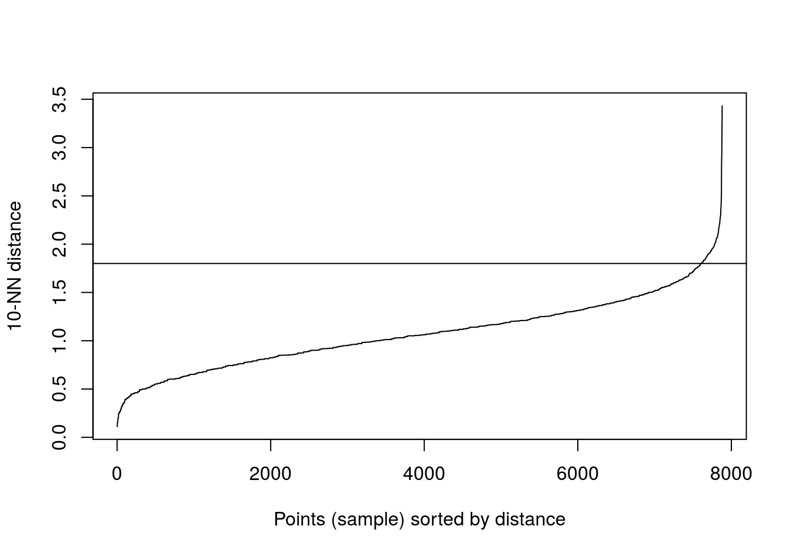
<p class="caption">10-nearest neighbour distances for the aggregation data set</p>
</div>


```r
res <- dbscan::dbscan(aggregation[,1:2], eps=1.8, minPts = 10)
table(res$cluster)
```

```
## 
##   0   1   2   3   4   5   6 
##   2 168 307 105 127  45  34
```


```r
plot_dbscan_clusters(aggregation, res)
```

<div class="figure" style="text-align: center">

<p class="caption">DBSCAN clustering (eps=1.8, minPts=10) of the aggregation data set. Outlier observations are shown as grey crosses.</p>
</div>


#### Noisy moons

```r
noisy_moons <- read.csv("data/example_clusters/noisy_moons.csv", header=F)
kNNdistplot(noisy_moons[,1:2], k=10)
abline(h=0.075)
```

<div class="figure" style="text-align: center">
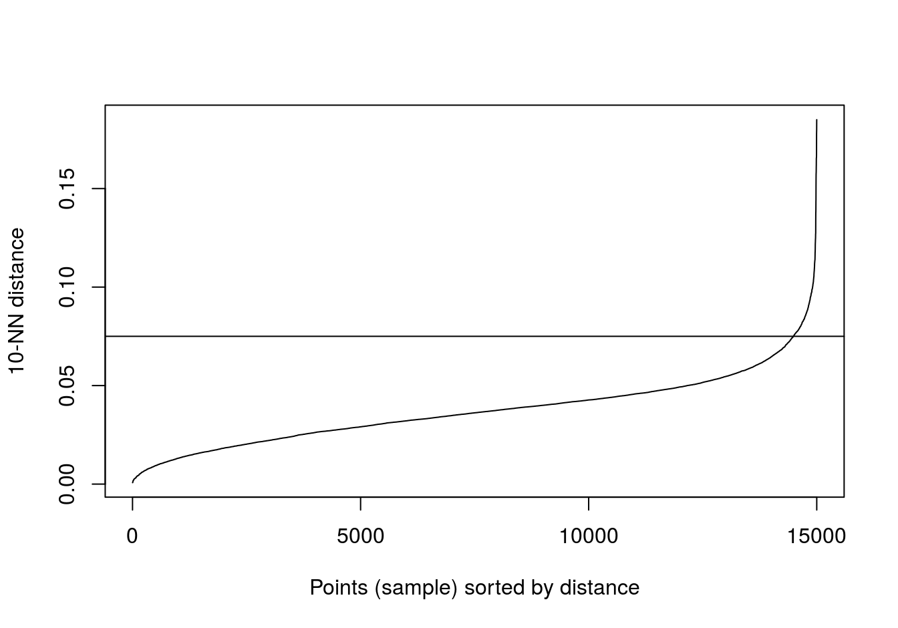
<p class="caption">10-nearest neighbour distances for the noisy moons data set</p>
</div>


```r
res <- dbscan::dbscan(noisy_moons[,1:2], eps=0.075, minPts = 10)
table(res$cluster)
```

```
## 
##   0   1   2 
##   8 748 744
```


```r
plot_dbscan_clusters(noisy_moons, res)
```

<div class="figure" style="text-align: center">
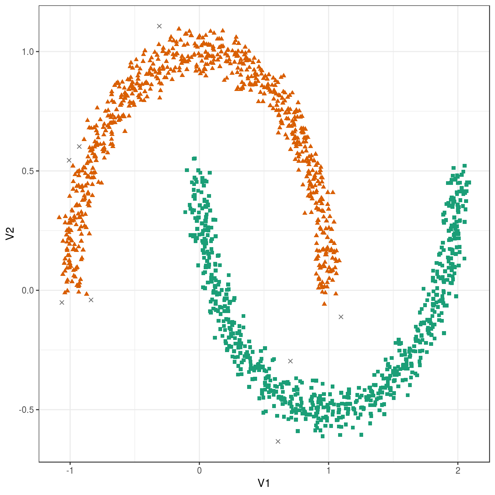
<p class="caption">DBSCAN clustering (eps=0.075, minPts=10) of the noisy moons data set. Outlier observations are shown as grey crosses.</p>
</div>


#### Different density


```r
diff_density <- read.csv("data/example_clusters/different_density.csv", header=F)
kNNdistplot(diff_density[,1:2], k=10)
abline(h=0.9)
abline(h=0.6, lty=2)
```

<div class="figure" style="text-align: center">
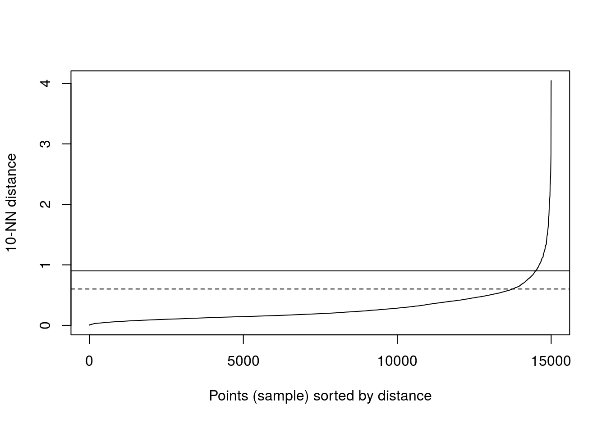
<p class="caption">10-nearest neighbour distances for the different density distributions data set</p>
</div>


```r
res <- dbscan::dbscan(diff_density[,1:2], eps=0.9, minPts = 10)
table(res$cluster)
```

```
## 
##    0    1 
##   40 1460
```


```r
plot_dbscan_clusters(diff_density, res)
```

<div class="figure" style="text-align: center">
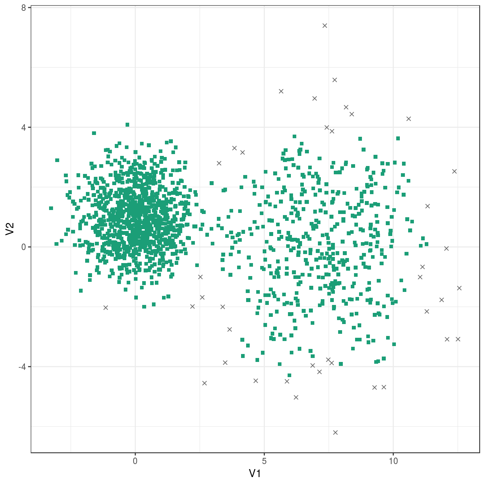
<p class="caption">DBSCAN clustering of the different density distribution data set with eps=0.9 and minPts=10. Outlier observations are shown as grey crosses.</p>
</div>


```r
res <- dbscan::dbscan(diff_density[,1:2], eps=0.6, minPts = 10)
table(res$cluster)
```

```
## 
##   0   1   2 
## 109 399 992
```


```r
plot_dbscan_clusters(diff_density, res)
```

<div class="figure" style="text-align: center">

<p class="caption">DBSCAN clustering of the different density distribution data set with eps=0.6 and minPts=10. Outlier observations are shown as grey crosses.</p>
</div>


#### Anisotropic distributions


```r
aniso <- read.csv("data/example_clusters/aniso.csv", header=F)
kNNdistplot(aniso[,1:2], k=10)
abline(h=0.35)
```

<div class="figure" style="text-align: center">
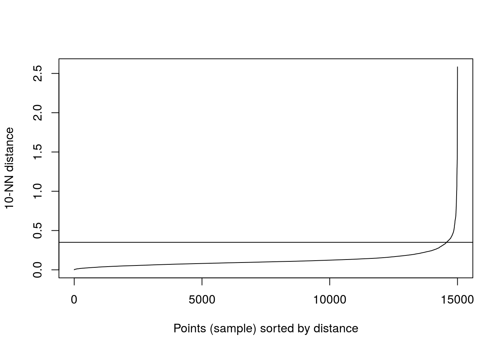
<p class="caption">10-nearest neighbour distances for the anisotropic distributions data set</p>
</div>


```r
res <- dbscan::dbscan(aniso[,1:2], eps=0.35, minPts = 10)
table(res$cluster)
```

```
## 
##   0   1   2   3 
##  29 489 488 494
```


```r
plot_dbscan_clusters(aniso, res)
```

<div class="figure" style="text-align: center">
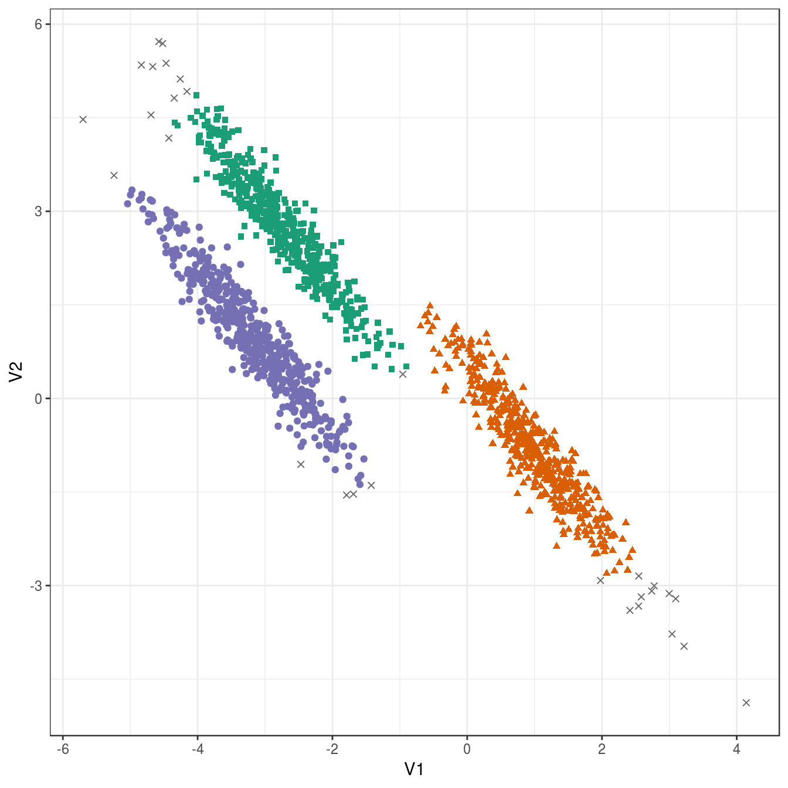
<p class="caption">DBSCAN clustering (eps=0.3, minPts=10) of the anisotropic distributions data set. Outlier observations are shown as grey crosses.</p>
</div>


#### No structure


```r
no_structure <- read.csv("data/example_clusters/no_structure.csv", header=F)
kNNdistplot(no_structure[,1:2], k=10)
abline(h=0.057)
```

<div class="figure" style="text-align: center">
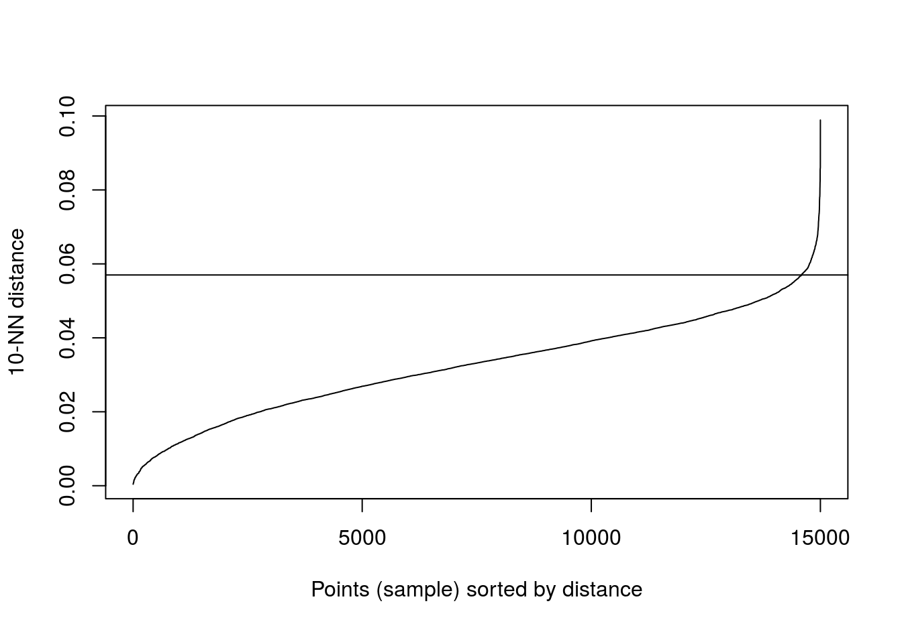
<p class="caption">10-nearest neighbour distances for the data set with no structure.</p>
</div>


```r
res <- dbscan::dbscan(no_structure[,1:2], eps=0.57, minPts = 10)
table(res$cluster)
```

```
## 
##    1 
## 1500
```

<!--No need for scatter plot-->


### Example: gene expression profiling of human tissues
Returning again to the data on gene expression of human tissues.

```r
load("data/tissues_gene_expression/tissuesGeneExpression.rda")
```


```r
table(tissue)
```

```
## tissue
##  cerebellum       colon endometrium hippocampus      kidney       liver 
##          38          34          15          31          39          26 
##    placenta 
##           6
```

We'll try k=5 (default for dbscan), because there are only six observations for placenta.


```r
kNNdistplot(t(e), k=5)
abline(h=85)
```

<div class="figure" style="text-align: center">
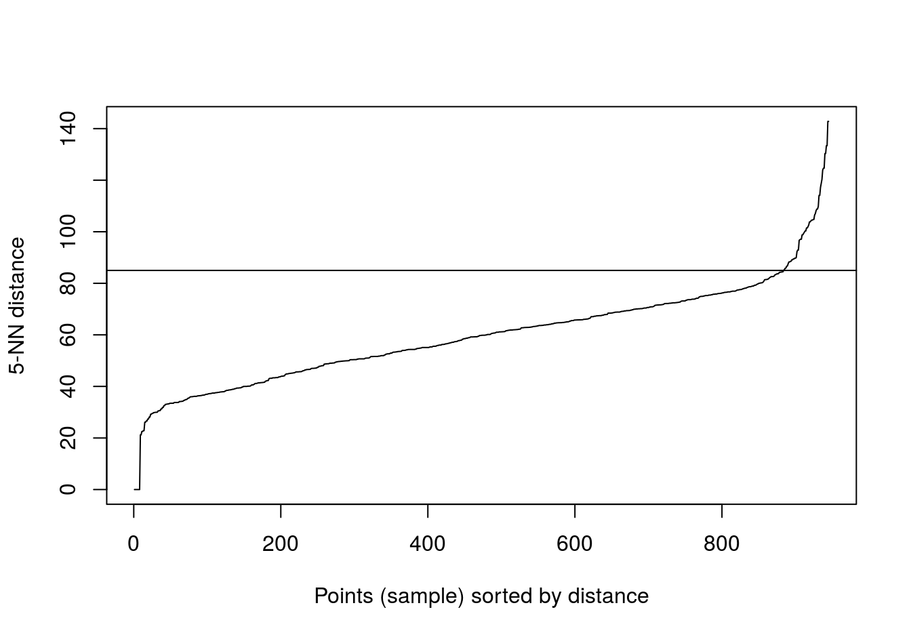
<p class="caption">Five-nearest neighbour distances for the gene expression profiling of human tissues data set.</p>
</div>


```r
set.seed(42)
res <- dbscan::dbscan(t(e), eps=85, minPts=5)
table(res$cluster)
```

```
## 
##  0  1  2  3  4  5  6 
## 12 37 62 34 24 15  5
```

```r
table(tissue, res$cluster)
```

```
##              
## tissue         0  1  2  3  4  5  6
##   cerebellum   2  0 31  0  0  0  5
##   colon        0  0  0 34  0  0  0
##   endometrium  0  0  0  0  0 15  0
##   hippocampus  0  0 31  0  0  0  0
##   kidney       2 37  0  0  0  0  0
##   liver        2  0  0  0 24  0  0
##   placenta     6  0  0  0  0  0  0
```


```r
pca <- prcomp(t(e))
ggplot(data=as.data.frame(pca$x), aes(PC1,PC2)) + 
  geom_point(col=brewer.pal(8,"Dark2")[c(8,1:7)][res$cluster+1], 
             shape=c(48:55)[res$cluster+1], size=5) + 
  theme_bw()
```

<div class="figure" style="text-align: center">
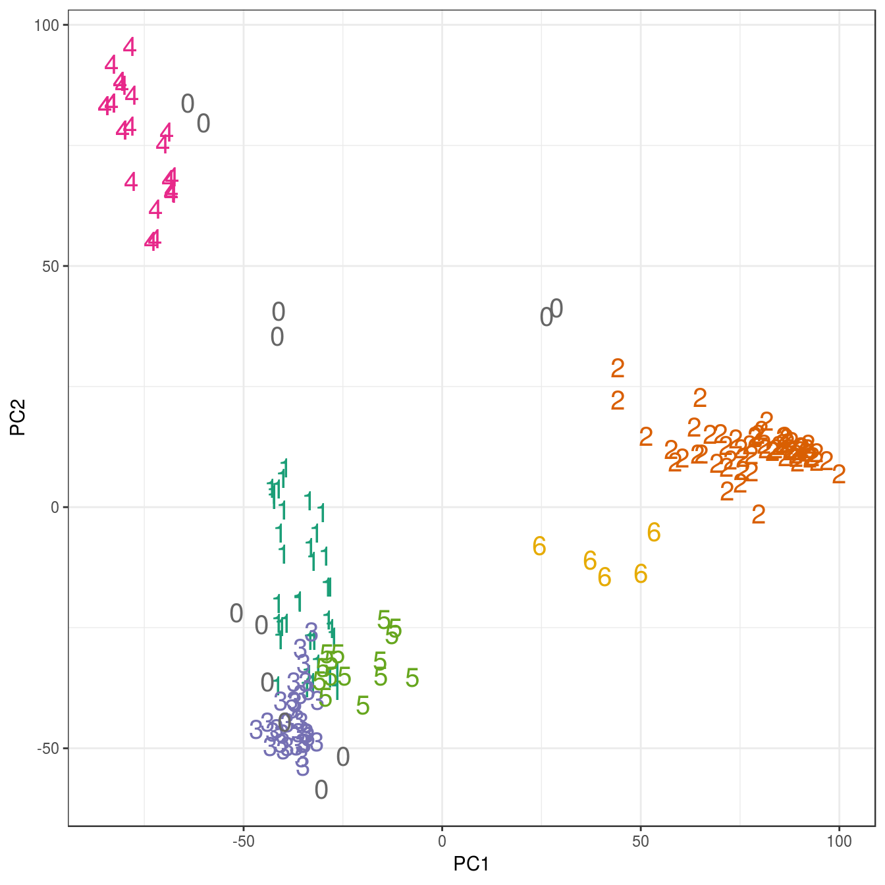
<p class="caption">Clustering of human tissue gene expression: scatterplot of first two principal components.</p>
</div>


## Evaluating cluster quality
<!--
http://scikit-learn.org/stable/auto_examples/cluster/plot_kmeans_silhouette_analysis.html
-->

### Silhouette method {#silhouetteMethod}

**Silhouette**
\begin{equation}
  s(i) = \frac{b(i) - a(i)}{max\left(a(i),b(i)\right)}
  (\#eq:silhouette)
\end{equation}

Where

* _a(i)_ - average dissimmilarity of _i_ with all other data within the cluster. _a(i)_ can be interpreted as how well _i_ is assigned to its cluster (the smaller the value, the better the assignment).
* _b(i)_ - the lowest average dissimilarity of _i_ to any other cluster, of which _i_ is not a member.

Observations with a large _s(i)_ (close to 1) are very well clustered. Observations lying between clusters will have a small _s(i)_ (close to 0). If an observation has a negative _s(i)_, it has probably been placed in the wrong cluster. 

### Example - k-means clustering of blobs data set
Load library required for calculating silhouette coefficients and plotting silhouettes.

```r
library(cluster)
```

We are going to take another look at k-means clustering of the blobs data-set (figure \@ref(fig:kmeansRangeK)). Specifically we are going to see if silhouette analysis supports our original choice of k=3 as the optimum number of clusters (figure \@ref(fig:choosingKplot)).

Silhouette analysis requires a minimum of two clusters, so we'll try values of k from 2 to 9.

```r
k <- 2:9
```
Create a palette of colours for plotting.

```r
kColours <- brewer.pal(9,"Set1")
```
Perform k-means clustering for each value of k from 2 to 9.

```r
res <- lapply(k, function(i){kmeans(blobs[,1:2], i, nstart=50)})
```

Calculate the Euclidean distance matrix

```r
d <- dist(blobs[,1:2])
```

Silhouette plot for k=2

```r
s2 <- silhouette(res[[2-1]]$cluster, d)
plot(s2, border=NA, col=kColours[sort(res[[2-1]]$cluster)], main="")
```

<div class="figure" style="text-align: center">
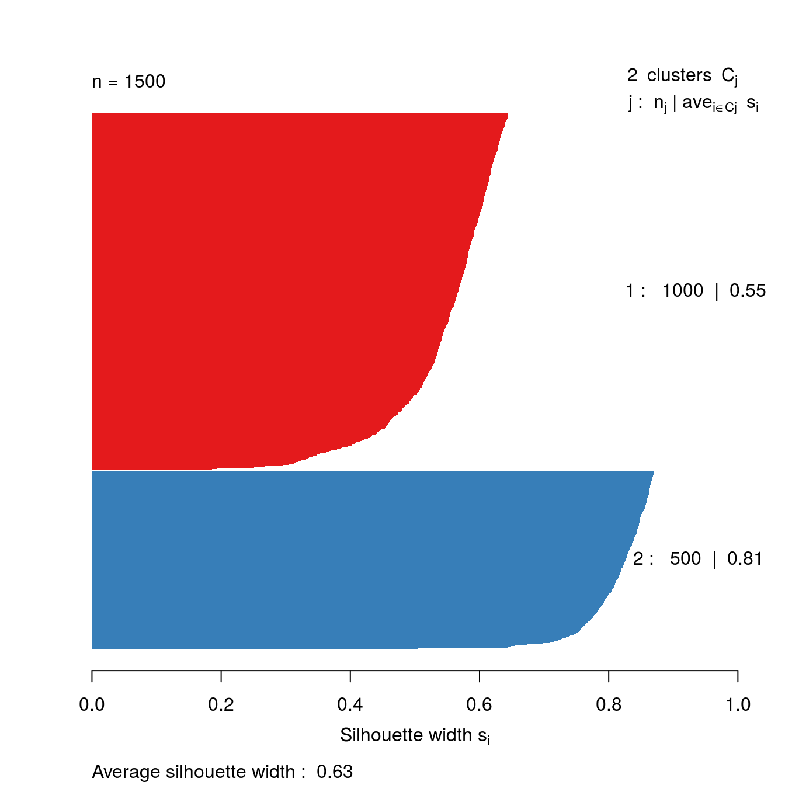
<p class="caption">Silhouette plot for k-means clustering of the blobs data set with k=2.</p>
</div>

Silhouette plot for k=9

```r
s9 <- silhouette(res[[9-1]]$cluster, d)
plot(s9, border=NA, col=kColours[sort(res[[9-1]]$cluster)], main="")
```

<div class="figure" style="text-align: center">
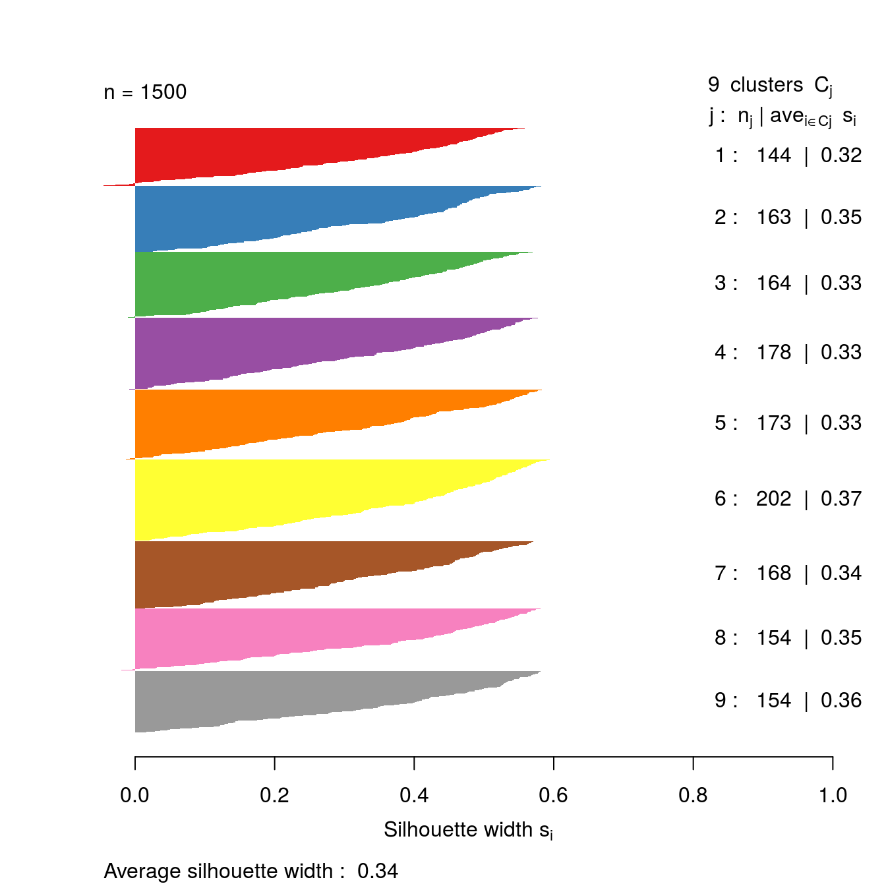
<p class="caption">Silhouette plot for k-means clustering of the blobs data set with k=9.</p>
</div>

Let's take a look at the silhouette plot for k=3.

```r
s3 <- silhouette(res[[3-1]]$cluster, d)
plot(s3, border=NA, col=kColours[sort(res[[3-1]]$cluster)], main="")
```

<div class="figure" style="text-align: center">
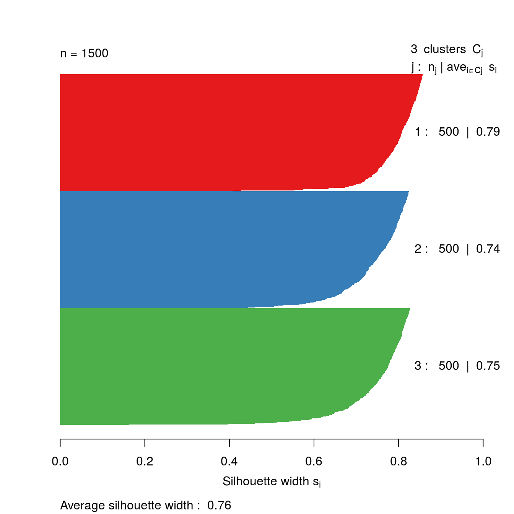
<p class="caption">Silhouette plot for k-means clustering of the blobs data set with k=3.</p>
</div>

So far the silhouette plots have shown that k=3 appears to be the optimum number of clusters, but we should investigate the silhouette coefficients at other values of k. Rather than produce a silhouette plot for each value of k, we can get a useful summary by making a barplot of average silhouette coefficients.

First we will calculate the silhouette coefficient for every observation (we need to index our list of **kmeans** outputs by ```i-1```, because we are counting from k=2 ).

```r
s <- lapply(k, function(i){silhouette(res[[i-1]]$cluster, d)})
```
We can then calculate the mean silhouette coefficient for each value of k from 2 to 9.

```r
avgS <- sapply(s, function(x){mean(x[,3])})
```
Now we have the data we need to produce a barplot.

```r
dat <- data.frame(k, avgS)
ggplot(data=dat, aes(x=k, y=avgS)) + 
         geom_bar(stat="identity", fill="steelblue") +
  geom_text(aes(label=round(avgS,2)), vjust=1.6, color="white", size=3.5)+
  labs(y="Average silhouette coefficient") +
  scale_x_continuous(breaks=2:9) +
  theme_bw()
```

<div class="figure" style="text-align: center">
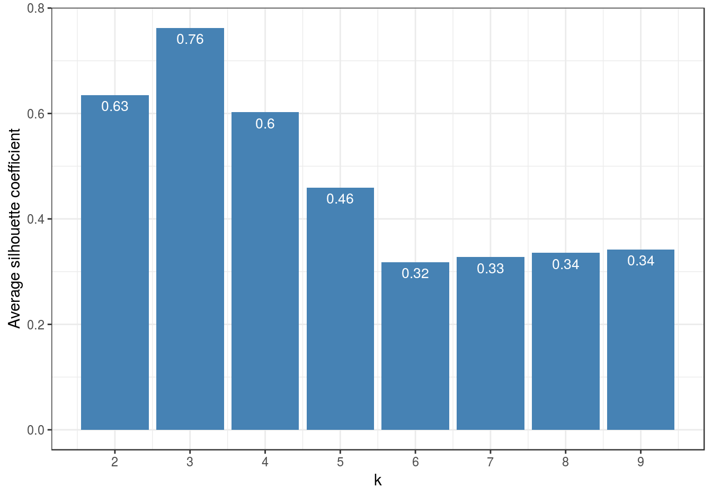
<p class="caption">Barplot of the average silhouette coefficients resulting from k-means clustering of the blobs data-set using values of k from 1-9.</p>
</div>

The bar plot (figure \@ref(fig:silhouetteAllK)) confirms that the optimum number of clusters is three.

### Example - DBSCAN clustering of noisy moons
<!--
Read data

```r
noisy_moons <- read.csv("data/example_clusters/noisy_moons.csv", header=F)
```
-->
The clusters that DBSCAN found in the noisy moons data set are shown in figure \@ref(fig:noisyMoonsDBSCANscatter).

Let's repeat clustering, because the original result is no longer in memory.

```r
res <- dbscan::dbscan(noisy_moons[,1:2], eps=0.075, minPts = 10)
```

Identify noise points as we do not want to include these in the silhouette analysis

```r
# identify and remove noise points
noise <- res$cluster==0
```

Remove noise points from cluster results

```r
clusters <- res$cluster[!noise]
```

Generate distance matrix from ```noisy_moons``` data.frame, exluding noise points.

```r
d <- dist(noisy_moons[!noise,1:2])
```

Silhouette analysis

```r
clusterColours <- brewer.pal(9,"Set1")
sil <- silhouette(clusters, d)
plot(sil, border=NA, col=clusterColours[sort(clusters)], main="")
```

<div class="figure" style="text-align: center">
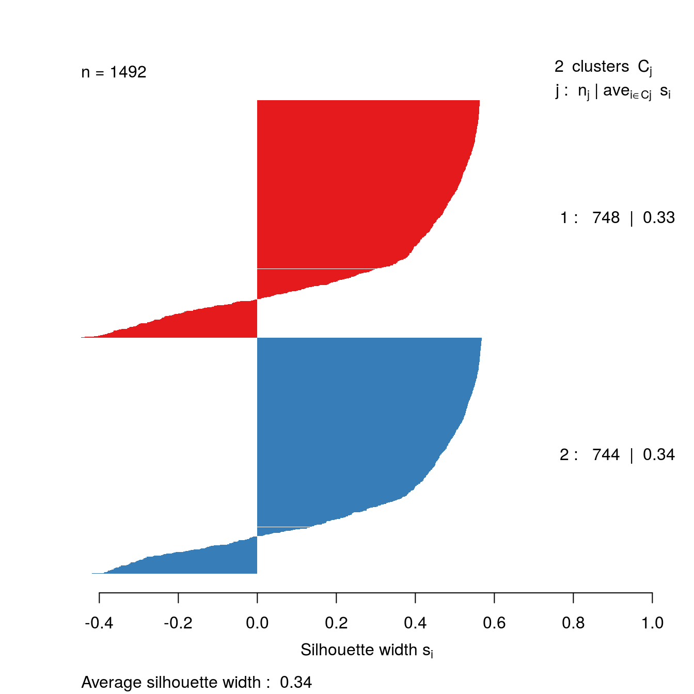
<p class="caption">Silhouette plot for DBSCAN clustering of the noisy moons data set.</p>
</div>

The silhouette analysis suggests that DBSCAN has found clusters of poor quality in the noisy moons data set. However, we saw by eye that it it did a good job of deliminiting the two clusters. The result demonstrates that the silhouette method is less useful when dealing with clusters that are defined by density, rather than inertia.


## Exercises

### Exercise 1 {#clusteringEx1}

Image segmentation is used to partition digital images into distinct regions containing pixels with similar attributes. Applications include identifying objects or structures in biomedical images. The aim of this exercise is to use k-means clustering to segment the image of a histological section of lung tissue (figure \@ref(fig:lungHistology)) into distinct biological structures, based on pixel colour.

<div class="figure" style="text-align: center">
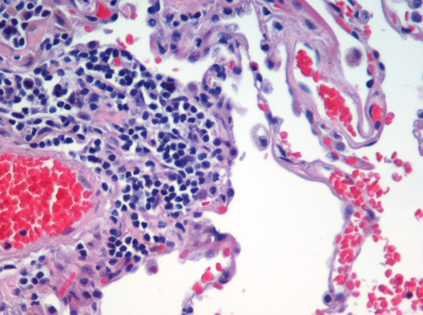
<p class="caption">Image of haematoxylin and eosin (H&E) stained section of lung tissue from a patient with end-stage emphysema. CC BY 2.0, https://commons.wikimedia.org/w/index.php?curid=437645.</p>
</div>

The haematoxylin and eosin (H & E) staining reveals four types of biological objects, identified by the following colours:

* blue-purple: cell nuclei
* red: red blood cells
* pink: other cell bodies and extracellular material
* white: air spaces

**Consider the following questions:**

* Can k-means clustering find the four biological objects in the image based on pixel colour? 
* Earlier we saw that if we plot the total within-cluster sum of squares against k, the position of the "elbow" is a useful guide to choosing the appropriate value of k (see section \@ref(choosingK). According to the "elbow" method, how many distinct clusters (colours) of pixels are present in the image?

**Hints:**
If you haven't worked with images in R before, you may find the following information helpful.

The package [EBImage](https://bioconductor.org/packages/EBImage/) provides a suite of tools for working with images. We will use it to read the file containing the image of the lung section.

<!--EBImage needs methods library, but doesn't import it -->


```r
library(EBImage)
```

```
## 
## Attaching package: 'EBImage'
```

```
## The following object is masked from 'package:dendextend':
## 
##     rotate
```

```r
library(methods)
img <- readImage("data/histology/Emphysema_H_and_E.jpg")
```

```img``` is an object of the [EBImage](https://bioconductor.org/packages/EBImage/) class Image; it is essentially a multidimensional array containing the pixel intensities. To see the dimensions of the array, run:

```r
dim(img)
```

```
## [1] 528 393   3
```

In the case of this colour image, the array is 3-dimensional with 528 x 393 x 3 elements. These dimensions correspond to the image width (in pixels), image height and number of colour channels, respectively. The colour channels are red, green and blue (RGB). 

Before we can cluster the pixels on colour, we need to convert the 3D array into a 2D data.frame (or matrix). Specifically, we require a data.frame (or matrix) where rows represent pixels and there is a column for the intensity of each of the three colour channels. We also need columns for the x and y coordinates of each pixel.


```r
imgDim <- dim(img)
imgDF <- data.frame(
  x = rep(1:imgDim[1], imgDim[2]),
  y = rep(imgDim[2]:1, each=imgDim[1]),
  r = as.vector(img[,,1]),
  g = as.vector(img[,,2]),
  b = as.vector(img[,,3])
)
```

If the data in ```imgDF``` are correct, we should be able to display the image using ggplot:

```r
ggplot(data = imgDF, aes(x = x, y = y)) + 
  geom_point(colour = rgb(imgDF[c("r", "g", "b")])) +
  xlab("x") +
  ylab("y") +
  theme_minimal()
```

<div class="figure" style="text-align: center">
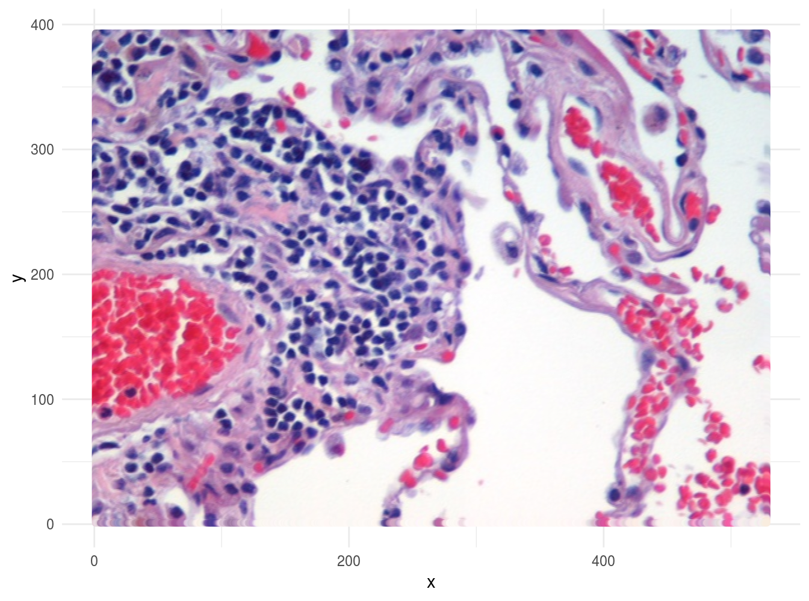
<p class="caption">Image of lung tissue recreated from reshaped data.</p>
</div>

This should be all the information you need to perform this exercise.


**Solutions to exercises can be found in appendix \@ref(solutions-clustering).**


