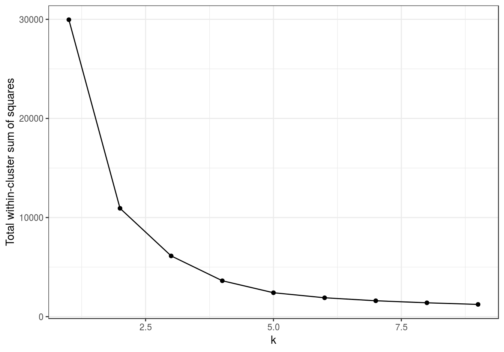
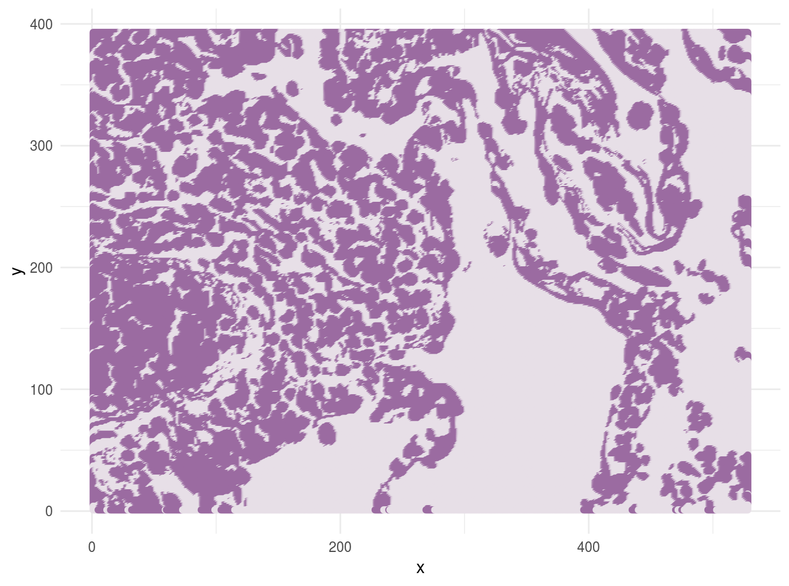
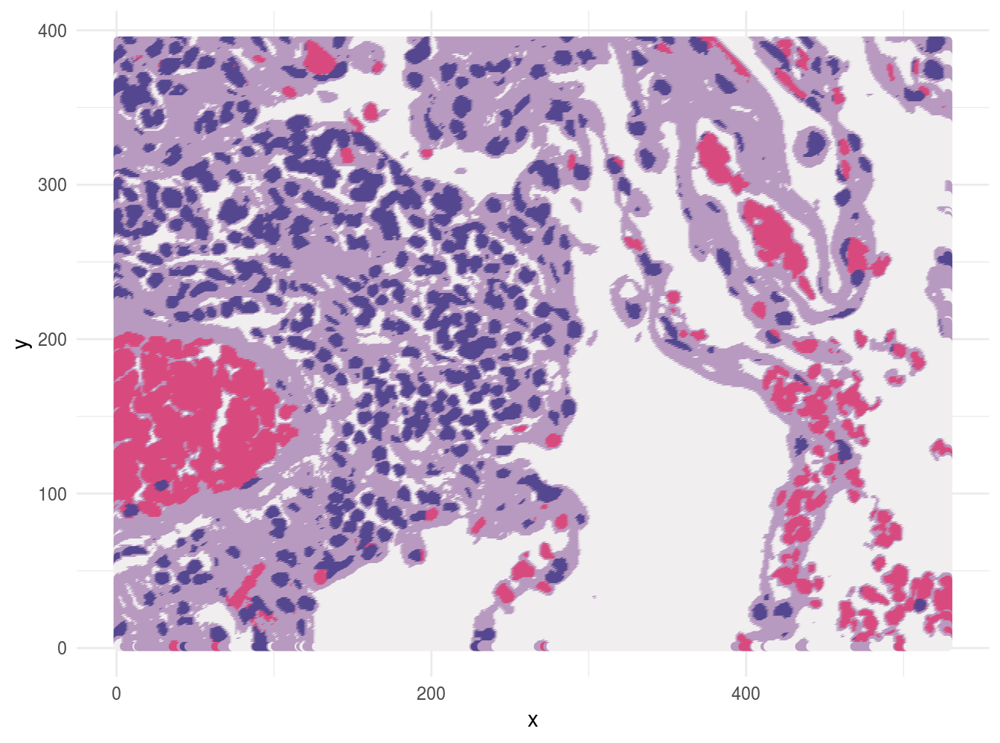

# Solutions ch. 4 - Clustering {#solutions-clustering}

Solutions to exercises of chapter \@ref(clustering). 

<!--
set.seed(42)
dbscanRes <- dbscan::dbscan(t(e), eps=85, minPts=5)


d <- dist((t(e)[dbscanRes$cluster>0,]))

dbscanS <- silhouette(dbscanRes$cluster[dbscanRes$cluster>0], d)
plot(dbscanS, col="black")

-->


## Exercise 1

First we need to read the image data and transform it into a suitable format for analysis:

```r
library(EBImage)
library(ggplot2)


img <- readImage("data/histology/Emphysema_H_and_E.jpg")

imgDim <- dim(img)

imgDF <- data.frame(
  x = rep(1:imgDim[1], imgDim[2]),
  y = rep(imgDim[2]:1, each=imgDim[1]),
  r = as.vector(img[,,1]),
  g = as.vector(img[,,2]),
  b = as.vector(img[,,3])
)
```

Next we will perform kmeans clustering for k in the range 1:9. This is computationally quite intensive, so we'll use parallel processing:

```r
library(doMC)
```

```
## Loading required package: foreach
```

```
## Loading required package: iterators
```

```
## Loading required package: parallel
```

```r
registerDoMC(detectCores())
k=1:9
set.seed(42)
res <- foreach(
  i=k, 
  .options.multicore=list(set.seed=FALSE)) %dopar% kmeans(imgDF[,c("r", "g", "b")], i, nstart=50)
```

We can now plot total within-cluster sum of squares against k:

```r
plot_tot_withinss <- function(kmeans_output){
  tot_withinss <- sapply(k, function(i){kmeans_output[[i]]$tot.withinss})
  qplot(k, tot_withinss, geom=c("point", "line"), 
        ylab="Total within-cluster sum of squares") + theme_bw()
}

plot_tot_withinss(res)
```

<div class="figure" style="text-align: center">

<p class="caption">(\#fig:imageAnalysisElbowPlot)Variance within the clusters of pixels. Total within-cluster sum of squares plotted against k.</p>
</div>

The plot of total within-cluster sum of squares against k (figure \@ref(fig:imageAnalysisElbowPlot)) shows an elbow at k=2, indicating that most of the variance in the image can be described by just two clusters. Let's plot the clusters for k=2.


```r
clusterColours <- rgb(res[[2]]$centers) 
ggplot(data = imgDF, aes(x = x, y = y)) + 
  geom_point(colour = clusterColours[res[[2]]$cluster]) +
  xlab("x") +
  ylab("y") +
  theme_minimal()
```

<div class="figure" style="text-align: center">

<p class="caption">(\#fig:pixelClustersK2)Result of k-means clustering of pixels based on colour for k=2.</p>
</div>

Segmentation of the image with k=2 separates air-spaces from all other objects (figure \@ref(fig:pixelClustersK2)). Therefore, the difference in pixel colour between the air-spaces and other objects accounts for most of the variance in the data-set (image).

Let's now take a look at a segmentation of the image using k=4.

```r
clusterColours <- rgb(res[[4]]$centers) 
ggplot(data = imgDF, aes(x = x, y = y)) + 
  geom_point(colour = clusterColours[res[[4]]$cluster]) +
  xlab("x") +
  ylab("y") +
  theme_minimal()
```

<div class="figure" style="text-align: center">

<p class="caption">(\#fig:pixelClustersK4)Result of k-means clustering of pixels based on colour for k=4.</p>
</div>

K-means clustering with k=4 rapidly and effectively segments the image of the histological section into the biological objects we can see by eye. A manual segmentation of the same image would be very laborious. This exercise highlights the importance of using biological insight to choose a sensible value of k.

*N.B.* the cluster centres provide the mean pixel intensities for the red, green and blue channels and we have used this information to colour the pixels belonging to each cluster (figure \@ref(fig:pixelClustersK4)).


