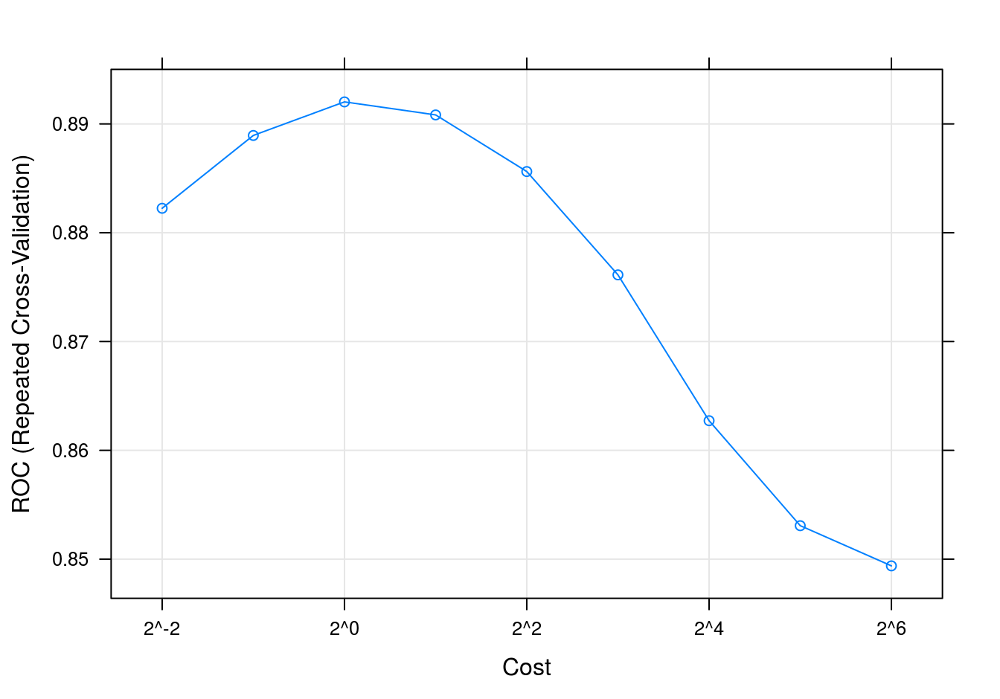
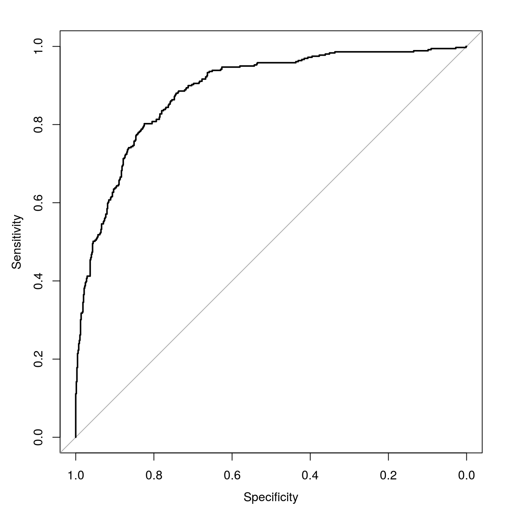

# Solutions ch. 6 - Support vector machines {#solutions-svm}

Solutions to exercises of chapter \@ref(svm).

## Exercise 1

Load required libraries

```r
library(caret)
```

```
## Loading required package: lattice
```

```
## Loading required package: ggplot2
```

```r
library(doMC)
```

```
## Loading required package: foreach
```

```
## Loading required package: iterators
```

```
## Loading required package: parallel
```

```r
library(pROC)
```

```
## Type 'citation("pROC")' for a citation.
```

```
## 
## Attaching package: 'pROC'
```

```
## The following objects are masked from 'package:stats':
## 
##     cov, smooth, var
```

```r
library(e1071)
```

Define a radial SVM using the e1071 library

```r
svmRadialE1071 <- list(
  label = "Support Vector Machines with Radial Kernel - e1071",
  library = "e1071",
  type = c("Regression", "Classification"),
  parameters = data.frame(parameter="cost",
                          class="numeric",
                          label="Cost"),
  grid = function (x, y, len = NULL, search = "grid") 
    {
      if (search == "grid") {
        out <- expand.grid(cost = 2^((1:len) - 3))
      }
      else {
        out <- data.frame(cost = 2^runif(len, min = -5, max = 10))
      }
      out
    },
  loop=NULL,
  fit=function (x, y, wts, param, lev, last, classProbs, ...) 
    {
      if (any(names(list(...)) == "probability") | is.numeric(y)) {
        out <- e1071::svm(x = as.matrix(x), y = y, kernel = "radial", 
                          cost = param$cost, ...)
      }
      else {
        out <- e1071::svm(x = as.matrix(x), y = y, kernel = "radial", 
                          cost = param$cost, probability = classProbs, ...)
      }
      out
    },
  predict = function (modelFit, newdata, submodels = NULL) 
    {
      predict(modelFit, newdata)
    },
  prob = function (modelFit, newdata, submodels = NULL) 
    {
      out <- predict(modelFit, newdata, probability = TRUE)
      attr(out, "probabilities")
    },
  predictors = function (x, ...) 
    {
      out <- if (!is.null(x$terms)) 
        predictors.terms(x$terms)
      else x$xNames
      if (is.null(out)) 
        out <- names(attr(x, "scaling")$x.scale$`scaled:center`)
      if (is.null(out)) 
        out <- NA
      out
    },
  tags = c("Kernel Methods", "Support Vector Machines", "Regression", "Classifier", "Robust Methods"),
  levels = function(x) x$levels,
  sort = function(x)
  {
    x[order(x$cost), ]
  }
)
```

Setup parallel processing

```r
registerDoMC(detectCores())
getDoParWorkers()
```

```
## [1] 8
```

Load data

```r
data(segmentationData)
```


```r
segClass <- segmentationData$Class
```

Extract predictors from segmentationData

```r
segData <- segmentationData[,4:59]
```

Partition data

```r
set.seed(42)
trainIndex <- createDataPartition(y=segClass, times=1, p=0.5, list=F)
segDataTrain <- segData[trainIndex,]
segDataTest <- segData[-trainIndex,]
segClassTrain <- segClass[trainIndex]
segClassTest <- segClass[-trainIndex]
```

Set seeds for reproducibility (optional). We will be trying 9 values of the tuning parameter with 5 repeats of 10 fold cross-validation, so we need the following list of seeds.

```r
set.seed(42)
seeds <- vector(mode = "list", length = 51)
for(i in 1:50) seeds[[i]] <- sample.int(1000, 9)
seeds[[51]] <- sample.int(1000,1)
```

We will pass the twoClassSummary function into model training through **trainControl**. Additionally we would like the model to predict class probabilities so that we can calculate the ROC curve, so we use the **classProbs** option. 

```r
cvCtrl <- trainControl(method = "repeatedcv", 
                       repeats = 5,
                       number = 10,
                       summaryFunction = twoClassSummary,
                       classProbs = TRUE,
                       seeds=seeds)
```

Tune SVM over the cost parameter. The default grid of cost parameters start at 0.25 and double at each iteration. Choosing ```tuneLength = 9``` will give us cost parameters of 0.25, 0.5, 1, 2, 4, 8, 16, 32 and 64. The train function will calculate an appropriate value of sigma (the kernel parameter) from the data.

```r
svmTune <- train(x = segDataTrain,
                 y = segClassTrain,
                 method = svmRadialE1071,
                 tuneLength = 9,
                 preProc = c("center", "scale"),
                 metric = "ROC",
                 trControl = cvCtrl)

svmTune
```

```
## Support Vector Machines with Radial Kernel - e1071 
## 
## 1010 samples
##   56 predictors
##    2 classes: 'PS', 'WS' 
## 
## Pre-processing: centered (56), scaled (56) 
## Resampling: Cross-Validated (10 fold, repeated 5 times) 
## Summary of sample sizes: 909, 909, 909, 909, 909, 909, ... 
## Resampling results across tuning parameters:
## 
##   cost   ROC        Sens       Spec     
##    0.25  0.8822479  0.8744615  0.6788889
##    0.50  0.8889402  0.8704615  0.7111111
##    1.00  0.8920256  0.8729231  0.7283333
##    2.00  0.8908291  0.8630769  0.7494444
##    4.00  0.8856239  0.8566154  0.7494444
##    8.00  0.8761282  0.8443077  0.7422222
##   16.00  0.8627265  0.8372308  0.7200000
##   32.00  0.8530769  0.8415385  0.6988889
##   64.00  0.8493846  0.8406154  0.6916667
## 
## ROC was used to select the optimal model using the largest value.
## The final value used for the model was cost = 1.
```


```r
svmTune$finalModel
```

```
## 
## Call:
## svm.default(x = as.matrix(x), y = y, kernel = "radial", cost = param$cost, 
##     probability = classProbs)
## 
## 
## Parameters:
##    SVM-Type:  C-classification 
##  SVM-Kernel:  radial 
##        cost:  1 
##       gamma:  0.01785714 
## 
## Number of Support Vectors:  531
```

SVM accuracy profile

```r
plot(svmTune, metric = "ROC", scales = list(x = list(log =2)))
```

<div class="figure" style="text-align: center">

<p class="caption">(\#fig:svmAccuracyProfileCellSegment)SVM accuracy profile.</p>
</div>

Test set results

```r
#segDataTest <- predict(transformations, segDataTest)
svmPred <- predict(svmTune, segDataTest)
confusionMatrix(svmPred, segClassTest)
```

```
## Confusion Matrix and Statistics
## 
##           Reference
## Prediction  PS  WS
##         PS 571 103
##         WS  79 256
##                                           
##                Accuracy : 0.8196          
##                  95% CI : (0.7945, 0.8429)
##     No Information Rate : 0.6442          
##     P-Value [Acc > NIR] : < 2e-16         
##                                           
##                   Kappa : 0.6005          
##  Mcnemar's Test P-Value : 0.08822         
##                                           
##             Sensitivity : 0.8785          
##             Specificity : 0.7131          
##          Pos Pred Value : 0.8472          
##          Neg Pred Value : 0.7642          
##              Prevalence : 0.6442          
##          Detection Rate : 0.5659          
##    Detection Prevalence : 0.6680          
##       Balanced Accuracy : 0.7958          
##                                           
##        'Positive' Class : PS              
## 
```

Get predicted class probabilities

```r
svmProbs <- predict(svmTune, segDataTest, type="prob")
head(svmProbs)
```

```
##           PS         WS
## 3  0.2304335 0.76956646
## 5  0.9334686 0.06653138
## 9  0.7495523 0.25044774
## 10 0.8312666 0.16873341
## 13 0.9445697 0.05543032
## 14 0.7674554 0.23254457
```

Build a ROC curve

```r
svmROC <- roc(segClassTest, svmProbs[,"PS"])
auc(svmROC)
```

```
## Area under the curve: 0.8864
```

Plot ROC curve.

```r
plot(svmROC, type = "S")
```

<div class="figure" style="text-align: center">

<p class="caption">(\#fig:svmROCcurveCellSegment)SVM ROC curve for cell segmentation data set.</p>
</div>

Calculate area under ROC curve

```r
auc(svmROC)
```

```
## Area under the curve: 0.8864
```


