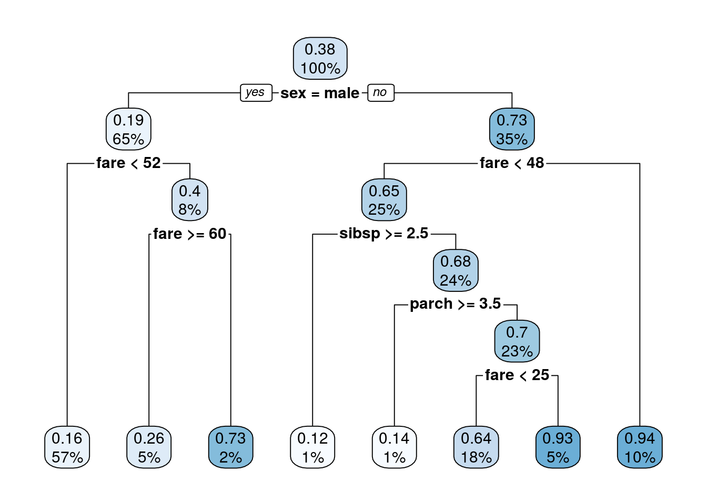
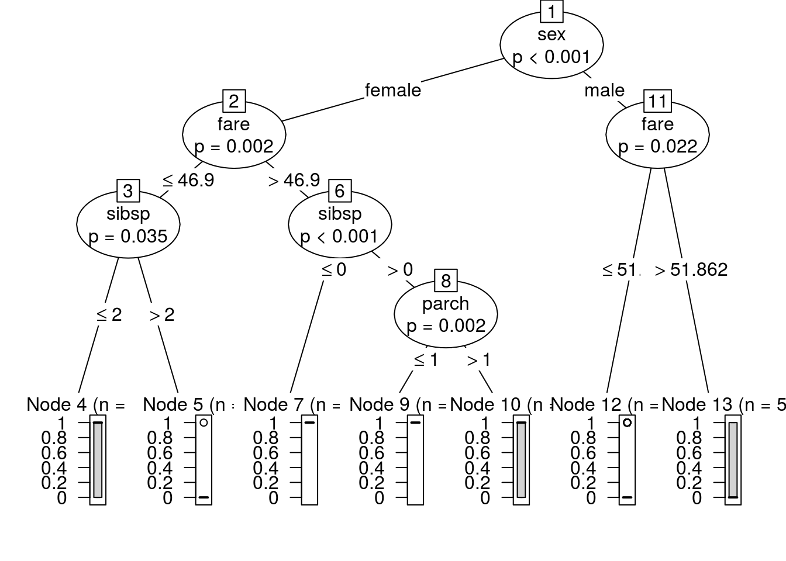
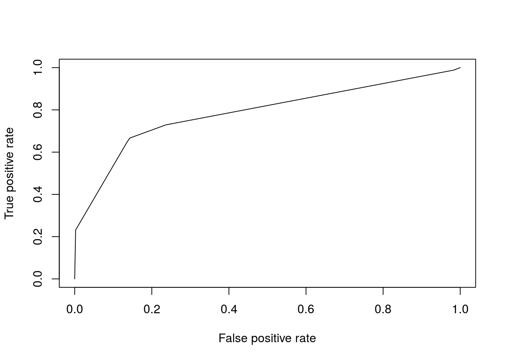

# Solutions ch. 9 - Decision trees and random forests {#solutions-decision-trees}

Solutions to exercises of chapter \@ref(decision-trees).

## Exercise 1

**Load the necessary packages**\
readr to read in the data\
dplyr to process data\
party and rpart for the classification tree algorithms 


```r
library(readr)
library(dplyr)
```

```
## 
## Attaching package: 'dplyr'
```

```
## The following objects are masked from 'package:stats':
## 
##     filter, lag
```

```
## The following objects are masked from 'package:base':
## 
##     intersect, setdiff, setequal, union
```

```r
library(party)
```

```
## Loading required package: grid
```

```
## Loading required package: mvtnorm
```

```
## Loading required package: modeltools
```

```
## Loading required package: stats4
```

```
## Loading required package: strucchange
```

```
## Loading required package: zoo
```

```
## 
## Attaching package: 'zoo'
```

```
## The following objects are masked from 'package:base':
## 
##     as.Date, as.Date.numeric
```

```
## Loading required package: sandwich
```

```r
library(rpart)
library(rpart.plot)
library(ROCR)
```

```
## Loading required package: gplots
```

```
## 
## Attaching package: 'gplots'
```

```
## The following object is masked from 'package:stats':
## 
##     lowess
```

```r
set.seed(100)
```

**Select features that may explain survival**

Each row in the data is a passenger. Columns are features:

survived: 0 if died, 1 if survived\
embarked: Port of Embarkation (Cherbourg, Queenstown,Southampton)\
sex: Gender\
sibsp: Number of Siblings/Spouses Aboard\
parch: Number of Parents/Children Aboard\
fare: Fare Payed

**Make categorical features should be made into factors**


```r
titanic3 <- "https://goo.gl/At238b" %>%
  read_csv %>% # read in the data
  select(survived, embarked, sex, 
         sibsp, parch, fare) %>%
  mutate(embarked = factor(embarked),
         sex = factor(sex))
```

```
## Parsed with column specification:
## cols(
##   pclass = col_character(),
##   survived = col_double(),
##   name = col_character(),
##   sex = col_character(),
##   age = col_double(),
##   sibsp = col_double(),
##   parch = col_double(),
##   ticket = col_character(),
##   fare = col_double(),
##   cabin = col_character(),
##   embarked = col_character(),
##   boat = col_character(),
##   body = col_double(),
##   home.dest = col_character()
## )
```

```r
#load("/Users/robertness/Downloads/titanic.Rdata")
```

**Split data into training and test sets**


```r
.data <- c("training", "test") %>%
  sample(nrow(titanic3), replace = T) %>%
  split(titanic3, .)
```

**Recursive partitioning is implemented in "rpart" package**


```r
rtree_fit <- rpart(survived ~ ., 
          .data$training) 
rpart.plot(rtree_fit)
```

```
## Warning: Bad 'data' field in model 'call' (expected a data.frame or a matrix).
## To silence this warning:
##     Call rpart.plot with roundint=FALSE,
##     or rebuild the rpart model with model=TRUE.
```



**Conditional partitioning is implemented in the "ctree" method**


```r
tree_fit <- ctree(survived ~ ., 
                  data = .data$training)
plot(tree_fit)
```



**Use ROCR package to visualize ROC Curve and compare methods**


```r
tree_roc <- tree_fit %>%
  predict(newdata = .data$test) %>%
  prediction(.data$test$survived) %>%
  performance("tpr", "fpr")
plot(tree_roc)
```




Acknowledgement: the code for this excersise is from  http://bit.ly/2fqWKvK
