# Solutions chapter 8 - use case 1 {#use-case-1-solutions}

Solutions to exercises of chapter \@ref(use-case-1).

## Preparation

### Load required libraries

```r
library(caret)
```

```
## Loading required package: lattice
```

```
## Loading required package: ggplot2
```

```r
library(doMC)
```

```
## Loading required package: foreach
```

```
## Loading required package: iterators
```

```
## Loading required package: parallel
```

```r
library(corrplot)
```

```
## corrplot 0.84 loaded
```

```r
library(rpart.plot)
```

```
## Loading required package: rpart
```

```r
library(pROC)
```

```
## Type 'citation("pROC")' for a citation.
```

```
## 
## Attaching package: 'pROC'
```

```
## The following objects are masked from 'package:stats':
## 
##     cov, smooth, var
```

### Define SVM model

```r
svmRadialE1071 <- list(
  label = "Support Vector Machines with Radial Kernel - e1071",
  library = "e1071",
  type = c("Regression", "Classification"),
  parameters = data.frame(parameter="cost",
                          class="numeric",
                          label="Cost"),
  grid = function (x, y, len = NULL, search = "grid") 
    {
      if (search == "grid") {
        out <- expand.grid(cost = 2^((1:len) - 3))
      }
      else {
        out <- data.frame(cost = 2^runif(len, min = -5, max = 10))
      }
      out
    },
  loop=NULL,
  fit=function (x, y, wts, param, lev, last, classProbs, ...) 
    {
      if (any(names(list(...)) == "probability") | is.numeric(y)) {
        out <- e1071::svm(x = as.matrix(x), y = y, kernel = "radial", 
                          cost = param$cost, ...)
      }
      else {
        out <- e1071::svm(x = as.matrix(x), y = y, kernel = "radial", 
                          cost = param$cost, probability = classProbs, ...)
      }
      out
    },
  predict = function (modelFit, newdata, submodels = NULL) 
    {
      predict(modelFit, newdata)
    },
  prob = function (modelFit, newdata, submodels = NULL) 
    {
      out <- predict(modelFit, newdata, probability = TRUE)
      attr(out, "probabilities")
    },
  predictors = function (x, ...) 
    {
      out <- if (!is.null(x$terms)) 
        predictors.terms(x$terms)
      else x$xNames
      if (is.null(out)) 
        out <- names(attr(x, "scaling")$x.scale$`scaled:center`)
      if (is.null(out)) 
        out <- NA
      out
    },
  tags = c("Kernel Methods", "Support Vector Machines", "Regression", "Classifier", "Robust Methods"),
  levels = function(x) x$levels,
  sort = function(x)
  {
    x[order(x$cost), ]
  }
)
```

### Setup parallel processing

```r
registerDoMC(detectCores())
getDoParWorkers()
```

```
## [1] 8
```

### Load data

```r
load("data/malaria/malaria.RData")
```

Inspect objects that have been loaded into R session

```r
ls()
```

```
## [1] "infectionStatus" "morphology"      "stage"           "svmRadialE1071"
```

```r
class(morphology)
```

```
## [1] "data.frame"
```

```r
dim(morphology)
```

```
## [1] 1237   23
```

```r
names(morphology)
```

```
##  [1] "Area"                        "Major Axis Length"          
##  [3] "Minor Axis length"           "Eccentricity"               
##  [5] "Mean OPL"                    "Max OPL"                    
##  [7] "Median OPL"                  "Std OPL"                    
##  [9] "Skewness"                    "Kurtosis"                   
## [11] "Variance OPL"                "IQR OPL"                    
## [13] "Optical volume"              "Centroid vs. center of mass"
## [15] "Elongation"                  "Upper quartile OPL"         
## [17] "Perimeter"                   "Equivalent diameter"        
## [19] "Max gradient"                "Mean gradient"              
## [21] "Upper quartile gradient"     "Min symmetry"               
## [23] "Mean symmetry"
```

```r
class(infectionStatus)
```

```
## [1] "factor"
```

```r
summary(as.factor(infectionStatus))
```

```
##   infected uninfected 
##        824        413
```

```r
class(stage)
```

```
## [1] "factor"
```

```r
summary(as.factor(stage))
```

```
## early trophozoite  late trophozoite          schizont        uninfected 
##               173               314               337               413
```

###Data splitting
Partition data into a training and test set using the **createDataPartition** function

```r
set.seed(42)
trainIndex <- createDataPartition(y=stage, times=1, p=0.7, list=F)
infectionStatusTrain <- infectionStatus[trainIndex]
stageTrain <- stage[trainIndex]
morphologyTrain <- morphology[trainIndex,]
infectionStatusTest <- infectionStatus[-trainIndex]
stageTest <- stage[-trainIndex]
morphologyTest <- morphology[-trainIndex,]
```


## Assess data quality

### Zero and near-zero variance predictors
The function **nearZeroVar** identifies predictors that have one unique value. It also diagnoses predictors having both of the following characteristics:

* very few unique values relative to the number of samples
* the ratio of the frequency of the most common value to the frequency of the 2nd most common value is large.

Such zero and near zero-variance predictors have a deleterious impact on modelling and may lead to unstable fits.


```r
nearZeroVar(morphologyTrain, saveMetrics = T)
```

```
##                             freqRatio percentUnique zeroVar   nzv
## Area                         1.000000      92.51152   FALSE FALSE
## Major Axis Length            1.000000     100.00000   FALSE FALSE
## Minor Axis length            1.000000     100.00000   FALSE FALSE
## Eccentricity                 1.000000     100.00000   FALSE FALSE
## Mean OPL                     1.000000     100.00000   FALSE FALSE
## Max OPL                      1.000000     100.00000   FALSE FALSE
## Median OPL                   1.000000     100.00000   FALSE FALSE
## Std OPL                      1.000000     100.00000   FALSE FALSE
## Skewness                     1.000000     100.00000   FALSE FALSE
## Kurtosis                     1.000000     100.00000   FALSE FALSE
## Variance OPL                 1.000000     100.00000   FALSE FALSE
## IQR OPL                      1.000000     100.00000   FALSE FALSE
## Optical volume               1.000000     100.00000   FALSE FALSE
## Centroid vs. center of mass  1.000000     100.00000   FALSE FALSE
## Elongation                   1.000000     100.00000   FALSE FALSE
## Upper quartile OPL           1.000000     100.00000   FALSE FALSE
## Perimeter                    1.166667      69.12442   FALSE FALSE
## Equivalent diameter          1.000000      92.51152   FALSE FALSE
## Max gradient                 1.000000     100.00000   FALSE FALSE
## Mean gradient                1.000000     100.00000   FALSE FALSE
## Upper quartile gradient      1.000000     100.00000   FALSE FALSE
## Min symmetry                 1.000000     100.00000   FALSE FALSE
## Mean symmetry                1.000000     100.00000   FALSE FALSE
```

There are no zero variance or near zero variance predictors in our data set.

### Are all predictors on the same scale?

```r
featurePlot(x = morphologyTrain,
            y = stageTrain,
            plot = "box",
            ## Pass in options to bwplot()
            scales = list(y = list(relation="free"),
                          x = list(rot = 90)),
            layout = c(5,5))
```

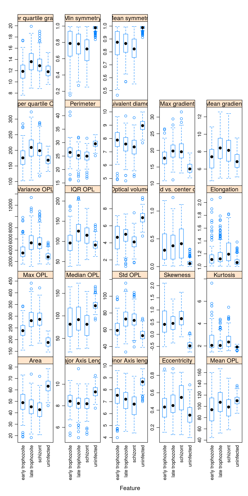
The variables in this data set are on different scales. In this situation it is important to centre and scale each predictor. A predictor variable is centered by subtracting the mean of the predictor from each value. To scale a predictor variable, each value is divided by its standard deviation. After centring and scaling the predictor variable has a mean of 0 and a standard deviation of 1.

### Redundancy from correlated variables
Examine pairwise correlations of predictors to identify redundancy in data set

```r
corMat <- cor(morphologyTrain)
corrplot(corMat, order="hclust", tl.cex=1)
```


Find highly correlated predictors

```r
highCorr <- findCorrelation(corMat, cutoff=0.75)
length(highCorr)
```

```
## [1] 16
```

```r
names(morphologyTrain)[highCorr]
```

```
##  [1] "Max OPL"                 "Area"                   
##  [3] "Minor Axis length"       "Std OPL"                
##  [5] "Equivalent diameter"     "Variance OPL"           
##  [7] "Mean gradient"           "Skewness"               
##  [9] "IQR OPL"                 "Optical volume"         
## [11] "Upper quartile gradient" "Median OPL"             
## [13] "Mean symmetry"           "Min symmetry"           
## [15] "Major Axis Length"       "Elongation"
```


### Skewness
Observations grouped by infection status:

```r
featurePlot(x = morphologyTrain,
            y = infectionStatusTrain,
            plot = "density",
            ## Pass in options to xyplot() to
            ## make it prettier
            scales = list(x = list(relation="free"),
                          y = list(relation="free")),
            adjust = 1.5,
            pch = "|",
            layout = c(5, 5),
            auto.key = list(columns = 2))
```

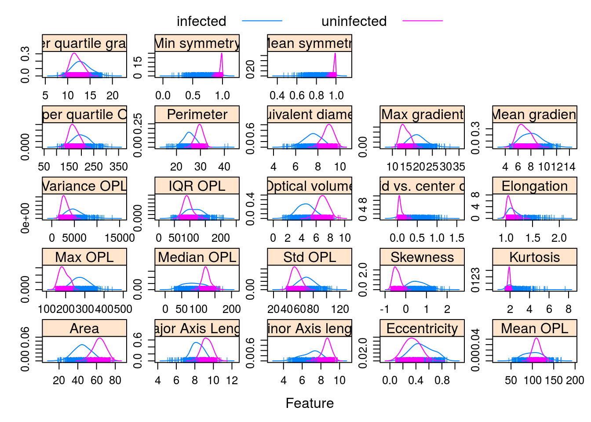

Observations grouped by infection stage:

```r
featurePlot(x = morphologyTrain,
            y = stageTrain,
            plot = "density",
            ## Pass in options to xyplot() to
            ## make it prettier
            scales = list(x = list(relation="free"),
                          y = list(relation="free")),
            adjust = 1.5,
            pch = "|",
            layout = c(5, 5),
            auto.key = list(columns = 2))
```

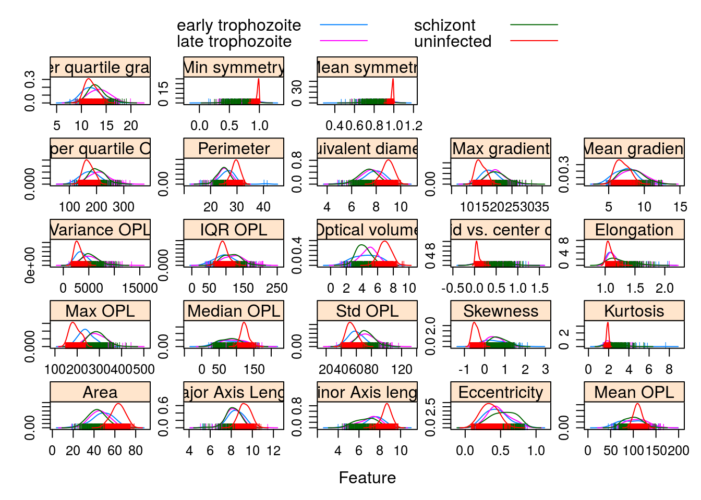


## Infection status (two-class problem)

### Model training and parameter tuning
All of the models we are going to use have a single tuning parameter. For each model we will use repeated cross validation to try 10 different values of the tuning parameter. 

For each model let's do five-fold cross-validation a total of five times. To make the analysis reproducible we need to specify the seed for each resampling iteration.

```r
set.seed(42)
seeds <- vector(mode = "list", length = 26)
for(i in 1:25) seeds[[i]] <- sample.int(1000, 10)
seeds[[26]] <- sample.int(1000,1)

train_ctrl_infect_status <- trainControl(method="repeatedcv",
                           number = 5,
                           repeats = 5,
                           seeds = seeds,
                           summaryFunction = twoClassSummary,
                           classProbs = TRUE)
```

### KNN
Train knn model:

```r
knnFit <- train(morphologyTrain, infectionStatusTrain,
                method="knn",
                preProcess = c("center", "scale"),
                #tuneGrid=tuneParam,
                tuneLength=10,
                trControl=train_ctrl_infect_status)
```

```
## Warning in train.default(morphologyTrain, infectionStatusTrain, method =
## "knn", : The metric "Accuracy" was not in the result set. ROC will be used
## instead.
```

```r
knnFit
```

```
## k-Nearest Neighbors 
## 
## 868 samples
##  23 predictors
##   2 classes: 'infected', 'uninfected' 
## 
## Pre-processing: centered (23), scaled (23) 
## Resampling: Cross-Validated (5 fold, repeated 5 times) 
## Summary of sample sizes: 695, 694, 694, 694, 695, 694, ... 
## Resampling results across tuning parameters:
## 
##   k   ROC        Sens       Spec     
##    5  0.9956347  0.9726777  0.9937931
##    7  0.9966555  0.9692174  0.9931034
##    9  0.9967199  0.9692174  0.9931034
##   11  0.9965857  0.9702519  0.9924138
##   13  0.9963379  0.9692174  0.9910345
##   15  0.9964685  0.9678351  0.9875862
##   17  0.9966529  0.9664498  0.9882759
##   19  0.9967286  0.9661109  0.9868966
##   21  0.9970731  0.9650675  0.9868966
##   23  0.9969775  0.9654153  0.9875862
## 
## ROC was used to select the optimal model using the largest value.
## The final value used for the model was k = 21.
```

```r
plot(knnFit)
```

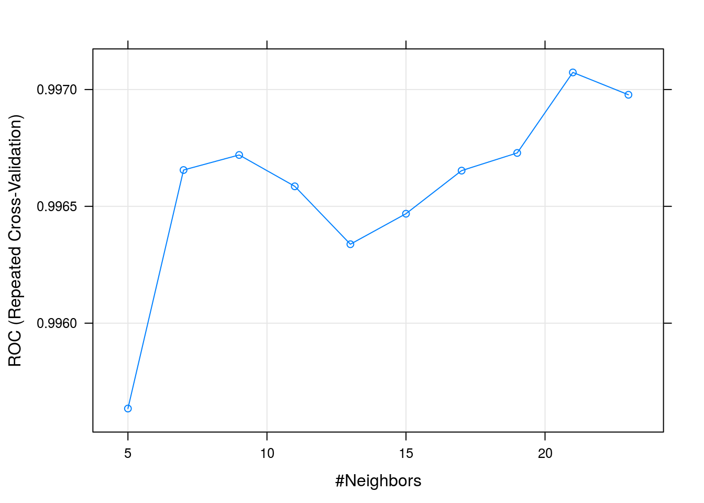


### SVM
Train svm model:

```r
svmFit <- train(morphologyTrain, infectionStatusTrain,
                method=svmRadialE1071,
                preProcess = c("center", "scale"),
                #tuneGrid=tuneParam,
                tuneLength=10,
                trControl=train_ctrl_infect_status)
```

```
## Warning in train.default(morphologyTrain, infectionStatusTrain, method =
## svmRadialE1071, : The metric "Accuracy" was not in the result set. ROC will
## be used instead.
```

```r
svmFit
```

```
## Support Vector Machines with Radial Kernel - e1071 
## 
## 868 samples
##  23 predictors
##   2 classes: 'infected', 'uninfected' 
## 
## Pre-processing: centered (23), scaled (23) 
## Resampling: Cross-Validated (5 fold, repeated 5 times) 
## Summary of sample sizes: 694, 694, 695, 694, 695, 694, ... 
## Resampling results across tuning parameters:
## 
##   cost    ROC        Sens       Spec     
##     0.25  0.9977719  0.9764948  0.9848276
##     0.50  0.9979155  0.9806417  0.9931034
##     1.00  0.9980584  0.9813343  0.9917241
##     2.00  0.9983201  0.9820270  0.9931034
##     4.00  0.9983314  0.9813343  0.9931034
##     8.00  0.9981986  0.9827226  0.9931034
##    16.00  0.9982936  0.9847886  0.9931034
##    32.00  0.9980604  0.9851334  0.9889655
##    64.00  0.9974875  0.9837481  0.9882759
##   128.00  0.9970936  0.9823688  0.9841379
## 
## ROC was used to select the optimal model using the largest value.
## The final value used for the model was cost = 4.
```

```r
plot(svmFit, scales = list(x = list(log =2)))
```


### Decision tree
Train decision tree model:

```r
dtFit <- train(morphologyTrain, infectionStatusTrain,
                method="rpart",
                preProcess = c("center", "scale"),
                #tuneGrid=tuneParam,
                tuneLength=10,
                trControl=train_ctrl_infect_status)
```

```
## Warning in train.default(morphologyTrain, infectionStatusTrain, method =
## "rpart", : The metric "Accuracy" was not in the result set. ROC will be
## used instead.
```

```r
dtFit
```

```
## CART 
## 
## 868 samples
##  23 predictors
##   2 classes: 'infected', 'uninfected' 
## 
## Pre-processing: centered (23), scaled (23) 
## Resampling: Cross-Validated (5 fold, repeated 5 times) 
## Summary of sample sizes: 694, 695, 694, 695, 694, 694, ... 
## Resampling results across tuning parameters:
## 
##   cp          ROC        Sens       Spec     
##   0.00000000  0.9752903  0.9754423  0.9634483
##   0.09885057  0.9523538  0.9619490  0.9427586
##   0.19770115  0.9523538  0.9619490  0.9427586
##   0.29655172  0.9523538  0.9619490  0.9427586
##   0.39540230  0.9523538  0.9619490  0.9427586
##   0.49425287  0.9523538  0.9619490  0.9427586
##   0.59310345  0.9523538  0.9619490  0.9427586
##   0.69195402  0.9523538  0.9619490  0.9427586
##   0.79080460  0.9523538  0.9619490  0.9427586
##   0.88965517  0.8015262  0.9733973  0.6296552
## 
## ROC was used to select the optimal model using the largest value.
## The final value used for the model was cp = 0.
```

```r
plot(dtFit)
```

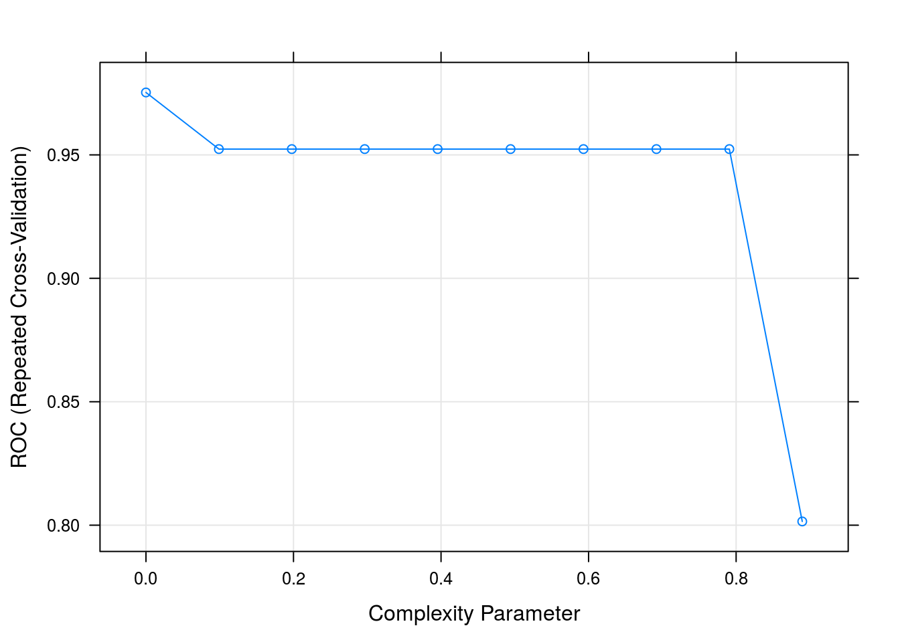

```r
prp(dtFit$finalModel)
```

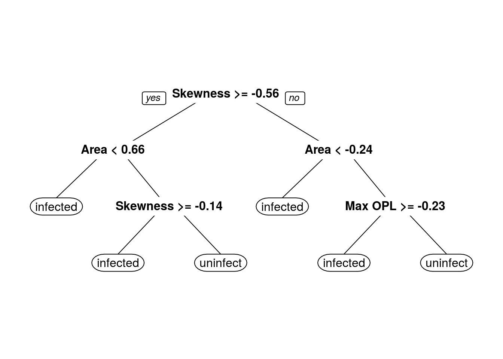


### Random forest

```r
rfFit <- train(morphologyTrain, infectionStatusTrain,
                method="rf",
                preProcess = c("center", "scale"),
                #tuneGrid=tuneParam,
                tuneLength=10,
                trControl=train_ctrl_infect_status)
```

```
## Warning in train.default(morphologyTrain, infectionStatusTrain, method =
## "rf", : The metric "Accuracy" was not in the result set. ROC will be used
## instead.
```

```r
rfFit
```

```
## Random Forest 
## 
## 868 samples
##  23 predictors
##   2 classes: 'infected', 'uninfected' 
## 
## Pre-processing: centered (23), scaled (23) 
## Resampling: Cross-Validated (5 fold, repeated 5 times) 
## Summary of sample sizes: 694, 694, 695, 694, 695, 694, ... 
## Resampling results across tuning parameters:
## 
##   mtry  ROC        Sens       Spec     
##    2    0.9981532  0.9868666  0.9813793
##    4    0.9979057  0.9879010  0.9868966
##    6    0.9977327  0.9885937  0.9855172
##    9    0.9973191  0.9892834  0.9841379
##   11    0.9973216  0.9892834  0.9820690
##   13    0.9967486  0.9889355  0.9813793
##   16    0.9968264  0.9882399  0.9793103
##   18    0.9964275  0.9878921  0.9772414
##   20    0.9959667  0.9875442  0.9772414
##   23    0.9941175  0.9868516  0.9765517
## 
## ROC was used to select the optimal model using the largest value.
## The final value used for the model was mtry = 2.
```

```r
plot(rfFit)
```

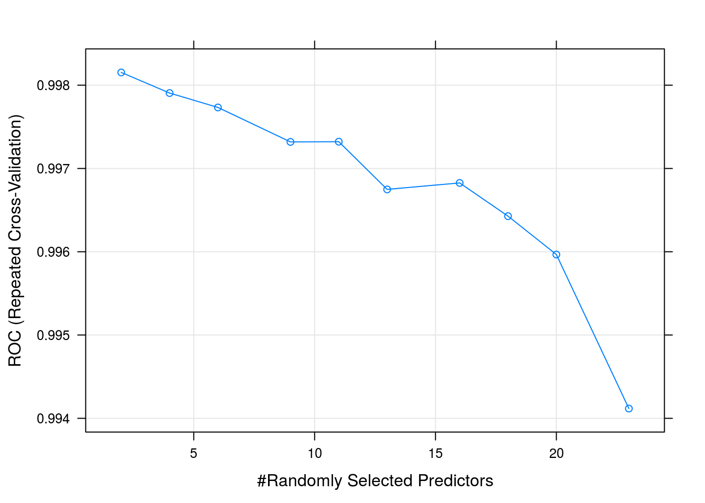


### Compare models
Make a list of our models

```r
model_list <- list(knn=knnFit,
                   svm=svmFit,
                   decisionTree=dtFit,
                   randomForest=rfFit)
```

Collect resampling results for each model

```r
resamps <- resamples(model_list)
resamps
```

```
## 
## Call:
## resamples.default(x = model_list)
## 
## Models: knn, svm, decisionTree, randomForest 
## Number of resamples: 25 
## Performance metrics: ROC, Sens, Spec 
## Time estimates for: everything, final model fit
```

```r
summary(resamps)
```

```
## 
## Call:
## summary.resamples(object = resamps)
## 
## Models: knn, svm, decisionTree, randomForest 
## Number of resamples: 25 
## 
## ROC 
##                   Min.   1st Qu.    Median      Mean   3rd Qu.      Max.
## knn          0.9925684 0.9952774 0.9980510 0.9970731 0.9985880 0.9998501
## svm          0.9933115 0.9965815 0.9995541 0.9983314 1.0000000 1.0000000
## decisionTree 0.9357907 0.9716855 0.9778537 0.9752903 0.9826087 0.9976962
## randomForest 0.9939061 0.9971514 0.9994003 0.9981532 0.9997027 1.0000000
##              NA's
## knn             0
## svm             0
## decisionTree    0
## randomForest    0
## 
## Sens 
##                   Min.   1st Qu.    Median      Mean   3rd Qu. Max. NA's
## knn          0.9224138 0.9565217 0.9655172 0.9650675 0.9826087    1    0
## svm          0.9482759 0.9741379 0.9827586 0.9813343 0.9913043    1    0
## decisionTree 0.9217391 0.9655172 0.9741379 0.9754423 0.9827586    1    0
## randomForest 0.9568966 0.9826087 0.9913043 0.9868666 1.0000000    1    0
## 
## Spec 
##                   Min.   1st Qu.    Median      Mean   3rd Qu. Max. NA's
## knn          0.9482759 0.9827586 0.9827586 0.9868966 1.0000000    1    0
## svm          0.9827586 0.9827586 1.0000000 0.9931034 1.0000000    1    0
## decisionTree 0.8793103 0.9482759 0.9827586 0.9634483 0.9827586    1    0
## randomForest 0.9310345 0.9827586 0.9827586 0.9813793 1.0000000    1    0
```

```r
bwplot(resamps)
```

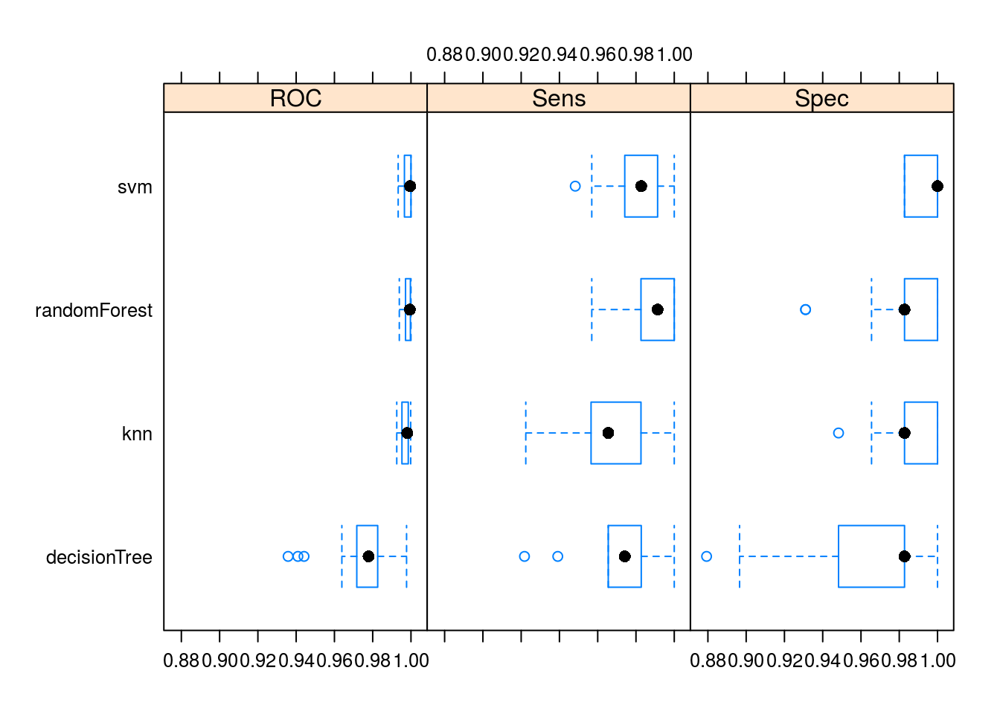


### Predict test set using our best model

```r
test_pred <- predict(svmFit, morphologyTest)
confusionMatrix(test_pred, infectionStatusTest)
```

```
## Confusion Matrix and Statistics
## 
##             Reference
## Prediction   infected uninfected
##   infected        242          3
##   uninfected        4        120
##                                           
##                Accuracy : 0.981           
##                  95% CI : (0.9613, 0.9923)
##     No Information Rate : 0.6667          
##     P-Value [Acc > NIR] : <2e-16          
##                                           
##                   Kappa : 0.9574          
##  Mcnemar's Test P-Value : 1               
##                                           
##             Sensitivity : 0.9837          
##             Specificity : 0.9756          
##          Pos Pred Value : 0.9878          
##          Neg Pred Value : 0.9677          
##              Prevalence : 0.6667          
##          Detection Rate : 0.6558          
##    Detection Prevalence : 0.6640          
##       Balanced Accuracy : 0.9797          
##                                           
##        'Positive' Class : infected        
## 
```

### ROC curve

```r
svmProbs <- predict(svmFit, morphologyTest, type="prob")
head(svmProbs)
```

```
##               infected uninfected
## normal_..4 0.019842960 0.98015704
## normal_..7 0.959900420 0.04009958
## normal_.12 0.009452970 0.99054703
## normal_.17 0.002097783 0.99790222
## normal_.18 0.003581587 0.99641841
## normal_.19 0.024682569 0.97531743
```


```r
svmROC <- roc(infectionStatusTest, svmProbs[,"infected"])
auc(svmROC)
```

```
## Area under the curve: 0.9977
```


```r
plot(svmROC)
```

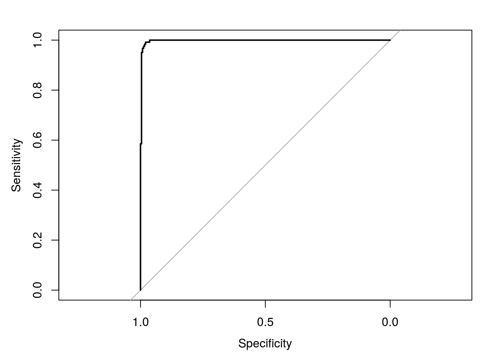


## Discrimination of infective stages (multi-class problem)

### Define cross-validation procedure

```r
train_ctrl_stage <- trainControl(method="repeatedcv",
                           number = 5,
                           repeats = 5,
                           seeds = seeds)
```

### KNN
Train knn model with all variables:

```r
knnFit <- train(morphologyTrain, stageTrain,
                method="knn",
                preProcess = c("center", "scale"),
                #tuneGrid=tuneParam,
                tuneLength=10,
                trControl=train_ctrl_stage)

knnFit
```

```
## k-Nearest Neighbors 
## 
## 868 samples
##  23 predictors
##   4 classes: 'early trophozoite', 'late trophozoite', 'schizont', 'uninfected' 
## 
## Pre-processing: centered (23), scaled (23) 
## Resampling: Cross-Validated (5 fold, repeated 5 times) 
## Summary of sample sizes: 694, 695, 693, 695, 695, 695, ... 
## Resampling results across tuning parameters:
## 
##   k   Accuracy   Kappa    
##    5  0.6806513  0.5576508
##    7  0.6940101  0.5754335
##    9  0.6949123  0.5762065
##   11  0.6931076  0.5731317
##   13  0.6940246  0.5743092
##   15  0.6917084  0.5706892
##   17  0.6917110  0.5704146
##   19  0.6958385  0.5759926
##   21  0.6956085  0.5755366
##   23  0.6958385  0.5755180
## 
## Accuracy was used to select the optimal model using the largest value.
## The final value used for the model was k = 19.
```

```r
plot(knnFit)
```


### SVM
Train SVM model with all variables:

```r
svmFit <- train(morphologyTrain, stageTrain,
                method=svmRadialE1071,
                preProcess = c("center", "scale"),
                #tuneGrid=tuneParam,
                tuneLength=10,
                trControl=train_ctrl_stage)

svmFit
```

```
## Support Vector Machines with Radial Kernel - e1071 
## 
## 868 samples
##  23 predictors
##   4 classes: 'early trophozoite', 'late trophozoite', 'schizont', 'uninfected' 
## 
## Pre-processing: centered (23), scaled (23) 
## Resampling: Cross-Validated (5 fold, repeated 5 times) 
## Summary of sample sizes: 693, 695, 695, 694, 695, 694, ... 
## Resampling results across tuning parameters:
## 
##   cost    Accuracy   Kappa    
##     0.25  0.7078501  0.5940116
##     0.50  0.7156902  0.6063755
##     1.00  0.7195864  0.6124250
##     2.00  0.7198083  0.6134929
##     4.00  0.7198030  0.6136120
##     8.00  0.7207491  0.6154010
##    16.00  0.7138537  0.6068131
##    32.00  0.6991156  0.5874694
##    64.00  0.6869050  0.5717486
##   128.00  0.6763009  0.5579433
## 
## Accuracy was used to select the optimal model using the largest value.
## The final value used for the model was cost = 8.
```

```r
plot(svmFit, scales = list(x = list(log =2)))
```

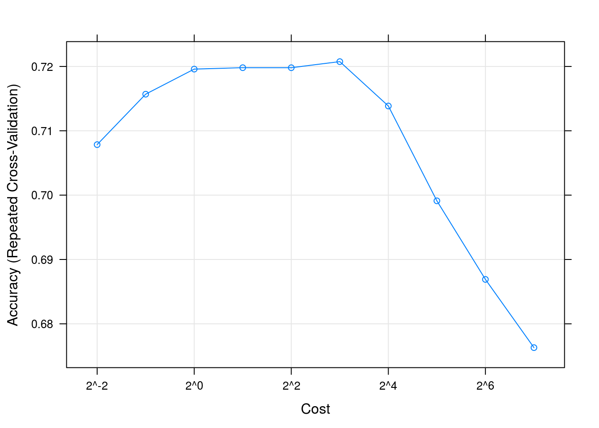


### Decision tree
Train decision tree model with all variables:

```r
dtFit <- train(morphologyTrain, stageTrain,
                method="rpart",
                preProcess = c("center", "scale"),
                #tuneGrid=tuneParam,
                tuneLength=10,
                trControl=train_ctrl_stage)

dtFit
```

```
## CART 
## 
## 868 samples
##  23 predictors
##   4 classes: 'early trophozoite', 'late trophozoite', 'schizont', 'uninfected' 
## 
## Pre-processing: centered (23), scaled (23) 
## Resampling: Cross-Validated (5 fold, repeated 5 times) 
## Summary of sample sizes: 693, 695, 695, 694, 695, 694, ... 
## Resampling results across tuning parameters:
## 
##   cp           Accuracy   Kappa    
##   0.005190311  0.6850209  0.5667306
##   0.006920415  0.6864227  0.5691875
##   0.007785467  0.6871071  0.5706621
##   0.010380623  0.6799831  0.5607537
##   0.012110727  0.6825278  0.5637137
##   0.013840830  0.6815977  0.5624175
##   0.015570934  0.6811498  0.5609683
##   0.034602076  0.6820522  0.5613656
##   0.124567474  0.6184755  0.4610759
##   0.399653979  0.3964157  0.1019836
## 
## Accuracy was used to select the optimal model using the largest value.
## The final value used for the model was cp = 0.007785467.
```

```r
plot(dtFit)
```

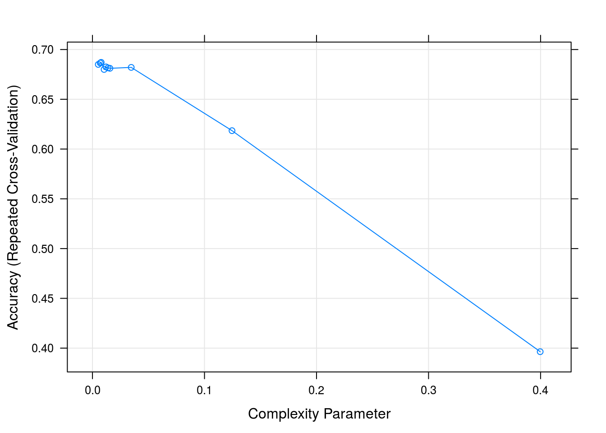

```r
prp(dtFit$finalModel)
```


### Random forest
Train random forest model with all variables:

```r
rfFit <- train(morphologyTrain, stageTrain,
                method="rf",
                preProcess = c("center", "scale"),
                #tuneGrid=tuneParam,
                tuneLength=10,
                trControl=train_ctrl_stage)

rfFit
```

```
## Random Forest 
## 
## 868 samples
##  23 predictors
##   4 classes: 'early trophozoite', 'late trophozoite', 'schizont', 'uninfected' 
## 
## Pre-processing: centered (23), scaled (23) 
## Resampling: Cross-Validated (5 fold, repeated 5 times) 
## Summary of sample sizes: 693, 695, 695, 694, 695, 694, ... 
## Resampling results across tuning parameters:
## 
##   mtry  Accuracy   Kappa    
##    2    0.7184462  0.6121623
##    4    0.7179838  0.6120214
##    6    0.7232845  0.6196398
##    9    0.7248884  0.6221363
##   11    0.7209591  0.6167334
##   13    0.7230175  0.6196534
##   16    0.7195890  0.6150192
##   18    0.7181885  0.6132322
##   20    0.7184422  0.6133707
##   23    0.7149754  0.6086754
## 
## Accuracy was used to select the optimal model using the largest value.
## The final value used for the model was mtry = 9.
```

```r
plot(rfFit)
```


### Compare models
Make a list of our models

```r
model_list <- list(knn=knnFit,
                   svm=svmFit,
                   decisionTree=dtFit,
                   randomForest=rfFit)
```

Collect resampling results for each model

```r
resamps <- resamples(model_list)
resamps
```

```
## 
## Call:
## resamples.default(x = model_list)
## 
## Models: knn, svm, decisionTree, randomForest 
## Number of resamples: 25 
## Performance metrics: Accuracy, Kappa 
## Time estimates for: everything, final model fit
```

```r
summary(resamps)
```

```
## 
## Call:
## summary.resamples(object = resamps)
## 
## Models: knn, svm, decisionTree, randomForest 
## Number of resamples: 25 
## 
## Accuracy 
##                   Min.   1st Qu.    Median      Mean   3rd Qu.      Max.
## knn          0.6494253 0.6763006 0.6896552 0.6958385 0.7142857 0.7643678
## svm          0.6666667 0.6994220 0.7241379 0.7207491 0.7341040 0.7873563
## decisionTree 0.6494253 0.6647399 0.6820809 0.6871071 0.7011494 0.7514451
## randomForest 0.6820809 0.7109827 0.7225434 0.7248884 0.7413793 0.7745665
##              NA's
## knn             0
## svm             0
## decisionTree    0
## randomForest    0
## 
## Kappa 
##                   Min.   1st Qu.    Median      Mean   3rd Qu.      Max.
## knn          0.5132532 0.5494582 0.5659846 0.5759926 0.6029405 0.6719246
## svm          0.5396405 0.5873584 0.6199144 0.6154010 0.6334746 0.7079477
## decisionTree 0.5204446 0.5381140 0.5650286 0.5706621 0.5876401 0.6588554
## randomForest 0.5631113 0.6014192 0.6164257 0.6221363 0.6424494 0.6931089
##              NA's
## knn             0
## svm             0
## decisionTree    0
## randomForest    0
```

```r
bwplot(resamps)
```


### Predict test set using our best model

```r
test_pred <- predict(rfFit, morphologyTest)
confusionMatrix(test_pred, stageTest)
```

```
## Confusion Matrix and Statistics
## 
##                    Reference
## Prediction          early trophozoite late trophozoite schizont uninfected
##   early trophozoite                27                3        7          3
##   late trophozoite                 16               57       28          0
##   schizont                          5               33       66          0
##   uninfected                        3                1        0        120
## 
## Overall Statistics
##                                           
##                Accuracy : 0.7317          
##                  95% CI : (0.6834, 0.7763)
##     No Information Rate : 0.3333          
##     P-Value [Acc > NIR] : < 2.2e-16       
##                                           
##                   Kappa : 0.6305          
##  Mcnemar's Test P-Value : NA              
## 
## Statistics by Class:
## 
##                      Class: early trophozoite Class: late trophozoite
## Sensitivity                           0.52941                  0.6064
## Specificity                           0.95912                  0.8400
## Pos Pred Value                        0.67500                  0.5644
## Neg Pred Value                        0.92705                  0.8619
## Prevalence                            0.13821                  0.2547
## Detection Rate                        0.07317                  0.1545
## Detection Prevalence                  0.10840                  0.2737
## Balanced Accuracy                     0.74427                  0.7232
##                      Class: schizont Class: uninfected
## Sensitivity                   0.6535            0.9756
## Specificity                   0.8582            0.9837
## Pos Pred Value                0.6346            0.9677
## Neg Pred Value                0.8679            0.9878
## Prevalence                    0.2737            0.3333
## Detection Rate                0.1789            0.3252
## Detection Prevalence          0.2818            0.3360
## Balanced Accuracy             0.7558            0.9797
```


