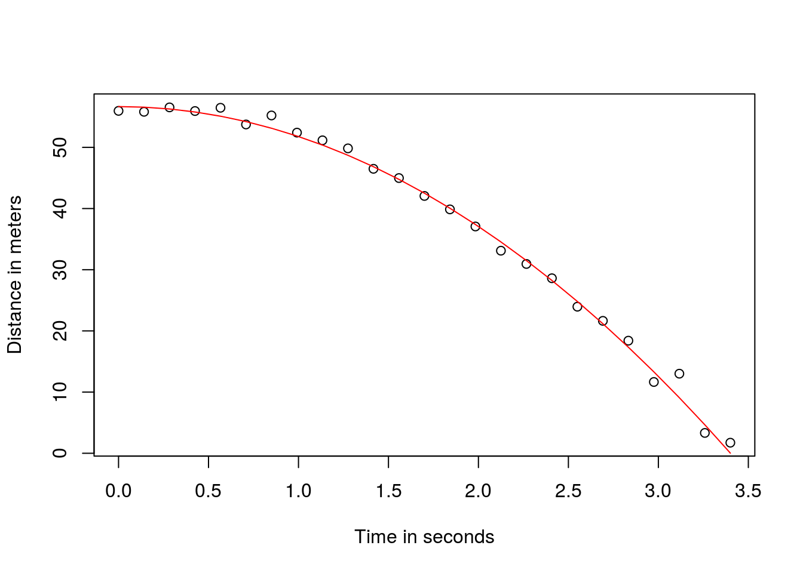
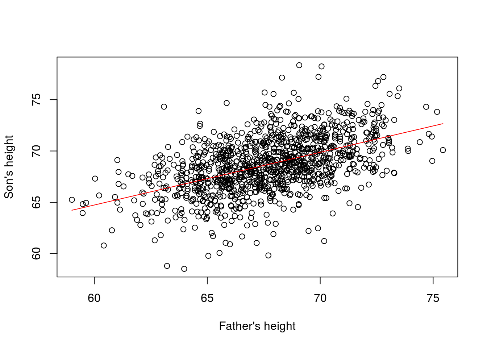

# Solutions ch. 3 - Linear models and matrix algebra {#solutions-linear-models}

Solutions to exercises of chapter \@ref(linear-models).

## Example 2

We already know the equation that describes the data very well from high school physics. 

$$d = h_0 + v_0 t - 0.5 \times 9.8 t^2$$

with $h_0$ and $v_0$ the starting height and velocity respectively. The data we simulated above followed this equation and added measurement error to simulate n observations for dropping the ball $(v_0=0)$ from from height $(h_0=56.67)$

Here is what the data looks like with the solid line representing the true trajectory:


```r
g <- 9.8 ##meters per second
n <- 25
tt <- seq(0,3.4,len=n) ##time in secs, t is a base function
f <- 56.67  - 0.5*g*tt^2
y <-  f + rnorm(n,sd=1)
plot(tt,y,ylab="Distance in meters",xlab="Time in seconds")
lines(tt,f,col=2)
```



In R we can fit this model by simply using the lm function. 

```r
tt2 <-tt^2
fit <- lm(y~tt+tt2)
summary(fit)$coef
```

```
##               Estimate Std. Error     t value     Pr(>|t|)
## (Intercept) 56.9880829  0.7113153  80.1164881 1.244222e-28
## tt          -0.3885387  0.9689614  -0.4009847 6.922993e-01
## tt2         -4.7611845  0.2752678 -17.2965514 2.706678e-14
```


## Example 2

```r
data(father.son,package="UsingR")
x=father.son$fheight
y=father.son$sheight
X <- cbind(1,x)
thetahat <- solve( t(X) %*% X ) %*% t(X) %*% y
###or
thetahat <- solve( crossprod(X) ) %*% crossprod( X, y )
```

We can see the results of this by computing the estimated $\hat{\theta}_0+\hat{\theta}_1 x$ for any value of $x$:


```r
newx <- seq(min(x),max(x),len=100)
X <- cbind(1,newx)
fitted <- X%*%thetahat
plot(x,y,xlab="Father's height",ylab="Son's height")
lines(newx,fitted,col=2)
```




This $\hat{\boldsymbol{\theta}}=(\mathbf{X}^\top \mathbf{X})^{-1} \mathbf{X}^\top \mathbf{Y}$ is one of the most widely used results in data analysis.
