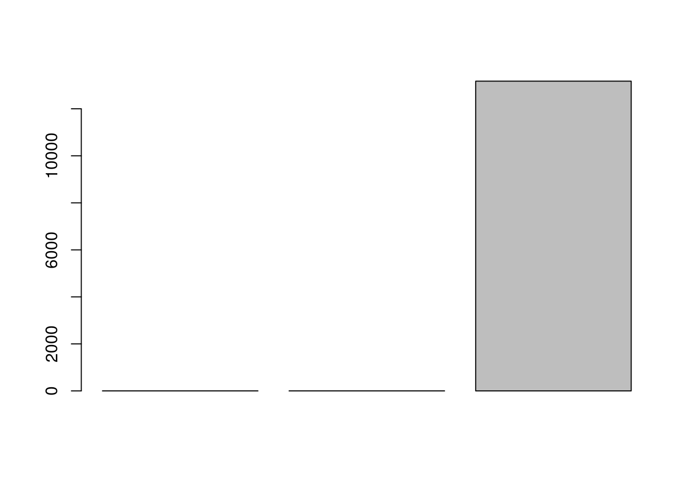
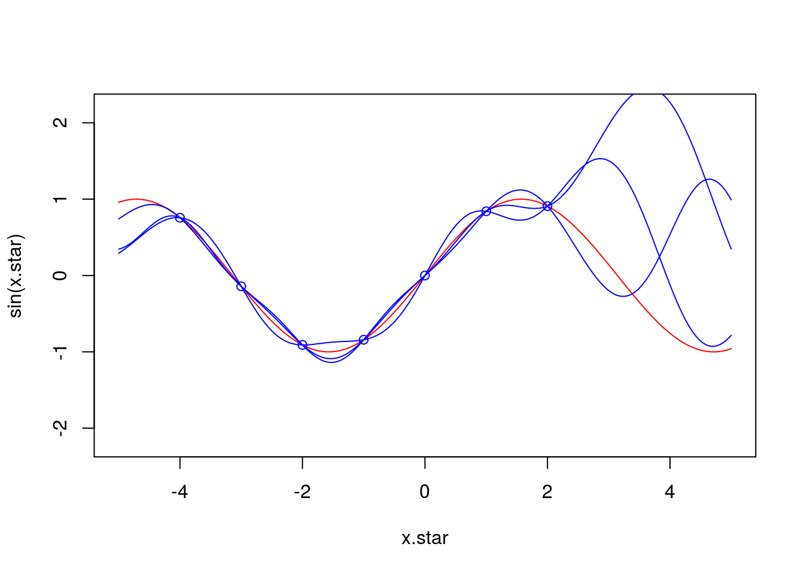
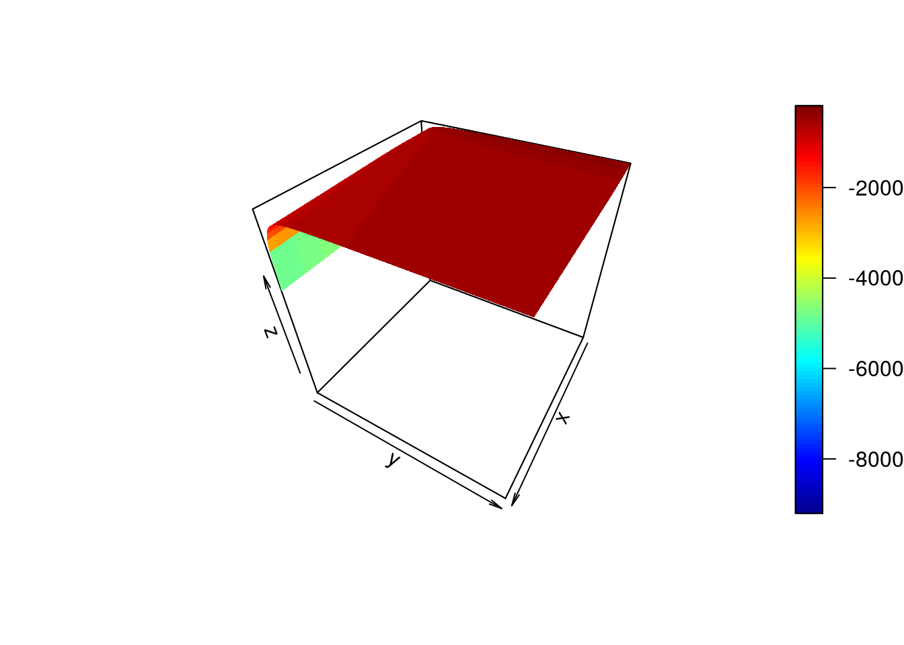

# Solutions ch. 4 - Linear and non-linear (logistic) regression {#solutions-logistic-regression}

Solutions to exercises of chapter \@ref(logistic-regression).

Exercise 9.1.


```r
options(warn=-1)

geneindex <- 36
D <- read.csv(file = "data/Arabidopsis/Arabidopsis_Botrytis_transpose_2.csv", header = TRUE, sep = ",", row.names=1)
genenames <- colnames(D)
Xs <- D$Time[1:24]
plot(Xs,(D[1:24,geneindex]),type="p",col="black",ylim=c(min(D[,geneindex])-0.2, max(D[,geneindex]+0.2)),main=genenames[geneindex],xlab = "Time", ylab = "log_2 expression")
points(Xs,(D[25:nrow(D),geneindex]),type="p",col="red")
```


Exercise 9.2. The caret package has a variety of features that are of use in ML. In the previous example, above, we fitted a linear model to a gene to identify parameters and make predictions using all the data. A better approach would be to partition the data into a test We can make use of the caret functionality to split our data into training and test sets, which should allow us to gauge uncertainty in our parameters and the strength of the model.

Exercise 9.3. Linear regression can generally be applied for any number of variables. A notable example, would be to regress the expression pattern of a gene against putative regulators.


```r
library(caret)
```

```
## Loading required package: lattice
```

```
## Loading required package: ggplot2
```

```r
geneindex <- 10
lrfit3 <- train(y~., data=data.frame(x=D[1:24,3:10],y=D[1:24,geneindex]), method = "lm")
```

Excercise 9.4. Compare the RMSE for various polynomial models versus that of the linear models. 


```r
lrfit2 <- train(y~poly(x,degree=1), data=data.frame(x=D[25:nrow(D),1],y=D[25:nrow(D),geneindex]), method = "lm")
lrfit3 <- train(y~poly(x,degree=3), data=data.frame(x=D[25:nrow(D),1],y=D[25:nrow(D),geneindex]), method = "lm")
lrfit4 <- train(y~poly(x,degree=20), data=data.frame(x=D[25:nrow(D),1],y=D[25:nrow(D),geneindex]), method = "lm")

plot(Xs,D[25:nrow(D),geneindex],type="p",col="black",ylim=c(min(D[,geneindex])-0.2, max(D[,geneindex]+0.2)),main=genenames[geneindex])
lines(Xs,fitted(lrfit2),type="l",col="blue")
lines(Xs,fitted(lrfit3),type="l",col="red")
lines(Xs,fitted(lrfit4),type="l",col="black")
```


We can look at the RMSE:


```r
barplot(c(lrfit2$results$RMSE,lrfit3$results$RMSE,lrfit4$results$RMSE))
```



Excercise 9.4 (optional): 

Example covariance functions implemented from the [Kernel Cookbook](http://www.cs.toronto.edu/~duvenaud/cookbook/). Here we implement a rational quadratic covariance function:


```r
covRQ <- function(X1,X2,l=1,sig=1,a=2) {
  K <- matrix(rep(0, length(X1)*length(X2)), nrow=length(X1))
  for (i in 1:nrow(K)) {
    for (j in 1:ncol(K)) {
      K[i,j] <- sig^2*(1 + (abs(X1[i]-X2[j])^2/(2*a*l^2))    )^a 
    }
  }
  return(K)
}
```

Here we implement a periodic covariance function:


```r
covPer <- function(X1,X2,l=1,sig=1,p=1) {
  K <- matrix(rep(0, length(X1)*length(X2)), nrow=length(X1))
  for (i in 1:nrow(K)) {
    for (j in 1:ncol(K)) {
      K[i,j] <- sig^2*exp(sin(pi*abs(X1[i]-X2[j])/p)^2 / l^2) 
    }
  }
  return(K)
}
```


Exercise 9.5: Try fitting plotting the GP for the optimised values of the hyperparameters. 

We need to borrow the following snippets of code from the main text.


```r
require(MASS)
```

```
## Loading required package: MASS
```

```r
require(plyr)
```

```
## Loading required package: plyr
```

```r
require(reshape2)
```

```
## Loading required package: reshape2
```

```r
require(ggplot2)

covSE <- function(X1,X2,l=1,sig=1) {
  K <- matrix(rep(0, length(X1)*length(X2)), nrow=length(X1))
  for (i in 1:nrow(K)) {
    for (j in 1:ncol(K)) {
      K[i,j] <- sig^2*exp(-0.5*(abs(X1[i]-X2[j]))^2 /l^2)
    }
  }
  return(K)
}
```


```r
x.star <- seq(-5,5,len=500)
f <- data.frame(x=c(-4,-3,-2,-1,0,1,2),
                y=sin(c(-4,-3,-2,-1,0,1,2)))
x <- f$x
k.xx <- covSE(x,x)
k.xxs <- covSE(x,x.star)
k.xsx <- covSE(x.star,x)
k.xsxs <- covSE(x.star,x.star)

f.star.bar <- k.xsx%*%solve(k.xx)%*%f$y  #Mean
cov.f.star <- k.xsxs - k.xsx%*%solve(k.xx)%*%k.xxs #Var

y1 <- mvrnorm(1, f.star.bar, cov.f.star)
y2 <- mvrnorm(1, f.star.bar, cov.f.star)
y3 <- mvrnorm(1, f.star.bar, cov.f.star)
plot(x.star,sin(x.star),type = 'l',col="red",ylim=c(-2.2, 2.2))
points(f,type = 'p',col="blue")
lines(x.star,y1,type = 'l',col="blue")
lines(x.star,y2,type = 'l',col="blue")
lines(x.star,y3,type = 'l',col="blue")
```



Exercise 9.6: Try fitting plotting the GP for the optimised values of the hyperparameters. 


```r
calcML <- function(f,l=1,sig=1) {
  f2 <- t(f)
  yt <- f2[2,]
  y  <- f[,2]
  K <- covSE(f[,1],f[,1],l,sig)
  ML <- -0.5*yt%*%ginv(K+0.1^2*diag(length(y)))%*%y -0.5*log(det(K)) -(length(f[,1])/2)*log(2*pi);
  return(ML)
}
```


```r
#install.packages("plot3D")
library(plot3D)

par <- seq(.1,10,by=0.1)
ML <- matrix(rep(0, length(par)^2), nrow=length(par), ncol=length(par))
for(i in 1:length(par)) {
  for(j in 1:length(par)) {
    ML[i,j] <- calcML(f,par[i],par[j])
  }
}

ind<-which(ML==max(ML), arr.ind=TRUE)
lmap<-par[ind[1]]
varmap<-par[ind[2]]
```


```r
x.star <- seq(-5,5,len=500)
f <- data.frame(x=c(-4,-3,-2,-1,0,1,2),
                y=sin(c(-4,-3,-2,-1,0,1,2)))
x <- f$x
k.xx <- covSE(x,x,lmap,varmap)
k.xxs <- covSE(x,x.star,lmap,varmap)
k.xsx <- covSE(x.star,x,lmap,varmap)
k.xsxs <- covSE(x.star,x.star,lmap,varmap)

f.star.bar <- k.xsx%*%solve(k.xx)%*%f$y  #Mean
cov.f.star <- k.xsxs - k.xsx%*%solve(k.xx)%*%k.xxs #Var

plot(x.star,sin(x.star),type = 'l',col="red",ylim=c(-2.2, 2.2))
points(f,type='o')
lines(x.star,f.star.bar,type = 'l')
lines(x.star,f.star.bar+2*sqrt(diag(cov.f.star)),type = 'l',pch=22, lty=2, col="black")
lines(x.star,f.star.bar-2*sqrt(diag(cov.f.star)),type = 'l',pch=22, lty=2, col="black")
```


Excercise 9.7: Now try fitting a Gaussian process to one of the gene expression profiles in the Botrytis dataset.


```r
covSEn <- function(X1,X2,l=1,sig=1,sigman=0.1) {
  K <- matrix(rep(0, length(X1)*length(X2)), nrow=length(X1))
  for (i in 1:nrow(K)) {
    for (j in 1:ncol(K)) {
      
      K[i,j] <- sig^2*exp(-0.5*(abs(X1[i]-X2[j]))^2 /l^2)
      
      if (i==j){
      K[i,j] <- K[i,j] + sigman^2
      }
      
    }
  }
  return(K)
}
```


```r
geneindex <- 36
lmap <- 0.1
varmap <- 5
x.star <- seq(0,1,len=500)
f <- data.frame(x=D[25:nrow(D),1]/48, y=D[25:nrow(D),geneindex])
x <- f$x
k.xx <- covSEn(x,x,lmap,varmap,0.2)
k.xxs <- covSEn(x,x.star,lmap,varmap,0.2)
k.xsx <- covSEn(x.star,x,lmap,varmap,0.2)
k.xsxs <- covSEn(x.star,x.star,lmap,varmap,0.2)

f.star.bar <- k.xsx%*%solve(k.xx)%*%f$y  #Mean
cov.f.star <- k.xsxs - k.xsx%*%solve(k.xx)%*%k.xxs #Var

plot(f,type = 'l',col="red")
points(f,type='o')
lines(x.star,f.star.bar,type = 'l')
lines(x.star,f.star.bar+2*sqrt(diag(cov.f.star)),type = 'l',pch=22, lty=2, col="black")
lines(x.star,f.star.bar-2*sqrt(diag(cov.f.star)),type = 'l',pch=22, lty=2, col="black")
```


```r
calcMLn <- function(f,l=1,sig=1,sigman=0.1) {
  f2 <- t(f)
  yt <- f2[2,]
  y  <- f[,2]
  K <- covSE(f[,1],f[,1],l,sig)
  ML <- -0.5*yt%*%ginv(K+diag(length(y))*sigman^2)%*%y -0.5*log(det(K+diag(length(y))*sigman^2)) -(length(f[,1])/2)*log(2*pi);
  return(ML)
}
```

Exercise 9.8 (optional): Write a function for determining differential expression for two genes. Hint: we are interested in comparing two models, and using Bayes' Factor to determine if the genes are differentially expressed. 


```r
f <- data.frame(x=D[25:nrow(D),1]/48, y=D[25:nrow(D),geneindex])
par <- seq(.1,10,by=0.1)
ML <- matrix(rep(0, length(par)^2), nrow=length(par), ncol=length(par))
for(i in 1:length(par)) {
  for(j in 1:length(par)) {
    ML[i,j] <- calcMLn(f,par[i],par[j],0.05)
  }
}
persp3D(z = ML,theta = 120)
```



```r
ind<-which(ML==max(ML), arr.ind=TRUE)
```

Now let's calculate the BF.


```r
lmap <- par[ind[1]]
varmap <- par[ind[2]]

f1 <- data.frame(x=D[1:24,1]/48, y=D[1:24,geneindex])
f2 <- data.frame(x=D[25:nrow(D),1]/48, y=D[25:nrow(D),geneindex])
f3 <- data.frame(x=D[,1]/48, y=D[,geneindex])

MLs <- matrix(rep(0, 3, nrow=3))
MLs[1] <- calcMLn(f1,lmap,varmap,0.05)
MLs[2] <- calcMLn(f2,lmap,varmap,0.05)
MLs[3] <- calcMLn(f3,lmap,varmap,0.05)

BF <- (MLs[1]+MLs[2]) -MLs[3]
BF
```

```
## [1] 2749.534
```

So from the Bayes' Factor there's some slight evidence for model 1 (differential expression) over model 2 (non-differential expression).


