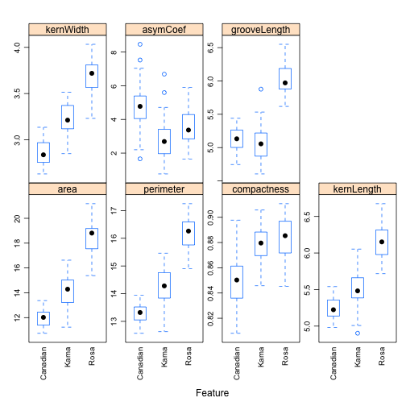
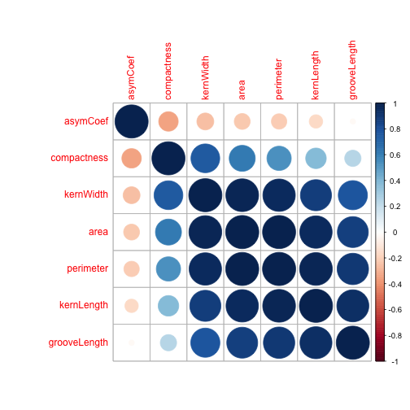
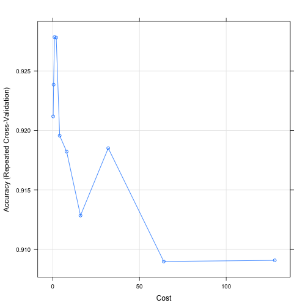
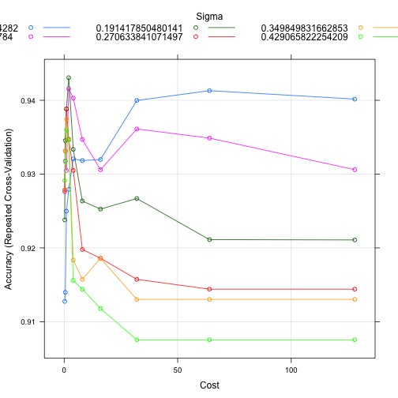
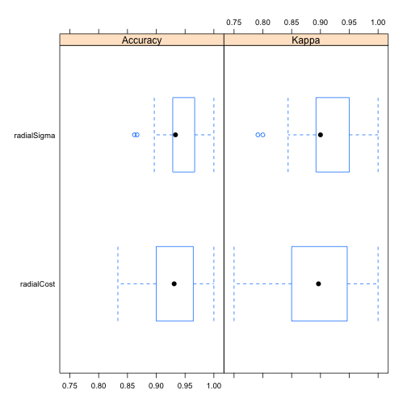

An introduction to caret
========================================================
author:
date:
autosize: true
transition: rotate
css: custom.css

Classification And Regression Trees
========================================================
The caret package was developed by Max Kuhn to:
- create a unified interface for modeling and prediction (interfaces to over 200 models)
- streamline model tuning using resampling
- provide a variety of “helper” functions and classes for day–to–day model building tasks
increase computational efficiency using parallel processing

<https://www.r-project.org/conferences/useR-2013/Tutorials/kuhn/user_caret_2up.pdf>

Why we need caret
========================================================

|obj Class  |Package |predict Function Syntax                  |
|:----------|:-------|:----------------------------------------|
|lda        |MASS    |predict(obj) (no options needed)         |
|glm        |stats   |predict(obj, type = "response")          |
|gbm        |gbm     |predict(obj, type = "response", n.trees) |
|mda        |mda     |predict(obj, type = "posterior")         |
|rpart      |rpart   |predict(obj, type = "prob")              |
|Weka       |RWeka   |predict(obj, type = "probability")       |
|LogitBoost |caTools |predict(obj, type = "raw", nIter)        |


https://www.r-project.org/conferences/useR-2013/Tutorials/kuhn/user_caret_2up.pdf


Available Models
========================================================

<https://topepo.github.io/caret/available-models.html>


CARET Workflow
========================================================
type:section

CARET Workflow
========================================================

- required packages
- example data set
- partition data
- assess data quality
- model training and parameter tuning
- model comparison
- predict test set

Packages
=======================================================
Load **CARET** package

```r
library(caret)
```

Other required packages are **doMC** (parallel processing) and **corrplot** (correlation matrix plots):

```r
library(doMC)
library(corrplot)
```

Example data set
=======================================================
type:section

Wheat seeds data set
=======================================================
The seeds data set https://archive.ics.uci.edu/ml/datasets/seeds contains morphological measurements on the kernels of three varieties of wheat: Kama, Rosa and Canadian.

Load the data into your R session using:


```r
load("data/wheat_seeds/wheat_seeds.Rda")
```
What objects have been loaded into our R session?

```r
ls()
```

```
[1] "morphometrics" "variety"      
```

Wheat seeds data set: predictors
======================================================
The **morphometrics** data.frame contains seven variables describing the morphology of the seeds.

```r
str(morphometrics)
```

```
'data.frame':	210 obs. of  7 variables:
 $ area        : num  15.3 14.9 14.3 13.8 16.1 ...
 $ perimeter   : num  14.8 14.6 14.1 13.9 15 ...
 $ compactness : num  0.871 0.881 0.905 0.895 0.903 ...
 $ kernLength  : num  5.76 5.55 5.29 5.32 5.66 ...
 $ kernWidth   : num  3.31 3.33 3.34 3.38 3.56 ...
 $ asymCoef    : num  2.22 1.02 2.7 2.26 1.35 ...
 $ grooveLength: num  5.22 4.96 4.83 4.8 5.17 ...
```

Wheat seeds data set: class labels
======================================================
The class labels of the seeds are in the factor **variety**.

```r
summary(variety)
```

```
Canadian     Kama     Rosa 
      70       70       70 
```

Partition data
======================================================
type:section

Training and test set
======================================================


Partition data into training and test set
======================================================

```r
set.seed(42)
trainIndex <- createDataPartition(y=variety, times=1, p=0.7, list=F)

varietyTrain <- variety[trainIndex]
morphTrain <- morphometrics[trainIndex,]

varietyTest <- variety[-trainIndex]
morphTest <- morphometrics[-trainIndex,]
```

Class distributions are balanced across the splits
====================================================
Training set

```r
summary(varietyTrain)
```

```
Canadian     Kama     Rosa 
      49       49       49 
```

Test set

```r
summary(varietyTest)
```

```
Canadian     Kama     Rosa 
      21       21       21 
```


Assess data quality
======================================================
type:section

Identification of near zero variance predictors
======================================================
The function **nearZeroVar** identifies predictors that have one unique value. It also diagnoses predictors having both of the following characteristics:

* very few unique values relative to the number of samples
* the ratio of the frequency of the most common value to the frequency of the 2nd most common value is large.

Such zero and near zero-variance predictors have a deleterious impact on modelling and may lead to unstable fits.

Identification of near zero variance predictors cont.
======================================================

```r
nearZeroVar(morphTrain, saveMetrics = T)
```

```
             freqRatio percentUnique zeroVar   nzv
area               1.5      93.87755   FALSE FALSE
perimeter          1.0      85.03401   FALSE FALSE
compactness        1.0      93.19728   FALSE FALSE
kernLength         1.5      91.83673   FALSE FALSE
kernWidth          1.5      91.15646   FALSE FALSE
asymCoef           1.0      98.63946   FALSE FALSE
grooveLength       1.0      77.55102   FALSE FALSE
```

Are all predictors on the same scale?
======================================================

```r
featurePlot(x = morphTrain,
            y = varietyTrain,
            plot = "box",
            ## Pass in options to bwplot()
            scales = list(y = list(relation="free"),
                          x = list(rot = 90)),
            layout = c(4,2))
```

Feature plots
======================================================


Predictors on different scales
=====================================================
The variables in this data set are on different scales. In this situation it is important to **centre** and **scale** each predictor.

- A predictor variable is **centered** by subtracting the mean of the predictor from each value.
- To **scale** a predictor variable, each value is divided by its standard deviation.

After centring and scaling the predictor variable has a mean of 0 and a standard deviation of 1.

Pairwise correlation between predictors
=====================================================
Examine pairwise correlations of predictors to identify redundancy in data set

```r
corMat <- cor(morphTrain)
corrplot(corMat, order="hclust", tl.cex=1)
```

Pairwise correlation between predictors cont.
=====================================================


Find highly correlated predictors
=====================================================

```r
highCorr <- findCorrelation(corMat, cutoff=0.75)
length(highCorr)
```

```
[1] 4
```

```r
names(morphTrain)[highCorr]
```

```
[1] "area"       "kernWidth"  "perimeter"  "kernLength"
```

Model training and parameter tuning
====================================================
type: section


Models to evaluate
======================================================
- **svmRadialCost** with one tuning parameter **C**
- **svmRadialSigma** with two tuning parameters: **sigma** and **C**

To find out more information about a particular model use:

```r
getModelInfo("svmRadialSigma")
```

Parameter tuning using cross-validation
======================================================


Parallel processing
======================================================
We will use repeated cross-validation to find the best value of our tuning parameters and we will try 10 values of each.

Repeated cross-validation can readily be parallelized to increase speed of execution. All we need to do is create a local cluster.  **CARET** will then use this cluster to parallelize the cross-validation.


```r
registerDoMC(detectCores())
getDoParWorkers()
```

```
[1] 4
```

Resampling
======================================================
The resampling method is specified using the **trainControl** function. To repeat five-fold cross validation a total of five times we would use:

```r
train_ctrl <- trainControl(method="repeatedcv",
                           number = 5,
                           repeats = 5)
```

Resampling cont.
======================================================
To make the analysis reproducible we need to specify the seed for each resampling iteration.

```r
set.seed(42)
seeds <- vector(mode = "list", length = 26)
for(i in 1:25) seeds[[i]] <- sample.int(1000, 10)
seeds[[26]] <- sample.int(1000,1)

train_ctrl <- trainControl(method="repeatedcv",
                           number = 5,
                           repeats = 5,
                           seeds = seeds)
```

Train svmRadialCost model
========================================================
The **train** function is used to tune a model

```r
rcFit <- train(morphTrain, varietyTrain,
                method="svmRadialCost",
                preProcess = c("center", "scale"),
                #tuneGrid=tuneParam,
                tuneLength=10,
                trControl=train_ctrl)
```

```r
rcFit
```

Train svmRadialCost model cont.
========================================================

```
Support Vector Machines with Radial Basis Function Kernel 

147 samples
  7 predictor
  3 classes: 'Canadian', 'Kama', 'Rosa' 

Pre-processing: centered (7), scaled (7) 
Resampling: Cross-Validated (5 fold, repeated 5 times) 
Summary of sample sizes: 118, 117, 117, 117, 119, 118, ... 
Resampling results across tuning parameters:

  C       Accuracy   Kappa    
    0.25  0.9211790  0.8817025
    0.50  0.9238456  0.8856728
    1.00  0.9278456  0.8916728
    2.00  0.9277997  0.8916162
    4.00  0.9195632  0.8792973
    8.00  0.9182266  0.8772683
   16.00  0.9128506  0.8691940
   32.00  0.9185090  0.8776993
   64.00  0.9089918  0.8634461
  128.00  0.9090837  0.8635816

Accuracy was used to select the optimal model using the largest value.
The final value used for the model was C = 1.
```

Train svmRadialCost model cont.
=========================================================


Train svmRadialSigma model
======================================================
If we set **tuneLength** to 10 the svmRadialSigma model will be evaluated with 10 different values of **C**. The svmRadialSigma model is setup to evaluate a maximum of six values of sigma. Therefore in each resampling iteration we need a total of 60 seeds (10x6).

```r
set.seed(42)
seeds <- vector(mode = "list", length = 26)
for(i in 1:25) seeds[[i]] <- sample.int(1000, 60)
seeds[[26]] <- sample.int(1000,1)

train_ctrl <- trainControl(method="repeatedcv",
                           number = 5,
                           repeats = 5,
                           seeds = seeds)
```


Train svmRadialSigma model cont.
========================================================
The **train** function is used to tune a model

```r
rsFit <- train(morphTrain, varietyTrain,
                method="svmRadialSigma",
                preProcess = c("center", "scale"),
                #tuneGrid=tuneParam,
                tuneLength=10,
                trControl=train_ctrl)
```

```r
rsFit
```

Train svmRadialSigma model cont.
========================================================

```
Support Vector Machines with Radial Basis Function Kernel 

147 samples
  7 predictor
  3 classes: 'Canadian', 'Kama', 'Rosa' 

Pre-processing: centered (7), scaled (7) 
Resampling: Cross-Validated (5 fold, repeated 5 times) 
Summary of sample sizes: 118, 117, 117, 119, 117, 117, ... 
Resampling results across tuning parameters:

  sigma       C       Accuracy   Kappa    
  0.03298587    0.25  0.9127455  0.8690039
  0.03298587    0.50  0.9139803  0.8707992
  0.03298587    1.00  0.9249787  0.8872711
  0.03298587    2.00  0.9279278  0.8917430
  0.03298587    4.00  0.9320657  0.8979946
  0.03298587    8.00  0.9318325  0.8976274
  0.03298587   16.00  0.9319737  0.8977663
  0.03298587   32.00  0.9399737  0.9097827
  0.03298587   64.00  0.9413071  0.9117827
  0.03298587  128.00  0.9401609  0.9100772
  0.11220186    0.25  0.9275993  0.8912570
  0.11220186    0.50  0.9317833  0.8975240
  0.11220186    1.00  0.9304959  0.8955636
  0.11220186    2.00  0.9415895  0.9122590
  0.11220186    4.00  0.9403021  0.9102937
  0.11220186    8.00  0.9346864  0.9018007
  0.11220186   16.00  0.9305944  0.8956279
  0.11220186   32.00  0.9361182  0.9039525
  0.11220186   64.00  0.9348768  0.9021248
  0.11220186  128.00  0.9305944  0.8956908
  0.19141785    0.25  0.9237865  0.8855445
  0.19141785    0.50  0.9345419  0.9016186
  0.19141785    1.00  0.9388243  0.9081049
  0.19141785    2.00  0.9430640  0.9144600
  0.19141785    4.00  0.9333530  0.8997595
  0.19141785    8.00  0.9263547  0.8892215
  0.19141785   16.00  0.9252611  0.8876242
  0.19141785   32.00  0.9266897  0.8897655
  0.19141785   64.00  0.9211232  0.8814091
  0.19141785  128.00  0.9210739  0.8813310
  0.27063384    0.25  0.9278325  0.8916086
  0.27063384    0.50  0.9331133  0.8994356
  0.27063384    1.00  0.9388276  0.9080804
  0.27063384    2.00  0.9347323  0.9018646
  0.27063384    4.00  0.9304959  0.8954346
  0.27063384    8.00  0.9197833  0.8793671
  0.27063384   16.00  0.9185977  0.8776302
  0.27063384   32.00  0.9157406  0.8733349
  0.27063384   64.00  0.9144072  0.8713351
  0.27063384  128.00  0.9144072  0.8713351
  0.34984983    0.25  0.9277833  0.8914907
  0.34984983    0.50  0.9331133  0.8994356
  0.34984983    1.00  0.9374450  0.9059735
  0.34984983    2.00  0.9346371  0.9017149
  0.34984983    4.00  0.9183547  0.8772711
  0.34984983    8.00  0.9157373  0.8733367
  0.34984983   16.00  0.9185944  0.8776533
  0.34984983   32.00  0.9130246  0.8692947
  0.34984983   64.00  0.9130246  0.8692947
  0.34984983  128.00  0.9130246  0.8692947
  0.42906582    0.25  0.9291166  0.8934907
  0.42906582    0.50  0.9316847  0.8973104
  0.42906582    1.00  0.9360164  0.9038402
  0.42906582    2.00  0.9346371  0.9017313
  0.42906582    4.00  0.9155928  0.8731255
  0.42906582    8.00  0.9144039  0.8713367
  0.42906582   16.00  0.9117865  0.8674486
  0.42906582   32.00  0.9075501  0.8610938
  0.42906582   64.00  0.9075501  0.8610938
  0.42906582  128.00  0.9075501  0.8610938

Accuracy was used to select the optimal model using the largest value.
The final values used for the model were sigma = 0.1914179 and C = 2.
```

Train svmRadialSigma model cont.
=========================================================


Model comparison
=========================================================
type:section

Make a list of our models
========================================================

```r
model_list <- list(radialCost=rcFit,
                   radialSigma=rsFit)
```

Collect resampling results for each model
========================================================

```r
resamps <- resamples(model_list)
resamps
```

```

Call:
resamples.default(x = model_list)

Models: radialCost, radialSigma 
Number of resamples: 25 
Performance metrics: Accuracy, Kappa 
Time estimates for: everything, final model fit 
```

Summarize resampling results
========================================================

```r
summary(resamps)
```

```

Call:
summary.resamples(object = resamps)

Models: radialCost, radialSigma 
Number of resamples: 25 

Accuracy 
                 Min.   1st Qu.    Median      Mean   3rd Qu. Max. NA's
radialCost  0.8333333 0.9000000 0.9310345 0.9278456 0.9642857    1    0
radialSigma 0.8620690 0.9285714 0.9333333 0.9430640 0.9666667    1    0

Kappa 
                 Min.   1st Qu.    Median      Mean   3rd Qu. Max. NA's
radialCost  0.7500000 0.8500000 0.8966132 0.8916728 0.9464627    1    0
radialSigma 0.7913669 0.8923077 0.9000000 0.9144600 0.9500000    1    0
```

Plot resampling results
=========================================================

```r
bwplot(resamps)
```

Boxplots of resampling results
=========================================================


Predict test set
========================================================
type:section

Predict test set
========================================================
Predict varieties of the test set using best model.

```r
test_pred <- predict(rsFit, morphTest)
confusionMatrix(test_pred, varietyTest)
```

Confusion matrix
========================================================

```
Confusion Matrix and Statistics

          Reference
Prediction Canadian Kama Rosa
  Canadian       20    0    0
  Kama            1   20    2
  Rosa            0    1   19

Overall Statistics
                                          
               Accuracy : 0.9365          
                 95% CI : (0.8453, 0.9824)
    No Information Rate : 0.3333          
    P-Value [Acc > NIR] : < 2.2e-16       
                                          
                  Kappa : 0.9048          
 Mcnemar's Test P-Value : NA              

Statistics by Class:

                     Class: Canadian Class: Kama Class: Rosa
Sensitivity                   0.9524      0.9524      0.9048
Specificity                   1.0000      0.9286      0.9762
Pos Pred Value                1.0000      0.8696      0.9500
Neg Pred Value                0.9767      0.9750      0.9535
Prevalence                    0.3333      0.3333      0.3333
Detection Rate                0.3175      0.3175      0.3016
Detection Prevalence          0.3175      0.3651      0.3175
Balanced Accuracy             0.9762      0.9405      0.9405
```

Performance measures
=========================================================
**sensitivity** = TPR = TP/P = TP/(TP+FN)

**specificity** = TNR = TN/N = TN/(TN+FP)

**precision** = PPV = TP/(TP+FP)

**negative predictive value** = TN/(TN+FN)

Resources
========================================================

- Manual: http://topepo.github.io/caret/index.html

- JSS Paper: http://www.jstatsoft.org/v28/i05/paper

- Book: http://appliedpredictivemodeling.com


