Clustering
========================================================
#author: Matt Wayland
#date: 12 March, 2019
autosize: true
transition: rotate
css: custom.css

Clustering
===

Clustering attempts to find groups (clusters) of similar objects. The members of a cluster should be more similar to each other, than to objects in other clusters. Clustering algorithms aim to minimize intra-cluster variation and maximize inter-cluster variation.

Methods of clustering can be broadly divided into two types:

- **Hierarchic** techniques produce dendrograms (trees) through a process of division or agglomeration.

- **Partitioning** algorithms divide objects into non-overlapping subsets (examples include k-means and DBSCAN)


Distance metrics
========================================================
type: section

Euclidean distance
========================================================
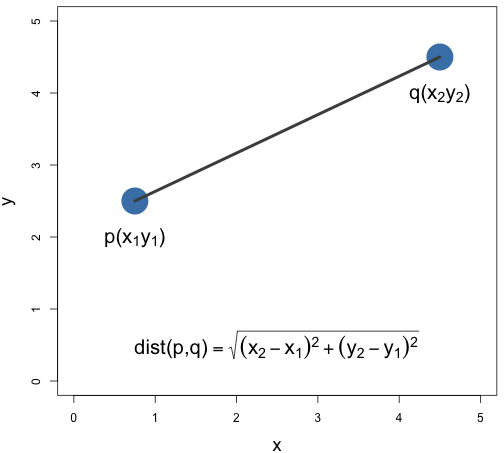

Distance matrix computation
=======================================================
The function **dist** computes the distances between rows of a data matrix.


```r
x
```

```
  V1 V2 V3
a  6  5  1
b  9  4  7
c  3  2  8
```

```r
dist(x)
```

```
         a        b
b 6.782330         
c 8.185353 6.403124
```

Hierarchic agglomerative
========================================================
type: section

Building a dendrogram
========================================================
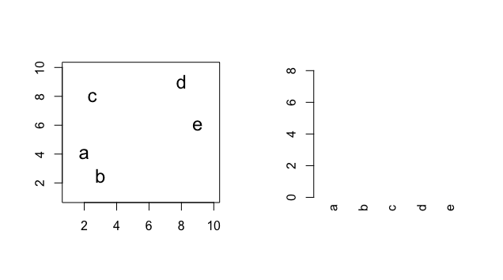

Building a dendrogram continued
========================================================


Building a dendrogram continued
========================================================


Building a dendrogram continued
========================================================


Building a dendrogram continued
========================================================


K-means clustering
========================================================
type: section

Algorithm
========================================================
**Pseudocode for the K-means algorithm**

```
randomly choose k objects as initial centroids
while true:

1. create k clusters by assigning each object to closest centroid

2. compute k new centroids by averaging the objects in each cluster

3. if none of the centroids differ from the previous iteration: return the current set of clusters
```


Randomly choose initial centroids
===================================

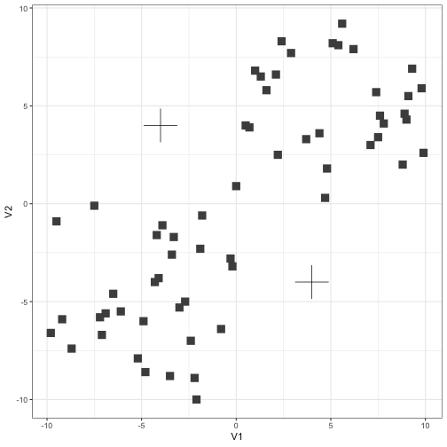

First iteration
========================================================

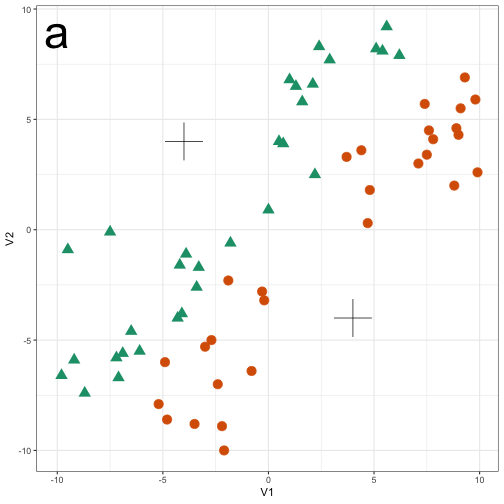
***


Second iteration
========================================================

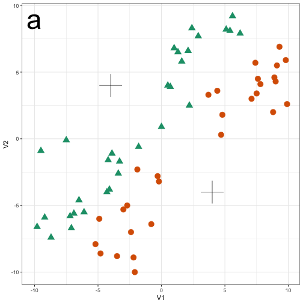
***
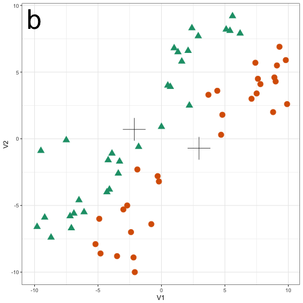

Third iteration
========================================================

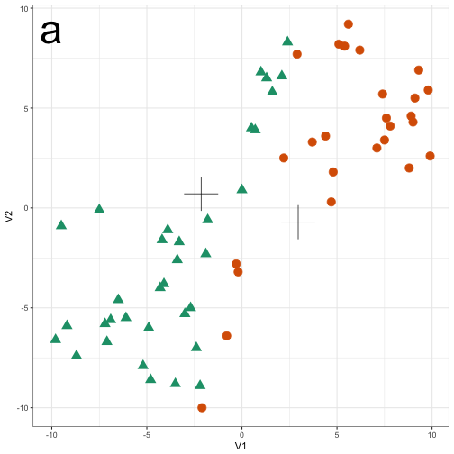
***
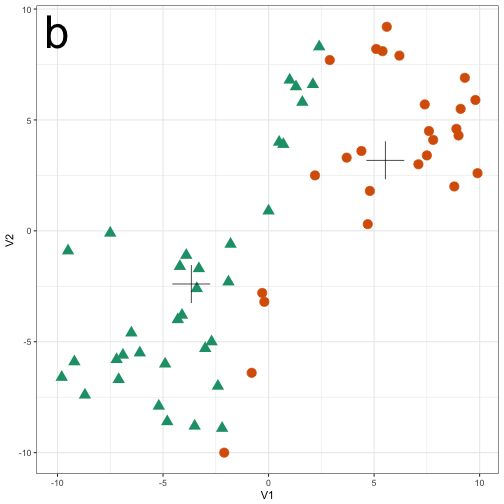

Fourth and final iteration
========================================================

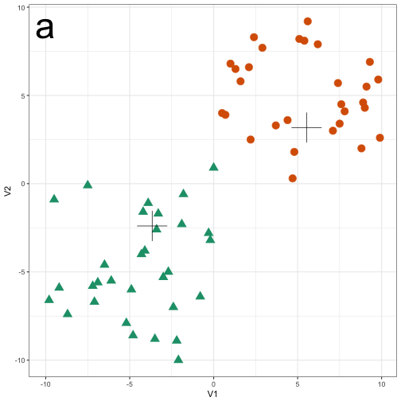
***
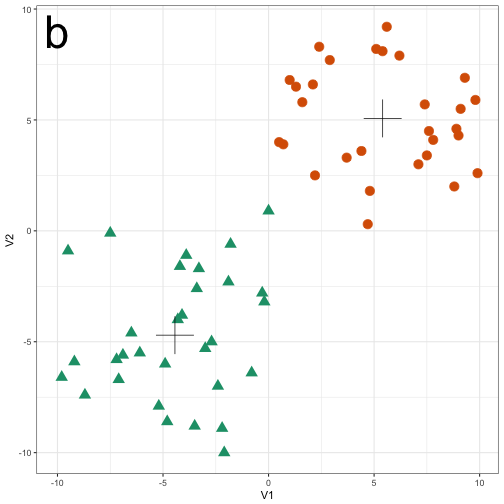

Choosing initial cluster centres
==============================================


***
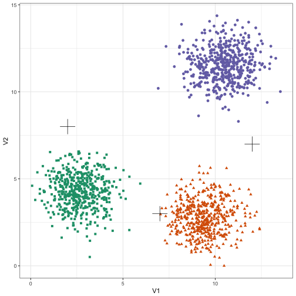


Avoid convergence to suboptimal solution
============================================
- Convergence to a local minimum can be avoided by starting the algorithm multiple times, with different random centres.

- The **nstart** argument to the **kmeans** function can be used to specify the number of random sets and optimal solution will be selected automatically, *e.g.*:


```r
kmeans(x, nstart=50)
```


K-means method in R
========================
**Usage**


```r
kmeans(x, centers, iter.max = 10, nstart = 1,
       algorithm = c("Hartigan-Wong", "Lloyd",
                     "Forgy", "MacQueen"),
       trace=FALSE)
```


K-means method in R continued
===================================
**Value**

Returns an object of class **kmeans**, a list including the following components:
- **cluster** A vector of integers (from 1:k) indicating the cluster to which each point is allocated.
- **centers** A matrix of cluster centres.
- **tot.withinss**  Total within-cluster sum of squares, i.e. sum(withinss).
- **size** The number of points in each cluster.

The list contains many other items. For a more details consult help:

```r
?kmeans
```

Trying different values of k
======================================================
Let's perform k-means clustering for a range of values of *k* from 1 to 9.

```r
blobs <- as.data.frame(read.csv("/Users/matt/git_repositories/intro-machine-learning-2018/data/example_clusters/blobs.csv", header=F))

k <- 1:9

res <- lapply(k, function(i){kmeans(blobs[,1:2], i, nstart=50)})
```

Create plot for each value of k
======================================================

```r
library(RColorBrewer)
point_colours <- brewer.pal(9,"Set1")

plotList <- lapply(k, function(i){
  ggplot(blobs, aes(V1, V2)) +
    geom_point(col=point_colours[res[[i]]$cluster], size=1) +
    geom_point(data=as.data.frame(res[[i]]$centers), aes(V1,V2), shape=3, col="black", size=5) +
    annotate("text", x=2, y=13, label=paste("k=", i, sep=""), size=8, col="black") +
    theme_bw()
}
)
```

Display plots in grid
==================================================

```r
pm <- ggmatrix(
  plotList, nrow=3, ncol=3, showXAxisPlotLabels = T, showYAxisPlotLabels = T
) + theme_bw()

pm
```

Clustering using a range of values of k
======================================================
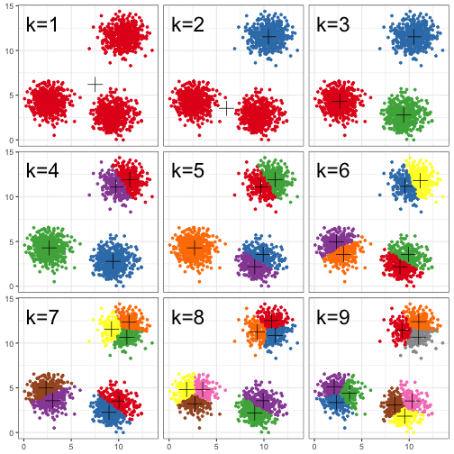

Choosing k
================================================================

```r
tot_withinss <- sapply(k, function(i){res[[i]]$tot.withinss})

qplot(k, tot_withinss, geom=c("point", "line"),
      ylab="Total within-cluster sum of squares") + theme_bw()
```

Elbow plot
================================================================
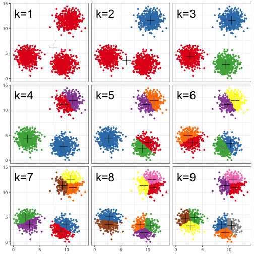


DBSCAN
========================================================
type: section

Density-based spatial clustering of applications with noise


DBSCAN parameters
========================================================
- **e (eps)** is the radius of our neighborhoods around a data point p.
- **minPts** is the minimum number of data points we want in a neighborhood to define a cluster.
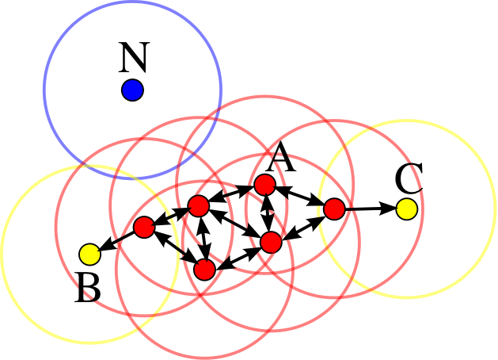


DBSCAN algorithm
========================================================
Abstract DBSCAN algorithm in pseudocode (Schubert et al. 2017)
```
1 Compute neighbours of each point and identify core points
2 Join neighbouring core points into clusters
3 foreach non-core point do
      Add to a neighbouring core point if possible
      Otherwise, add to noise
```

Implementation in R
========================================================
- DBSCAN is implemented in two R packages: **dbscan** and **fpc**.
- We will use the package **dbscan**, because it is significantly faster and can handle larger data sets than **fpc**.
- To avoid ambiguity, specify the package when calling the function, *e.g.*:

```r
dbscan::dbscan
```

Choosing parameters
=========================================================
The algorithm only needs parameters **eps** and **minPts**.

Use the **kNNdist** function from the **dbscan** package to plot the distances of the 10-nearest neighbours for each observation.


```r
library(dbscan)
kNNdistplot(blobs[,1:2], k=10)
```

10-nearest neighbour distances for the blobs data
=========================================================


```r
abline(h=0.6)
```

DBSCAN blobs data (eps=0.6, minPts=10)
========================================================

```r
res <- dbscan::dbscan(blobs[,1:2], eps=0.6, minPts = 10)

table(res$cluster)
```

```

  0   1   2   3 
 43 484 486 487 
```

Create scatter plot
=======================================================

```r
ggplot(blobs, aes(V1,V2)) +
  geom_point(col=brewer.pal(8,"Dark2")[c(8,1:7)][res$cluster+1],
             shape=c(4,15,17,19)[res$cluster+1],
             size=3) +
  theme_bw()
```

Clusters and noise points
=======================================================
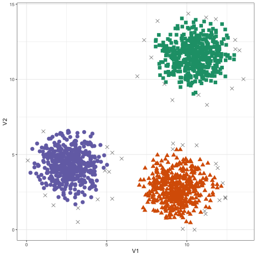


Examples
====================================
type: section

- 2D synthetic data sets
- Gene expression profiling of human tissues

2D synthetic data sets
========================
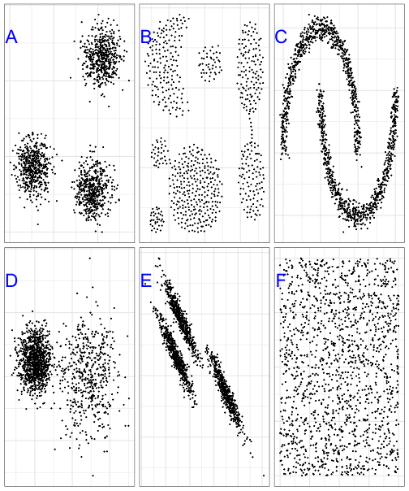

Gene expression profiling of human tissues
=======================================
* 7 tissue types
* 189 observations/samples
* 22k transcripts

Exercise
=======================================
type: prompt

- Image segmentation using *k*-means clustering

