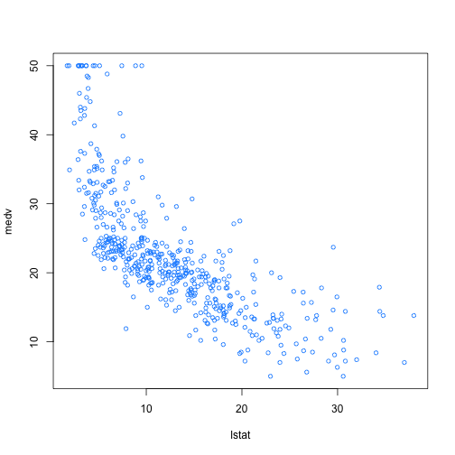
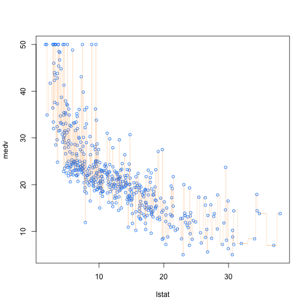
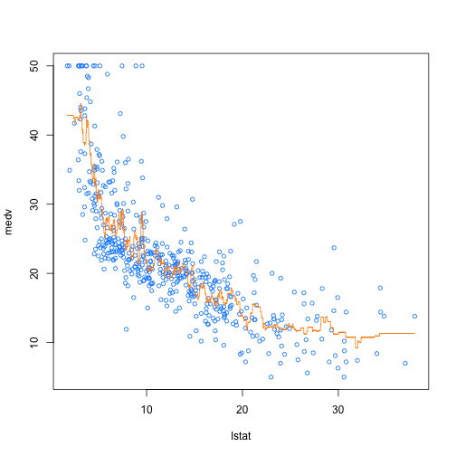
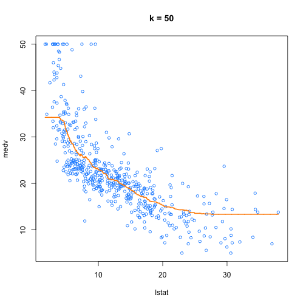
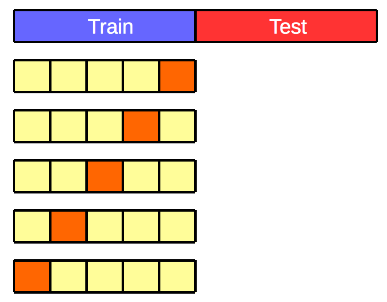

k-nearest neighbours
========================================================
#author:
#date:
autosize: true
transition: rotate
css: custom.css

k-NN Classification
=====================================================

***
Two classes: blue squares & red triangles

Test object: green circle

k=3: solid line circle

k=5: dashed line circle

k-NN characteristics
=====================================================
- simplest method of supervised learning we will cover in this course.
- non-parametric
- instance (memory) based learning, because all computation is deferred until prediction
- most computationally demanding aspects of knn are finding neighbours and storing the learning set

k-NN Regression example
====================================================

***
Socioeconomic data for 506 neighbourhoods around Boston.

**medv**: median house value

**lstat**: percent of households with low economic status

k=1
===========

k=5
=========

k=10
=========

k=25
============

k=50
==============

k=506
=================

Choosing k
========================================================

- The number of neighbours *k* can have a considerable impact on the predictive performance of k-NN in both classification and regression.

- The optimal value of *k* should be chosen using cross-validation.

k-fold cross-validation
=========================

Bias-variance tradeoff
==========================================================

The bias–variance tradeoff is the problem of simultaneously minimizing two sources of error that prevent supervised learning algorithms from generalizing beyond their training set:

- The **bias** is error from erroneous assumptions in the learning algorithm. High bias can cause an algorithm to miss the relevant relations between features and target outputs (underfitting).

- The **variance** is error from sensitivity to small fluctuations in the training set. High variance can cause an algorithm to model the random noise in the training data, rather than the intended outputs (overfitting).

