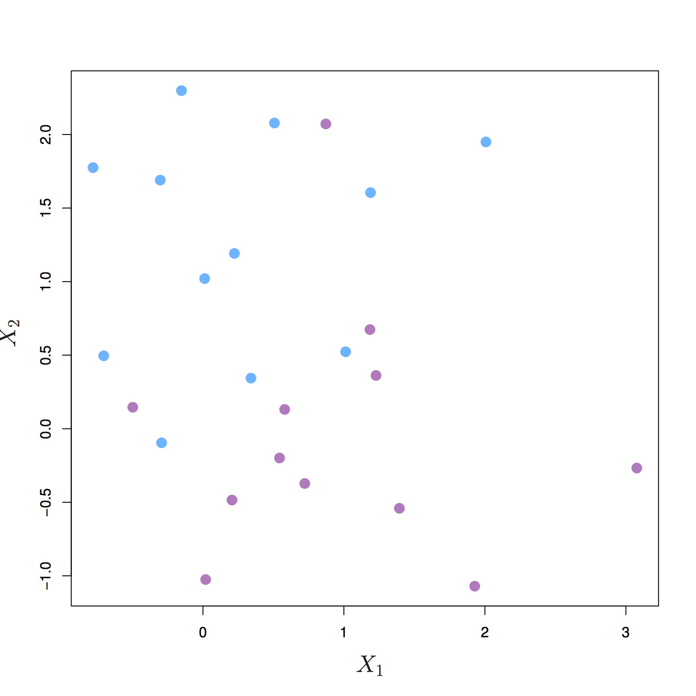
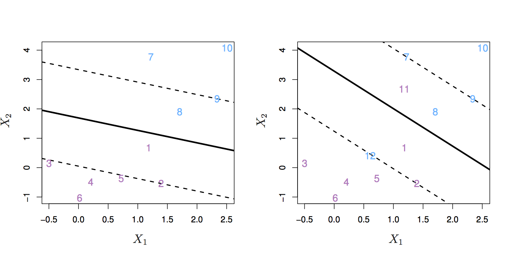
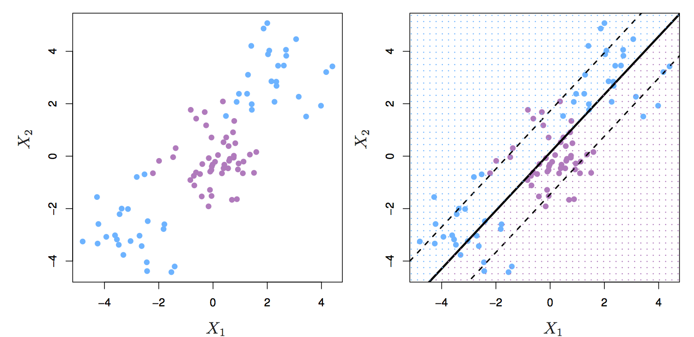
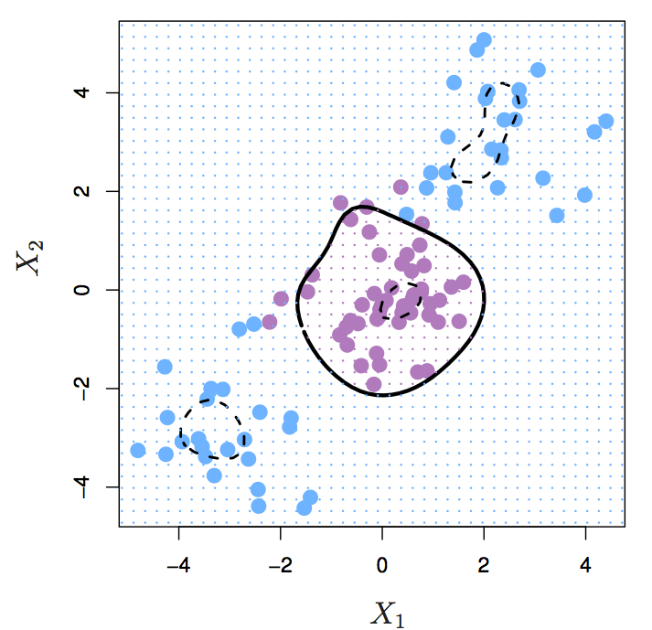

Support Vector Machines
========================================================
author:
date:
autosize: true
transition: rotate
css: custom.css

Separating hyperplanes
========================================================

http://www-bcf.usc.edu/~gareth/ISL/

Maximum margin classifier
========================================================

http://www-bcf.usc.edu/~gareth/ISL/

Classes not separable by a hyperplane
========================================================

http://www-bcf.usc.edu/~gareth/ISL/

Max margin classifier sensitive to indvidual data points
========================================================

http://www-bcf.usc.edu/~gareth/ISL/

Support Vector Classifier
========================================================

http://www-bcf.usc.edu/~gareth/ISL/

SVC and tuning parameter C
========================================================

http://www-bcf.usc.edu/~gareth/ISL/

Two classes of observations with a non-linear boundary between them
========================================================

http://www-bcf.usc.edu/~gareth/ISL/

Kernel Trick
========================================================

https://github.com/mbeyeler/opencv-machine-learning

Support Vector Machine
========================================================

http://www-bcf.usc.edu/~gareth/ISL/

Further reading
========================================================

### An Introduction to Statistical Learning
http://www-bcf.usc.edu/~gareth/ISL/

### Elements of Statistical Learning
https://web.stanford.edu/~hastie/ElemStatLearn/
